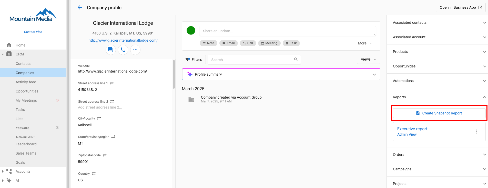
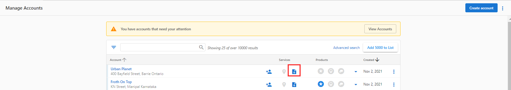
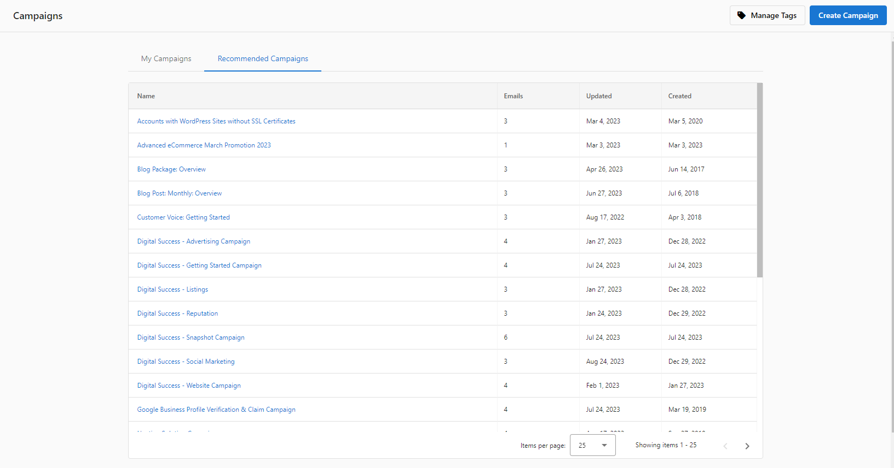
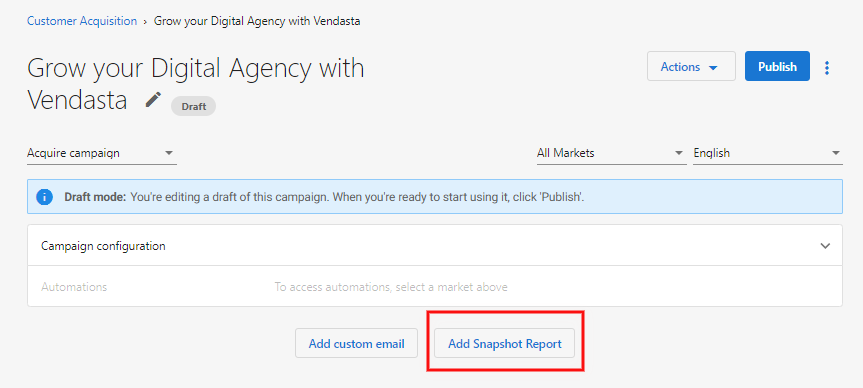

# Create Snapshot Reports

Prospecting can be challenging and time-consuming. That's why you'll love the **Snapshot Report**. This award-winning needs assessment empowers you and your sales team to start informed conversations with prospects. In fact, with the Snapshot Report and hot lead notifications, our partners have experienced as much as a 500% increase in their close rate! With 97% of consumers looking for businesses on the web, it's crucial to have accurate listings, positive reviews, regular social activity, a robust website, and successful ad campaigns. The Snapshot Report gives you the ability to assess and present these attributes of your prospects' online presence.

You can create Snapshot Reports in a few different ways:

## Create Snapshot Reports via the CRM

**To create a Snapshot Report via the CRM:**

1. Navigate to **Partner Center > CRM > Companies.**
2. Click on the **Reports** section on the right side-bar.
3. Select **'Create Snapshot Report.'**

When generating Snapshot Reports directly through the CRM, it's crucial to understand that unlike the standard Snapshot creation process, certain fields are not strictly required. However, the quality and effectiveness of your Snapshot Report depend heavily on the accuracy and completeness of key business information.

To ensure your Snapshot Reports provide valuable insights for your prospects, prioritize the following data points:

- **Business Name:** A clear and accurate business name is essential for identifying the prospect.
- **Business Address:** Providing a complete and correct address helps to localize the report and ensure accurate data analysis.
- **Business Phone Number:** A valid phone number allows for direct contact and verification of information.
- **Business Website:** A website provides a valuable source of information for the report and allows for further analysis of the business's online presence.
- **Accurate Business Category:** This is a critical field. Selecting the most accurate business category ensures that the report is tailored to the specific industry and provides relevant benchmarks and insights.

## Create Snapshot Reports via 'Snapshot Create icon'

To create a Snapshot Report with the Create Snapshot Report icon:

1. **Partner Center** > Accounts > Manage Accounts > Beside the desired account, click on  to create Snapshot Report.

## Fill in the Acquisition Widget

If you want to generate Snapshot Reports organically, you can embed an Acquisition Widget on your website. You can install this widget on any website you control, allowing users to request Snapshot Reports at their leisure.

To create a Snapshot Report:

- [**Embed the Acquisition Widget**](/snapshot-report/embed-acquisition-widget) on your website.

Whenever someone fills out the completed widget, the platform can generate a Snapshot Report for them. The platform will assign a salesperson to the prospect, notify the salesperson, and can even add the prospect to a customer acquisition email campaign.

## Run campaigns with a Snapshot Creation Event

You can use Snapshot Report Creation events with your email marketing campaigns to generate Snapshot Reports automatically.

To use a Snapshot Report Creation Event:

1. Go to **Partner Center** > **Marketing** > **Campaigns** > **Recommended or My Campaigns** > Select the Campaign you want to add Snapshot Creation to.
2. 
   :::note
   You can only modify a draft campaign that has not been delivered to a customer. If the campaign has already been published, you will need to [create a new campaign](/marketing/campaigns/create-new-campaign) to use the Snapshot Creation Event.
   :::

   

3. Click **Add Snapshot Report**.

   

   :::note
   **Note:** Snapshot Reports will be created for the accounts added to this campaign. If there is an existing report less than 30 days old, the email campaign will use that report. If the report is older than 30 days, the Snapshot Creation event will automatically refresh the report. Standard Snapshot Report fees apply for any reports that are created or refreshed.
   :::

## Wait 24 hours and get ready to sell

We recommend waiting 24 hours before showing the Snapshot Report to a prospect. This ensures that all of the available data has been gathered.

While you're waiting for your first Snapshot Report to generate:

- Study the [Snapshot Report Cheat Sheet](/snapshot-report/cheat-sheet)—it'll show you how to direct the conversation based on the results of the Snapshot Report.

[Next step: Send Snapshot Reports >>](/snapshot-report/send-snapshot-reports)