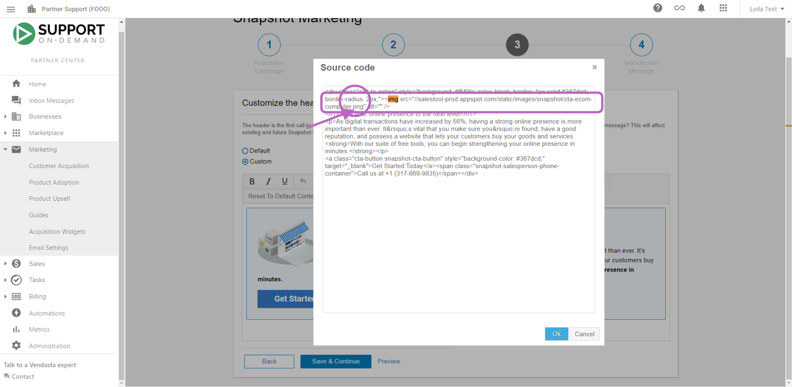

# Editing the Snapshot Banner Image & Getting an Image Source Code

Learn how to edit the banner image used for your Snapshot Reports.

Snapshot Reports can be branded with a custom header and banner image to match your business branding. This guide will walk you through how to edit the banner image of your Snapshot Reports.

## Update the Banner Image for Snapshot Reports

To update or change the banner image for your Snapshot Reports:

1. From the **Partner Center**, go to **Products → Snapshot Report**
2. Click the **Settings** tab
3. Under **Custom Headers**, click the **Edit** icon next to the header you want to update
4. Click on the **Logo** tab
5. Click **Replace** to upload a new image

**Note**: The optimal image size is 750 x 250 pixels. Images that are too large may not display correctly in your Snapshot Reports.

## Replace an Existing Banner Image

1. Click **Replace** under the banner image preview
2. Click **Choose File**
3. Select an image from your computer
4. Click **Upload**

## Using the Banner Image in Email Templates

If you want to use your banner image in email templates, you need to get the image source code:

1. From the **Partner Center**, go to **Products → Snapshot Report**
2. Click the **Settings** tab
3. Under **Custom Headers**, click the **Edit** icon next to the header
4. Click on the **Logo** tab
5. Right-click on the banner image
6. Select **Copy Image Address**

This URL is the source code for your image that you can use in your email templates.

## Using the Image Source in an Email Template

After copying the image URL, you can insert it into your email template:

1. Go to **Partner Center → Products → Email Marketing**
2. Select or create an email template
3. Click where you want to insert the image
4. Click the image icon in the editor
5. Paste the copied URL into the **Source** field
6. Adjust the size and alignment as needed
7. Click **OK** to insert the image

## Best Practices

- Use high-quality images that represent your brand
- Maintain consistent branding across all your Snapshot Reports
- Optimize image size for faster loading (750 x 250 pixels recommended)
- Ensure the image contrasts well with any text that may appear over it
- Test how your banner appears in different devices and screen sizes