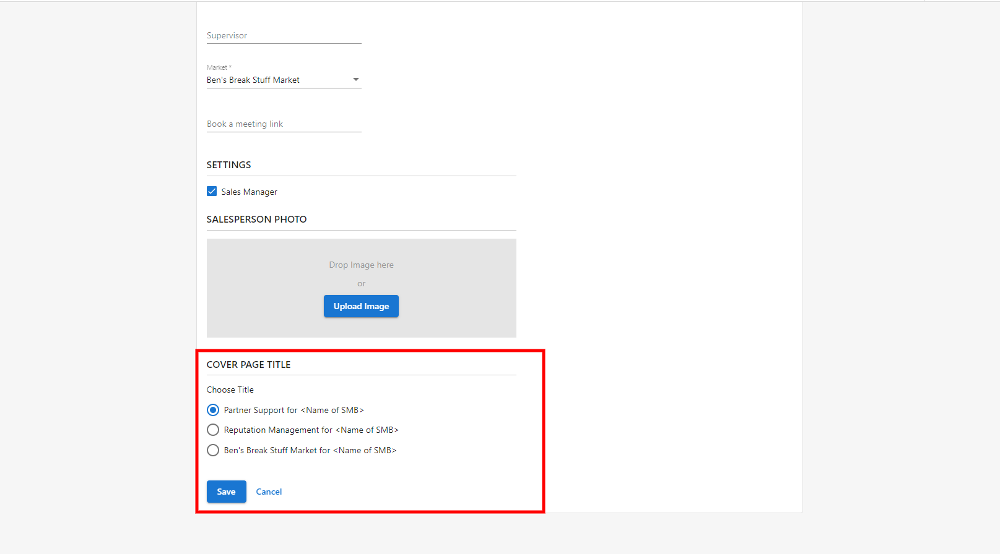

The cover page of the Snapshot Report is set by the Salesperson. You can edit this setting in the Salesperson's profile by following these steps: 

1. Log in to **Partner Center.**

2. Navigate to the **CRM** tab > click on **Salespeople.**

3. Click on the **Salesperson's name.**

4. Scroll down to '**Cover Page Title**'.

Cover page options are as follows:

a) Partner name.

b) Reputation Management product name.

c) Market name.

If a Salesperson has a "Job Title" listed in their settings, then it will override these options and display the Job Title instead.

