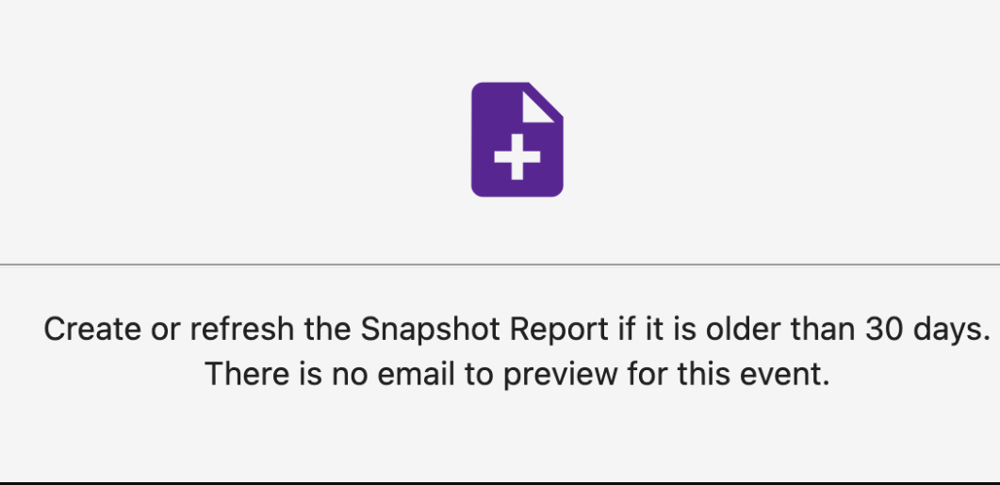

# Does a Snapshot event in an email campaign refresh expired reports?

A snapshot report that is expired will only be refreshed by a Snapshot event IF the Snapshot Report is older than 30 days. When you preview the event in the campaign, it will show the following:

