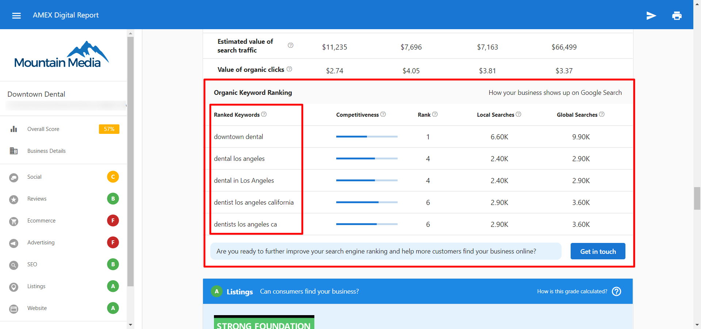

The organic SEO Keywords found in the Snapshot Report are pulled from the metadata of the business's website. The Snapshot Report will display five organic search terms that the business is currently ranking for on Google (within the past month).

