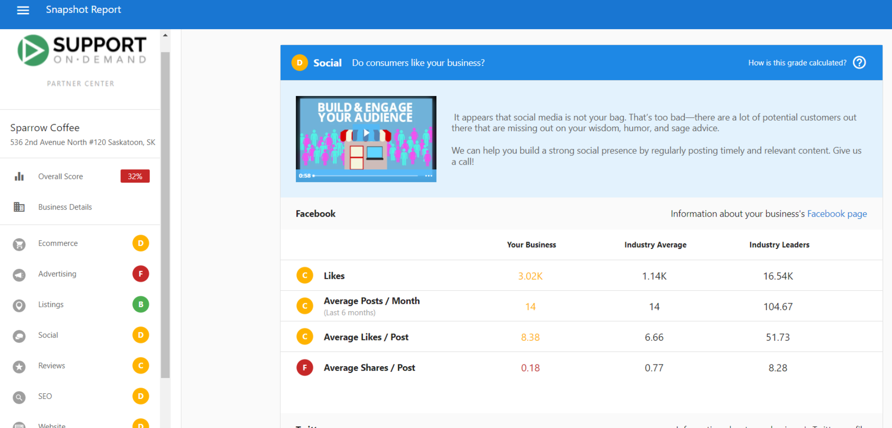
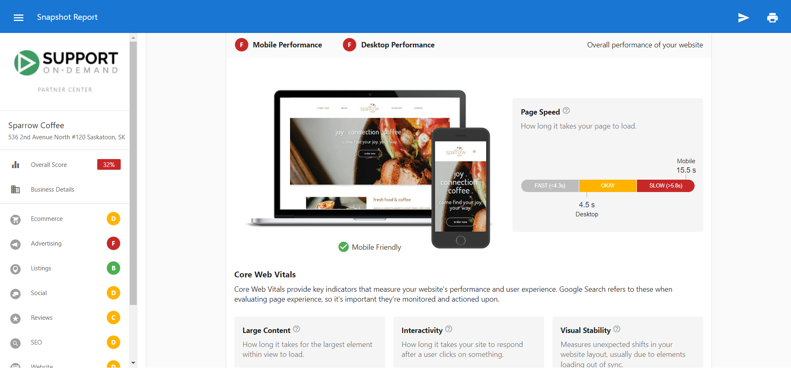

The Snapshot Report is a powerful tool that allows you to get to the heart of your client's online presence and reputation. To better speak to the report itself, it is useful to understand how our carefully tuned algorithm determines its grades.

## Overall Score

The overall score is calculated by averaging the primary grades you've received in each section within the Snapshot Report. These grades are converted into numerical values:

- **A** = 4
- **B** = 3
- **C** = 2
- **D** = 1
- **F** = 0

The converted values are then summed and then divided by a perfect score (24). When a section is disabled, the overall score will adjust accordingly.

### Example

In the above Snapshot Report, the score would be broken down as follows:

| Section | Grade | Score |
| ------- | ----- | ----- |
| Ecommerce | D | 1 |
| Advertising | F | 0 |
| Listings | B | 3 |
| Social | D | 1 |
| Reviews | C | 2 |
| SEO | D | 1 |
| Website | D | 1 |
| Total | N/A | 9 |

Once we have the total score, 9 in the above case, we then divide it by the perfect score of 28 (4 x # of section grades, giving us the overall score for the Snapshot Report.

9/28 = 0.321

This is then rounded to the nearest whole number. In the example provided, this would be the 32% shown in the screenshot.

## Sections

For each section in the Snapshot Report, we use the following percentile grading system:

- **A** = 90 - 100th percentile
- **B** = 75 - 89th percentile
- **C** = 50 - 74th percentile
- **D** = 30 - 49th percentile
- **F** = 0 - 29th percentile

## Listings

{/*  */}

The **Listings grade** is a reflection of your business's online listings. Each listing source is assigned a score based on how popular the site is. For example, having an accurate listing on a popular site like Google will have a greater influence on your Listing Score. The Listings grade is determined by the percentile range your business falls into when compared to other businesses in the same industry.

*Example: This business was in the top 25% compared to other businesses in the same industry, so therefore it was graded at a B.*

{/*  */}

## Reviews

{/*  */}

We first calculate the scores for each subsection contained under the Reviews heading. We then take those combined scores and divide them into the maximum possible score.

*Example: The above business's grades are broken down as follows:*

- *Reviews Found | Top 50% = C*
- *Reviews Found Per Month | Top 50% = C*
- *Average Review Score | Top 50% = C*
- *# of Review Sources | Top 50% = C*

*If we convert these to point values, we have 2, 2, 2, and 2. Adding these together gives a total point value of 8. Since there are 4 sub-grades, we would divide this by 4 which gives us a score of 2, resulting in an overall grade of C.*

## Social

We first calculate the grades for each subsection under the Social heading. From there, we convert those scores to numerical values, then divide them by the total number of grades available.

*Example: The above account has Facebook, X, and Instagram enabled on their Snapshot Report. Their subsections (Likes, Average Posts / Month, etc.) are calculated using the same method as other sections.*

*Facebook has ratings of C, C, C, and F. Converting these to numerical gives us 2, 2, 2, and 0 = 6/4 = 1.5 = **D***

{/*  */}

*X was not found, equalling a grade of **F**.*

*Instagram has two B ratings, giving us 3, and 3 = 6/2 = 3 = **B**.*

{/*  */}

*If we take the letter grade for each social site, we get Facebook = D (1), X = F (0), Instagram = B (3)*

*Total = 4/# of grades*

*4/3 = 1.3 = D grade overall*

## Website

{/*  */}

We use Google's PageSpeed Insights to analyze websites for the Snapshot Report. The Website section is comprised of three separate subsections. The grades from each of these are added together, then divided by the total number of grades available. We will break down these sections below.

*Example: In the above report, the website has received the following grades:*

- *Mobile - F*
- *Desktop - F*
- *Homepage Content - B*

*These convert to scores of 0, 0, and 3 respectively. Adding these together, we get a total of 3. If we divide this by 3 (the number of sections available), we receive a value of 1, which gives us a total grade of D.*

:::note
PageSpeed scores can vary as they are estimates of the website's performance and not exact numbers. Many factors can influence the performance such as internet traffic, the types of ads being served, the type of device being used, and antivirus software.
:::

### Mobile

Google's PageSpeed Insights scores both your speed and UX scores. We combine these scores, then compare the business to its industry percentiles to retrieve the Mobile grade.

### Desktop

For the Desktop score, we take your Google PageSpeed Insights score (out of 100) and compare it to the industry percentiles.

### Homepage Content

{/*  */}

Each line within the Homepage Content subsection is given point values based on if the element is or is not detected. We add these scores together, then compare these to the industry percentiles.

## Ecommerce

{/*  */}

This section breaks down 4 important categories that are relevant when it comes to eCommerce:

- Online storefront - This checks to see if your prospect has the ability to sell their products/services through their website using a recognized commerce platform.
- Online payments - This checks to see if your prospect is able to accept transactions through their site using recognized payment software.
- Lead engagement - This scan's the prospects' website to see if it is set up to properly engage customers with relevant content, encouraging them to either move down the sales funnel or purchase from them again.
- Online scheduler - This crawls the prospect's website to see if they have included any scheduling software that makes it easy for customers to book an appointment with the business.

This grade is weighted to match the insights of sales professionals, giving you a score that helps you focus on the areas that matter most. These areas are weighted as follows:

*Online storefront = high*  
*Online payments = medium*  
*Lead engagement = low*

## Advertising & SEO

The SEO and Advertising sections are backed by a deep catalog of keywords. Every month, we run millions of searches for these keywords, then take the top 50 organic results and the top 2 pages of ads and save those to our database. From there, we use those results to calculate the following:

- **Advertising:** *Estimated cost per click = Estimated monthly ad budget / Estimated monthly paid clicks*
- **SEO:** *Estimated value per click = Estimated monthly value of clicks / Estimated monthly clicks*

It is important to stress that these are estimates and may not always accurately reflect the actual value of those clicks.

*For more information on the Advertising section, check out [this article](/snapshot-report/advertising-section).*

{/*  */}

## Local SEO

The local SEO subsection score is based on where the business appears in the search results for each of the vicinities (9 each for near me and city).

1st = A

2nd or 3rd = B

4th - 20th = C

21st - 100th = D

Outside top 100 = F

The grade is then combined with the value per click grade to get the overall section grade.

:::note
We are unable to perform localized searches. We search from a centralized location, so if the business you are targeting has ads set up for only their local area, you may not see results.
:::

*For more information on the SEO section, check out [this article](/snapshot-report/seo).*