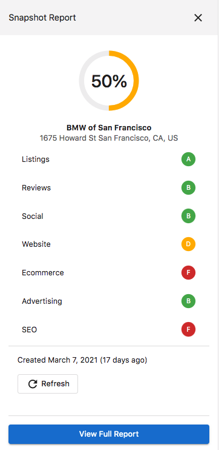
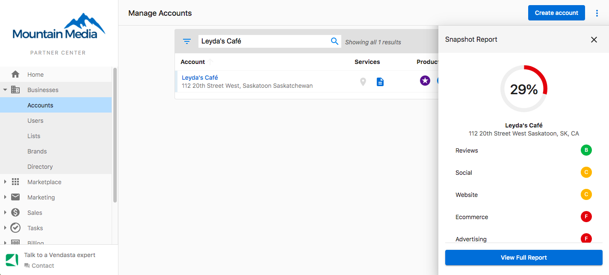
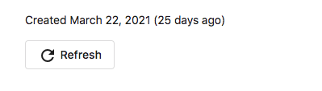

# Snapshot Report: Quick View Scorecard

The Quick View Scorecard on the Snapshot Report allows you to see a summarized view of a business's digital presence. You can view Letter Grades for key components of a business's online performance, as well as see their overall Digital Score.

## How to Find the Quick View Scorecard

The Quick View Scorecard is found within the Snapshot Report. To access it:

1. Click on the Snapshot Report icon in the left navigation panel

   

2. The Scorecard will appear at the top of the Snapshot Report

## Understanding the Scorecard

The Scorecard displays letter grades (A to F) for several key digital presence elements:

- **Advertising**: The business's performance in online advertising
- **Listings**: The accuracy and completeness of their business listings across the web
- **Reviews**: The business's online reputation based on customer reviews
- **Social**: Their social media presence and engagement
- **Website**: The quality and performance of their website

The **Digital Score** on the left provides an overall rating (0-100%) that combines all of these elements.

## Expanding the Quick View Scorecard

To see more details about each category, you can click on the Scorecard to expand it. The expanded view provides additional information about each component.

## Generating a New Snapshot Report

If you need to generate a fresh Snapshot Report:

1. Click the "Add New" button (plus icon)

   

2. Enter the business information requested
3. Submit to generate a new report

## Refreshing the Scorecard

To update the data in an existing Snapshot Report:

1. Click the "Refresh" option in the top-right of the report

   

2. Wait for the report to update with the latest data

Refreshing the report will update all scores and data with the most current information available.