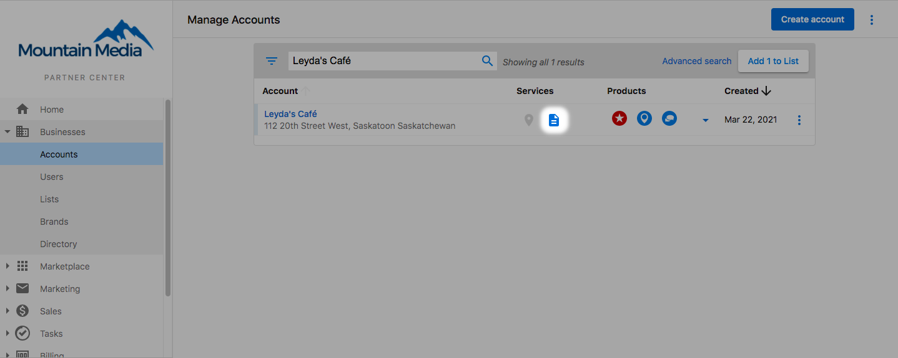
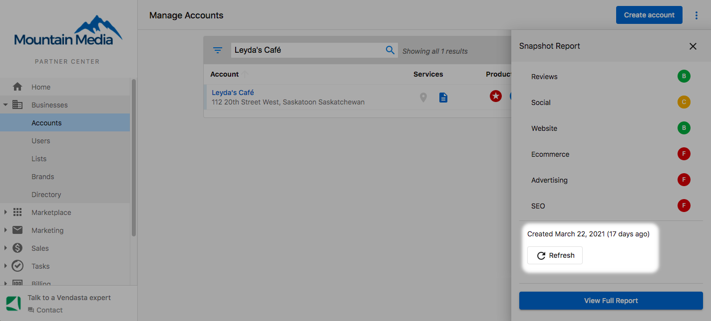
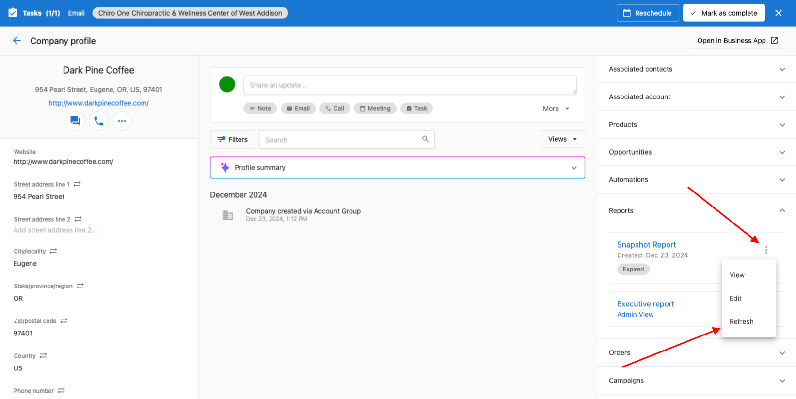

Snapshot Reports are active and accurate for seven days after which the report will stop updating. Sometimes you or your salespeople need more time to close a deal, or you simply need to rekindle an old prospect. Snapshot Report refreshes allow you to provide up-to-date data in these situations.

There are three methods for refreshing Snapshot Reports.

[Watch the video on how to refresh the snapshot report.](#h_01G7QK0R7E0V74BYW0NSV442MD)

### **Refreshing Snapshots for an individual account**

**Via Manage Accounts**

Partner Center Admins can refresh the Snapshot Report by navigating to **Accounts > Manage Accounts** and opening up the Snapshot scorecard by clicking the **Snapshot icon** to the right of the account name.

At the bottom of the Snapshot scorecard, you'll find the date it was created indicating how old the report is along with the refresh option. Click **Refresh** and confirm you'd like to refresh the Snapshot.

:::note
**Note**: If the report is still within the first 7 days of being created this option will not appear.
:::

Refreshed reports are very similar to new reports:

* Refreshed reports are the same price as new reports.
* You must wait a minimum of 10 minutes before accessing the report.
* The refreshed report uses data from the demo Reputation Management account.

However, please keep in mind that when a Snapshot Report is refreshed, a new report will override the old report.

**Via Companies**

The Snapshot report can also be refreshed via the Companies section of Partner Center. Navigate to **CRM > Companies > Select the desired company.** If there is an expired Snapshot Report, it will be shown under the **Reports** section on the right-hand side of the Company page. Click the 3 dots next to the report, and select **Refresh.**

### **Refreshing multiple Snapshot Reports.**

You can create and refresh multiple Snapshot Reports using **Lists** in Partner Center. [Learn more.](/snapshot-report/create-snapshot-reports#creating-multiple-snapshot-reports)