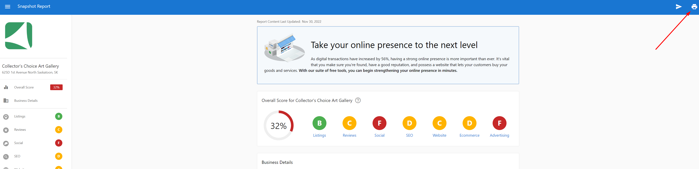
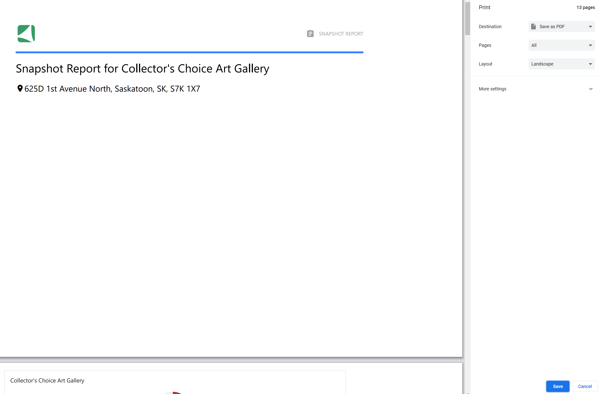

In your Partner Center, you can easily save the Snapshot Report as a PDF by doing the following:

[See walkthrough video](#save-snapshot-as-a-pdf-video)

1. Click **View Full Report** on the Snapshot Repot.
2. Click on the printer icon on the top right corner of the report.
   
3. Select **Save as PDF.**
   

## Save Snapshot as a PDF video {#save-snapshot-as-a-pdf-video}

<iframe src="https://drive.google.com/file/d/13Ni-ECrVhce5p6AuJSrq_E2fdcNxoqUL/preview" width="640" height="480" allowFullScreen></iframe>