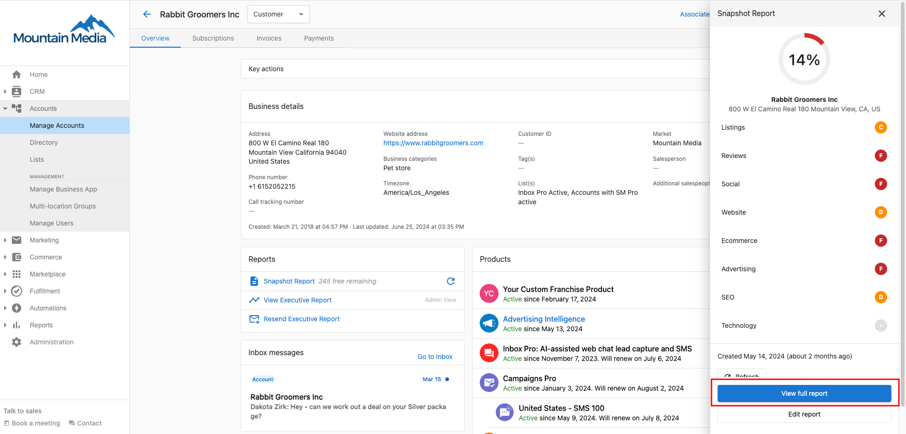
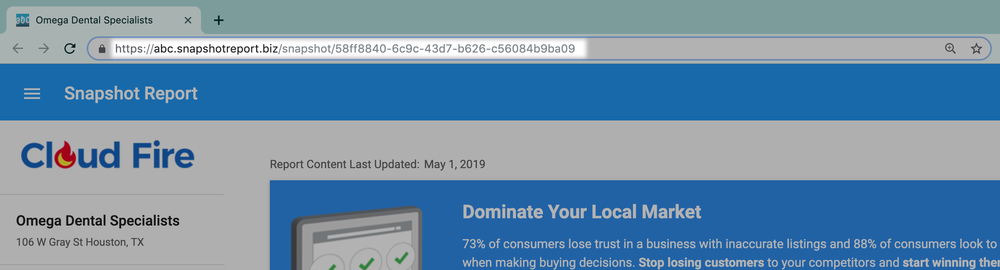

# Send Snapshot Reports

You can send Snapshot Reports a few different ways:

- Snapshot Report URL
- Email campaigns
- Email from Snapshot Report

## Snapshot Report URL

You can send a Snapshot Report by providing a link to the URL.

To send the Snapshot Report:

1. Go to **Partner Center** > **Accounts** > **Manage** > **Select the desired account**

2. Click **Snapshot Report > View Snapshot.**
   

3. Copy the URL at the top of the page.
   

4. Send the URL to your prospect.

Your prospect can view the Snapshot Report when they click on the URL link.

  <a 
    className="button button--primary"
    href="https://partners.vendasta.com/st/manage-prospects"
    target="_blank"
    rel="noopener"
  >
    Send Snapshot Reports
  </a>

## Email campaigns

To send a Snapshot Report through an email campaign:

1. Create an email marketing campaign with a Snapshot Creation Event. This event creates a Snapshot Report for each prospect on the campaign.
   - You can use one of our pre-built campaigns that contain a Snapshot Report (such as the [Local Marketing Snapshot](https://partners.vendasta.com/campaign/details/CAMPAIGN-DEFAULT-DRIP-NON-LD-PREMADE?marketId=default) or the [Local Marketing Snapshot w/ Citation Builder](https://partners.vendasta.com/campaign/details/CAMPAIGN-DEFAULT-DRIP-PREMADE?marketId=default)), or you can create your own campaign. [Learn more](/marketing/local-marketing-campaigns)

2. Publish the campaign.

3. Send the campaign to your prospects. [Learn more](/marketing/sending-marketing-campaigns)

The Snapshot Report will be delivered to your prospects through the email campaign.

**What will happen to a snapshot report if there is a snapshot event in email campaigns?**

Snapshot Report doesn't exist > **It'll create it.**

Snapshot Report exists, and it's older than 30 days > **It'll refresh it.**

Snapshot Report exists, and it's younger than 30 days > **It'll use it.**