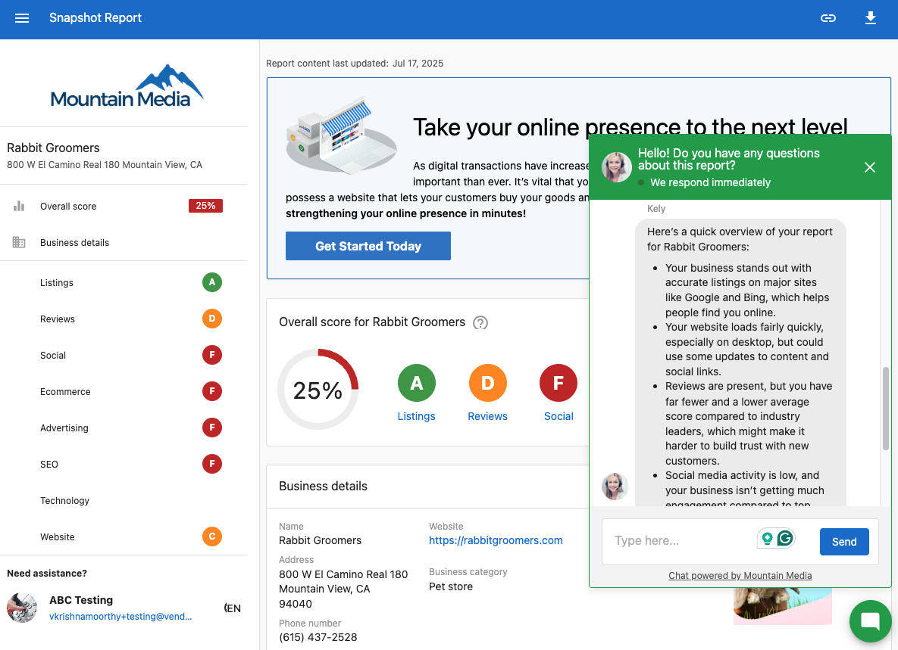
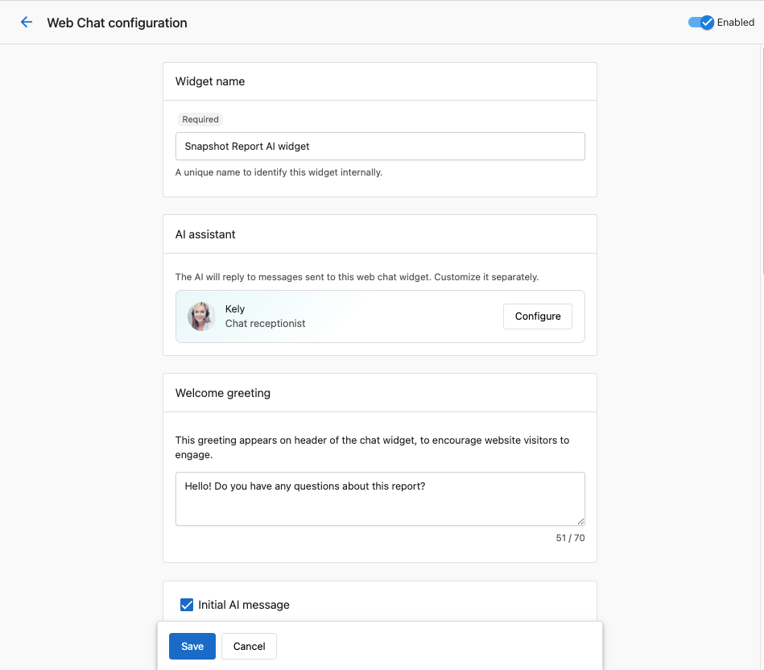
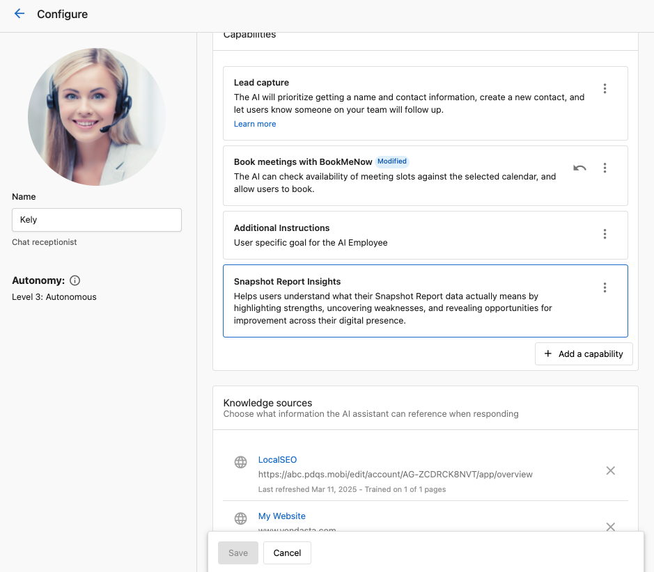
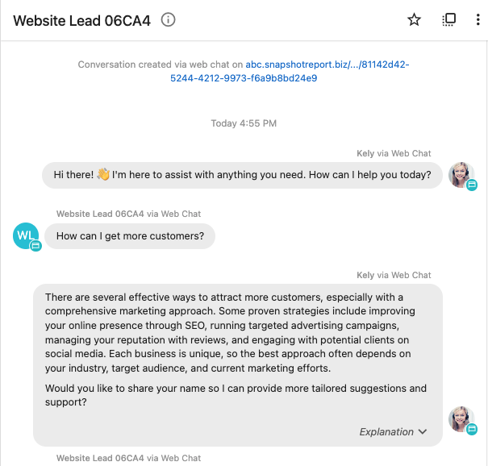

## What is AI Chat in Snapshot Report?

AI Chat is a widget embedded in the Snapshot Report that responds to visitor questions in real time. It understands the contents of the Snapshot Report, captures leads, and can book appointments directly from the chat.

## Why is AI Chat in Snapshot Report important?

AI Chat helps visitors instantly understand the value of their report. It enables real-time engagement, supports faster responses, and simplifies meeting scheduling. This increases the chances of converting leads into appointments and saves you time.

## What's included with AI Chat in Snapshot Report?
- Real-time answers about the Snapshot Report
- Built-in lead capture
- Appointment booking via integrated calendars
- Customizable welcome message and styling
- Prompt tuning for tailored chat behavior
- Chat visibility in Conversation history

## How to enable or disable AI Chat

1. Log in to Partner Center with an admin account.
2. Navigate to `AI` → `AI Workforce` → `AI Receptionist`.
3. Find the widget with your white-labeled name.
4. Click `Settings`.
5. Use the toggle in the top-right corner to turn the chat on or off.

## How to customize the welcome message and appearance
1. Go to the same `AI Receptionist` settings screen.
2. Scroll to `Appearance` or `Welcome Message`.
3. Edit the greeting to reflect your brand tone.
4. Adjust colors, fonts, and buttons to match your branding.
5. Click `Save`.

## How to customize widget behavior

1. In `AI Receptionist`, go to `Capabilities`.
2. Click `Snapshot Report Insights`.
3. Customize the prompt instructions to guide how the AI should respond:
   - Suggest specific packages
   - Ask follow-up questions
   - Provide next steps
4. Do **not** remove the **Important Requirements** section to maintain AI comprehension of the report.

## How to view conversations

1. In Partner Center, go to `Conversations`.
2. At the beginning of each AI conversation, you’ll see its source.
3. Click the link to view the originating Snapshot Report.

## Frequently asked questions (FAQs)

Why isn’t the widget booking appointments?

If you're using the built-in calendar:

1. Go to `AI Workforce` → `Chat Receptionist`.
2. Under `Capabilities`, click `Add a capability`.
3. Select `Book appointments in calendar`.
4. Choose an event link.
5. Click `Save`.

If you're using an external calendar, set up a custom capability to connect it.

Will these settings apply to my website AI chat?

No. Settings under `Snapshot Report Insights` only affect AI Chat within the Snapshot Report.

Can I hide the AI Chat on certain Snapshot Reports?

No. You can only enable or disable the AI Chat globally for all Snapshot Reports.

Can I edit the name of the AI Chat widget?

Yes. Go to `Snapshot Report Insights` under `Capabilities` and edit the widget name.

What’s the “Important Requirements” section in the prompt?

This ensures the AI can read and understand the Snapshot Report. Do not remove it.

Where can I see the full chat history?

Chat history is available in the `Conversations` section of Partner Center.

Can I change how the AI greets visitors?

Yes. Edit the `Welcome Message` field in the widget's settings.

Does changing widget styles affect other AI chats?

No. These customizations only apply to the Snapshot Report AI Chat widget.

Can I link the AI to a team calendar?

Yes. When enabling appointment booking, choose a team calendar link during setup.

