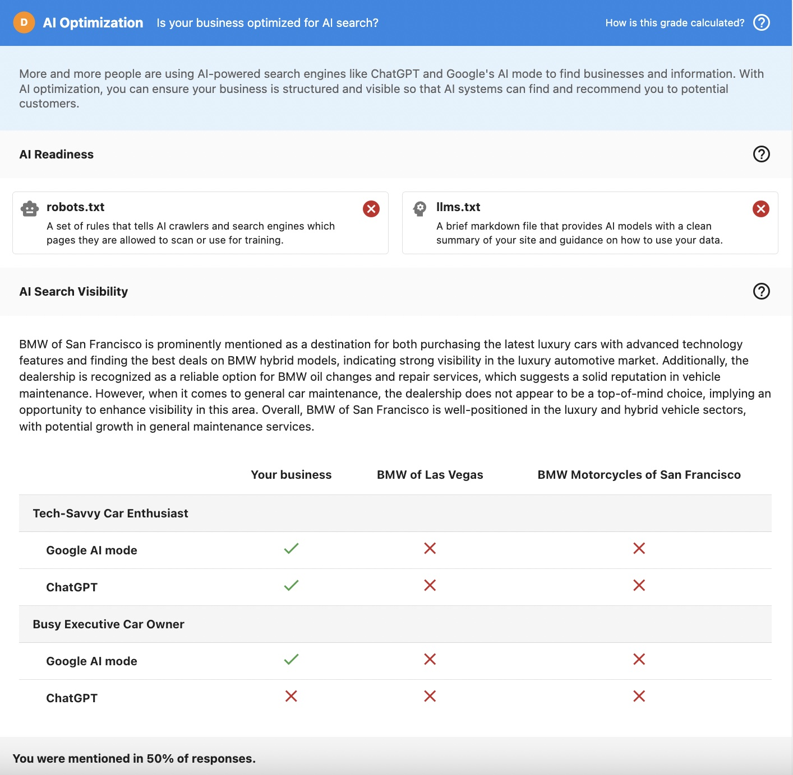
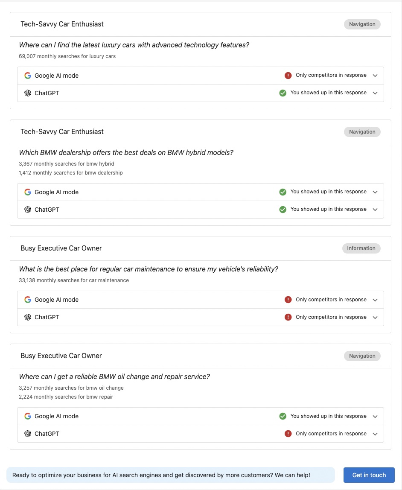

## What is AI Optimization?

The AI Optimization section helps you understand whether a business appears in AI-generated search results. As more customers use AI tools like Google AI Mode and ChatGPT to find businesses and get direct answers, businesses need to know if they're being discovered in these new search experiences.

The AI Optimization section provides two key assessments:

1. **AI Readiness Audit**: Checks whether a website has the foundational elements that allow AI systems to access and understand the business
2. **AI Visibility Audit**: Tests whether the business actually appears in AI-generated answers when real users ask questions

## Why is AI Optimization important?

### The shift to AI-powered search

Discovery is changing. Instead of scrolling through lists of search results, customers are increasingly asking AI tools direct questions and receiving immediate answers. If a business isn't mentioned in these AI responses, they risk losing potential customers, even if their traditional SEO performance looks strong.

### Why this matters for your sales conversations

The AI Optimization section helps you:

- **Explain visibility gaps**: Show prospects why they may not appear in AI answers
- **Create urgency**: Demonstrate how competitors are appearing when they're not
- **Bridge to SEO services**: Connect AI visibility insights directly to proven SEO solutions
- **Build credibility**: Use realistic, data-driven insights in early sales conversations
- **Identify opportunities**: Spot businesses that are strong candidates for deeper AI Optimization services

## What's included with AI Optimization?

### 1. AI Readiness Audit

The AI Readiness Audit checks whether a website includes foundational elements that allow AI systems and search crawlers to access and interpret the business information:

#### robots.txt
A set of rules that tells AI crawlers and search engines which pages they are allowed to scan or use for training. The audit checks whether this file exists and is accessible.

#### llms.txt
A brief markdown file that provides AI models with a clean summary of the business's site and guidance on how to use that data. This helps AI systems understand what the business offers and how to present it to users.

:::note
The AI Readiness Audit focuses on whether AI systems can access and interpret the website at a basic level. This is the foundation for AI visibility.
:::

### 2. AI Visibility Audit

The AI Visibility Audit tests real AI-style discovery using a controlled and realistic setup that closely approximates how customers actually search:

#### How it works

The audit simulates real user behavior by:

- **Using realistic personas**: Tests with 2 different customer personas to reflect how different types of customers search
- **Asking natural questions**: Generates 2 prompts per persona that convert popular keywords into natural language questions
- **Testing multiple AI engines**: Checks both Google AI Mode and ChatGPT to see where the business appears
- **Simulating real searches**: Uses a browser simulation to ask questions directly in the AI interface, just like real users do

#### What you'll see

For each persona and AI engine combination, you'll see:

- **Whether the business appears**: A clear indication if the business is mentioned in the AI response
- **Competitive comparison**: If competitors are specified, you'll see how they compare for the same searches
- **Response analysis**: Detailed text showing how the business is described (or not described) in AI responses

#### Query generation

Questions are generated using:

- **Popular keywords**: Based on search volume data from SpyFu
- **Natural language conversion**: Keywords are converted into questions that real customers would ask
- **Persona alignment**: Questions are tailored to each persona's search behavior and interests

#### Translation support

The audit supports multiple languages:

- Prompts and keywords are generated and asked in the target language
- This reflects how real users search in different regions
- Results show visibility in the language your prospects' customers actually use

## How to use AI Optimization insights

### Selling Vendasta SEO standard services

Use the AI Optimization section to demonstrate how improving traditional SEO fundamentals helps businesses get found in AI-generated answers. This creates a clear bridge from AI visibility gaps to Vendasta's SEO standard services.

**Example conversation flow:**
1. Show the prospect their AI Optimization grade
2. Explain that AI systems rely on the same SEO signals as traditional search
3. Connect missing AI visibility to specific SEO improvements
4. Position SEO services as the solution to improve AI discovery

### Sales and prospecting conversations

Demonstrate whether prospects appear in AI answers and how they compare to competitors. This creates immediate urgency and shows the competitive landscape.

**Key talking points:**
- "Let's see if you're showing up when customers ask AI tools about your services"
- "Here's how you compare to [competitor] in AI search results"
- "50% of AI responses mention your competitors, but not you"

### Client education

Help businesses understand how AI engines surface brands and why AI visibility depends on strong SEO signals. Educate them on the shift from traditional search to AI-powered discovery.

**Educational points:**
- Explain how AI tools use website content to generate answers
- Show why strong SEO fundamentals matter for AI visibility
- Demonstrate the connection between website optimization and AI discovery

### Pre-qualification for advanced services

Identify which businesses are strong candidates for deeper AI Optimization audits and Local SEO upgrades. Use the section to qualify leads for premium services.

**Qualification indicators:**
- Businesses with low AI visibility scores
- Competitive markets where AI visibility matters most
- Businesses ready to invest in comprehensive optimization

### Competitive differentiation

Showing competitor presence in AI answers helps reinforce urgency and value. Use competitive comparisons to close deals.

**Competitive insights:**
- "Your main competitor appears in 75% of AI responses for your industry"
- "Here's what AI says about them vs. you"
- "This is the gap we can help you close"

## Where to find AI Optimization

### Accessing the section

The AI Optimization section is available in all current Snapshot Reports:

1. Go to `Snapshot Report` -> `AI Optimization section`
2. The section appears alongside other report categories
3. Each component (AI Readiness and AI Visibility) is clearly labeled

### Enabling the section

#### For new reports (default configuration)

If you're using the default Snapshot Report configuration, the AI Optimization section is enabled automatically for new reports.

#### For customized reports

If you have customized your Snapshot Report, you'll need to enable the section:

1. Go to `Administration` -> `Customize` -> `Sales` -> `Default Snapshot Template`
2. Find the `AI Optimization` section
3. Enable the toggle
4. Save your changes

:::note
If you're using Markets, Snapshot Reports may have market-specific configurations. The AI Optimization section must be enabled at the market level where applicable.
:::

## Understanding the results

### AI Readiness grade

The AI Readiness Audit provides a grade based on:

- **Presence of robots.txt**: Whether the file exists and is properly configured
- **Presence of llms.txt**: Whether AI-specific guidance is available

A higher grade indicates better AI accessibility, while lower grades suggest foundational improvements are needed.

### AI Visibility results

The AI Visibility Audit shows:

- **Mention rate**: How often the business appears in AI responses (e.g., "You were mentioned in 50% of responses")
- **Per-query results**: Detailed breakdown for each persona and AI engine combination
- **Competitive positioning**: How the business compares to specified competitors

### Response analysis

For each query, you'll see:

- **Whether you appeared**: Clear indication with checkmarks or indicators
- **What AI said**: The actual text from AI responses mentioning (or not mentioning) the business
- **Competitor mentions**: If competitors were specified, whether they appeared in the same responses

## Best practices

### When to use AI Optimization

- **Early prospecting**: Use in initial conversations to create awareness and urgency
- **Competitive analysis**: When prospects want to understand their competitive position
- **SEO sales**: As a bridge to selling SEO and optimization services
- **Client education**: To help businesses understand the changing search landscape

### How to present results

1. **Start with the grade**: Show the overall AI Optimization grade to create immediate interest
2. **Explain the shift**: Help prospects understand why AI search matters
3. **Show specific examples**: Use actual AI responses to make it tangible
4. **Connect to solutions**: Link visibility gaps to specific services you offer
5. **Create urgency**: Use competitive comparisons to drive action

### What to emphasize

- **Real-world relevance**: These are actual AI responses, not theoretical
- **Competitive gaps**: Show where competitors are winning
- **Actionable insights**: Connect findings to specific improvements
- **Early advantage**: Position this as getting ahead of the trend

## Limitations and considerations

### Diagnostic tool, not a replacement

The AI Optimization section is intentionally lightweight and diagnostic. It's designed to:

- Inform conversations and create awareness
- Identify opportunities for deeper analysis
- Bridge to full AI Optimization services

It does not replace comprehensive AI Optimization analysis or provide detailed optimization recommendations.

### Result variability

AI answers can vary due to:

- **Personalization**: AI responses may differ based on user context
- **Model updates**: AI systems are constantly evolving
- **Context changes**: Different phrasing or timing can produce different results

The audit provides a standardized and repeatable approximation, but results may not match exactly what every user sees in every situation.

### Focus on trends, not absolutes

Use the AI Optimization section to:

- Identify visibility patterns
- Compare competitive positioning
- Create awareness and urgency
- Qualify opportunities

Avoid treating individual results as absolute guarantees of visibility or lack thereof.

## Frequently asked questions (FAQs)

What is the AI Optimization section?

The AI Optimization section is a Snapshot Report feature that audits basic AI readiness and tests whether a business appears in AI-generated answers. It includes two components: an AI Readiness Audit (checking for robots.txt and llms.txt) and an AI Visibility Audit (testing actual appearance in Google AI Mode and ChatGPT responses).

How are questions generated for the AI Visibility Audit?

Questions are generated from popular keywords based on search volume data from SpyFu. These keywords are then converted into natural language queries that align with each persona's search behavior and interests. This ensures the audit tests realistic, customer-relevant questions.

Does the AI Optimization section support languages other than English?

Yes. The audit supports translation, with prompts and keywords generated and asked in the target language. This reflects how real users search in different regions and provides more accurate visibility results for international businesses.

Where are the AI visibility results pulled from?

We simulate a browser, ask questions directly in the AI interface (Google AI Mode and ChatGPT), and analyze the response to determine whether the business is mentioned. This closely approximates real user search behavior rather than using APIs or theoretical analysis.

Which AI engines are included in the audit?

The audit currently tests two major AI engines: Google AI Mode and ChatGPT. These represent the primary platforms where customers are asking AI-powered questions to find businesses.

Does the AI Optimization section include recommendations or fixes?

No. The AI Optimization section focuses on diagnosis only. It identifies visibility gaps and readiness issues but does not provide specific optimization recommendations. Optimization and recommendations are delivered through SEO and AI Optimization services.

Are results guaranteed to match what every user sees?

No. AI answers can vary due to personalization, model updates, and context. The audit provides a standardized and repeatable approximation that gives you a reliable baseline for understanding AI visibility, but individual user experiences may differ.

How often should I check AI Optimization results?

AI Optimization results are included in each Snapshot Report. Since reports are active for 7 days and can be refreshed, you can get updated AI visibility results when you refresh a report. For ongoing monitoring, consider refreshing reports when significant website changes are made.

Can I use AI Optimization results to sell other services?

Yes. The AI Optimization section is designed to bridge to other services, particularly SEO. Use visibility gaps to demonstrate the need for website optimization, content improvements, and other SEO fundamentals that help businesses appear in AI responses.

What if a business has good traditional SEO but poor AI visibility?

This is actually a common scenario and a great sales opportunity. Traditional SEO and AI visibility are related but not identical. Use this gap to explain how AI systems interpret content differently and show how additional optimization can improve AI discovery while maintaining strong traditional SEO performance.

How do I enable AI Optimization for existing Snapshot Report templates?

Go to `Administration` -> `Customize` -> `Sales` -> `Default Snapshot Template`, find the AI Optimization section, and enable it. If you're using Markets, enable it at the market level. The section will then appear in all new Snapshot Reports created with that template.

Can I compare multiple competitors in the AI Visibility Audit?

The audit allows you to specify competitors when creating the Snapshot Report. The results will show how the business compares to those competitors across different personas and AI engines, helping you demonstrate competitive positioning.

## Screenshots or videos

<!-- Images to be added:
- ai-optimization-section.png (AI audit overview)
- ai-readiness-audit.png (AI Readiness details)
- ai-visibility-audit.png (Visibility audit with comparison table)
-->

### AI Optimization overview

The AI Optimization section provides a clear grade and overview of both AI Readiness and AI Visibility, showing how a business is optimized for AI search.

### Detailed breakdown

You can also find the response returned for each query for each persona on each AI engine.

---

