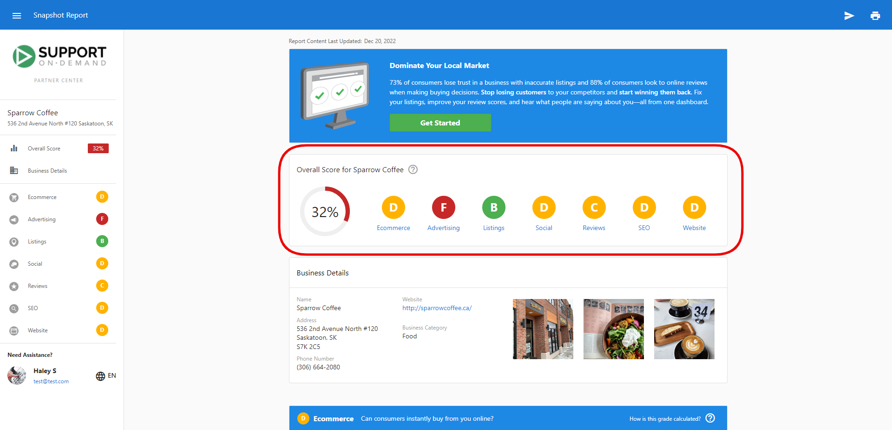
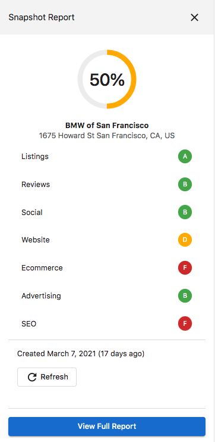
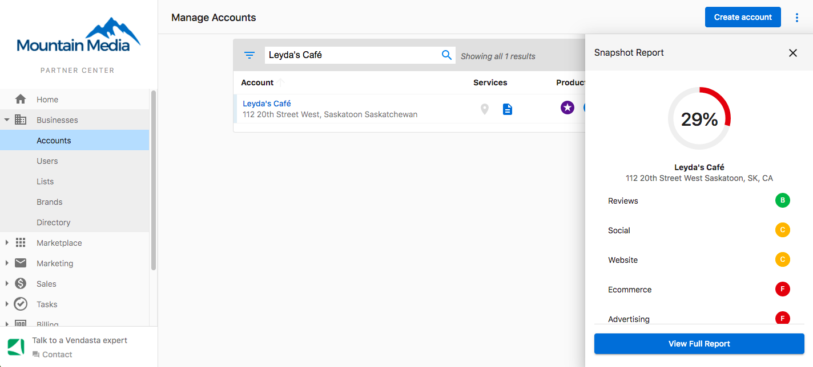

# Snapshot Report Analytics and Grading

## What are Snapshot Report Analytics and Grading?

Snapshot Report analytics provide comprehensive insights into how grades are calculated, how businesses compare against competitors, and what the various metrics mean. Understanding these analytics helps you better explain report results to prospects and identify the most impactful improvement opportunities.

## Why are Analytics and Grading important?

- **Data-Driven Conversations**: Understanding grade calculations helps you have more informed discussions with prospects
- **Competitive Intelligence**: Competitor analysis reveals market positioning and opportunities
- **Prioritized Recommendations**: Knowing how grades are weighted helps focus improvement efforts
- **Trust Building**: Explaining the methodology behind grades builds credibility with prospects
- **ROI Demonstration**: Analytics help show the value and impact of recommended improvements

## What's Included with Grade Calculations?

### Overall Score Methodology

The overall score is calculated by averaging the primary grades received in each section within the Snapshot Report. These grades are converted into numerical values:

- **A** = 4 points
- **B** = 3 points  
- **C** = 2 points
- **D** = 1 point
- **F** = 0 points

The converted values are summed and divided by the perfect score. When a section is disabled, the overall score adjusts accordingly.

#### Example Calculation

| Section | Grade | Score |
|---------|-------|-------|
| Ecommerce | D | 1 |
| Advertising | F | 0 |
| Listings | B | 3 |
| Social | D | 1 |
| Reviews | C | 2 |
| SEO | D | 1 |
| Website | D | 1 |
| **Total** | **N/A** | **9** |

Total Score: 9 ÷ 28 (perfect score) = 0.321 = 32%

### Section-Specific Grading

Each section uses a percentile grading system comparing businesses to others in their industry:

- **A** = 90-100th percentile (top 10%)
- **B** = 75-89th percentile (top 25%)
- **C** = 50-74th percentile (average performance)
- **D** = 30-49th percentile (below average)
- **F** = 0-29th percentile (bottom 30%)

### Detailed Section Calculations

#### Listings Grade
The Listings grade reflects online listings performance. Each listing source is assigned a score based on popularity (Google has greater influence than smaller directories). The grade is determined by percentile ranking compared to other businesses in the same industry.

#### Reviews Grade
Reviews grades combine multiple subsections:
1. Calculate scores for each subsection (Reviews Found, Monthly Reviews, Average Score, Review Sources)
2. Convert grades to numerical values and sum them
3. Divide by the number of subsections for the average

**Example**: C, C, C, C grades = (2+2+2+2) ÷ 4 = 2 = Overall **C** grade

#### Social Media Grade
Social grades are calculated for each platform separately, then combined:

1. **Individual Platform Scoring**: Each platform gets grades for subsections (likes, posts/month, engagement)
2. **Platform Average**: Subsection grades are averaged for each platform
3. **Overall Social Grade**: Platform grades are averaged for final score

**Example**: 
- Facebook: C, C, C, F = 1.5 = **D**
- X (Twitter): Not found = **F**  
- Instagram: B, B = 3 = **B**
- Overall: (1+0+3) ÷ 3 = 1.3 = **D**

#### Website Grade
Website grades combine three subsections using Google PageSpeed Insights:
- **Mobile Performance**: Speed + UX scores compared to industry percentiles
- **Desktop Performance**: PageSpeed score compared to industry percentiles  
- **Homepage Content**: Points awarded for detected elements compared to industry percentiles

**Example**: Mobile F (0) + Desktop F (0) + Homepage B (3) = 3 ÷ 3 = 1 = **D** grade

:::note
PageSpeed scores can vary as they are estimates, not exact numbers. Many factors influence performance including internet traffic, ad types, device type, and antivirus software.
:::

#### Ecommerce Grade
Ecommerce grades are weighted based on business impact:
- **Online Storefront**: High weight (most critical)
- **Online Payments**: Medium weight  
- **Lead Engagement**: Low weight

This weighting focuses on areas that matter most for online sales success.

#### SEO and Advertising Grades
These sections use a deep catalog of keywords with monthly searches across millions of terms:

- **Advertising**: *Estimated cost per click = Estimated monthly ad budget ÷ Estimated monthly paid clicks*
- **SEO**: *Estimated value per click = Estimated monthly value of clicks ÷ Estimated monthly clicks*

**Local SEO** subsection grading:
- 1st position = **A**
- 2nd or 3rd position = **B**
- 4th-20th position = **C**  
- 21st-100th position = **D**
- Outside top 100 = **F**

:::note
These are estimates and may not always accurately reflect actual click values. The system cannot perform localized searches, so local businesses may not appear in national-level analysis.
:::

## What's Included with Quick View Scorecard?

### Scorecard Components

The Quick View Scorecard provides a summarized view of digital presence with:

#### Digital Score
The overall rating (0-100%) combining all section grades, displayed prominently on the left side of the scorecard.

#### Section Grades
Letter grades (A-F) for key digital presence elements:
- **Advertising**: Online advertising performance
- **Listings**: Business listing accuracy and completeness  
- **Reviews**: Online reputation based on customer reviews
- **Social**: Social media presence and engagement
- **Website**: Website quality and performance

### Scorecard Features

#### Expandable Details
Click on the scorecard to expand it for additional information about each component and more detailed performance metrics.

#### Report Generation
Generate new reports directly from the scorecard by clicking the "Add New" button (plus icon) and entering business information.

#### Report Refreshing
Update existing report data by clicking the "Refresh" option in the top-right to get the most current information available.

## What's Included with Competitor Analysis?

### Competitive Intelligence Features

#### Adding Competitors
Add up to 10 competitor websites per business location to track competitive performance:

1. In the Competitor Data section, click **Add Competitor**
2. Enter competitor's website URL
3. Click **Add** to begin analysis

#### Competitive Metrics

**Website Performance Comparison**:
- Mobile-friendliness benchmarking
- Page speed comparisons  
- SEO optimization analysis
- Security measures evaluation

**Online Presence Analysis**:
- Local listings accuracy comparison
- Review volume and rating benchmarks
- Social media presence comparison
- Directory listing coverage analysis

### Strategic Competitive Insights

Use competitor data to:
- **Identify Gaps**: Find areas where the business underperforms competitors
- **Discover Opportunities**: Spot chances to outperform the competition
- **Prioritize Efforts**: Focus on areas with the biggest competitive advantage potential
- **Track Progress**: Monitor improvements against competitive benchmarks over time

## How to Use Analytics and Grading Information

### Client Presentation Strategies
1. **Start with Overall Score**: Use the Digital Score as a conversation starter
2. **Explain Percentiles**: Help clients understand they're being compared to industry peers
3. **Highlight Opportunities**: Focus on sections with the lowest grades for maximum impact
4. **Show Quick Wins**: Identify improvements that can boost multiple section grades
5. **Use Competitor Data**: Demonstrate specific areas where competitors are outperforming

### Prioritizing Improvements
1. **High-Impact Sections**: Focus first on sections that significantly affect overall score
2. **Weighted Importance**: Consider section weighting (e.g., storefront vs. lead engagement in ecommerce)
3. **Industry Relevance**: Prioritize sections most important for the client's industry
4. **Resource Requirements**: Balance potential impact with implementation difficulty
5. **Competitive Gaps**: Address areas where competitors have significant advantages

## Email Marketing Integration

### Snapshot Report Grades Dynamic Component

The 'Snapshot Report Grades' dynamic component displays prospect grades in personalized email marketing campaigns:

#### Available Grade Components
- Grade Review
- Grade Social  
- Grade Listings
- Grade Website
- Grade Advertising
- Grade eCommerce
- Grade SEO

#### Implementation Steps
1. From **Create Email** page in Campaign Builder, select **Insert Dynamic Component**
2. Select **Snapshot Report**
3. Choose the specific grade you want to include
4. Preview the email and save when satisfied

This allows personalized email campaigns that reference specific performance areas for each prospect.

## Frequently Asked Questions (FAQs)

Why does the SEO score seem inaccurate for my business?

SEO scores are based on industry percentiles and multiple factors including keyword usage, meta data, content, architecture, links, social presence, and trust signals. The score reflects how the business compares to others in their industry, not absolute performance. Recent changes, evolving competition, or industry-specific factors can affect scores.

How often do grades and scores change?

Grades can change when reports are refreshed (after 7 days) as new data is collected. Factors that influence changes include website updates, new reviews, social media activity, competitor improvements, and changes in industry benchmarks. Regular refreshing provides the most current performance picture.

Can I see how competitors are performing in specific areas?

Yes, the competitor data section shows detailed comparisons across website performance and online presence metrics. You can see how your prospect compares to competitors in areas like mobile-friendliness, page speed, review volume, social media presence, and directory listings.

What should I do if a client questions their grade?

Explain that grades are based on industry percentiles, not absolute standards. A "C" grade means average performance compared to similar businesses. Use the detailed breakdown to show specific areas for improvement and how addressing these issues can improve their competitive position.

How accurate are the competitor comparisons?

Competitor comparisons use the same methodology as the main business analysis, providing consistent benchmarking. However, they represent a snapshot in time and may not capture all competitive factors. Use them as directional insights rather than absolute competitive intelligence.

Can I customize which metrics are included in the scorecard?

Yes, you can customize which sections appear in Snapshot Reports through the configuration settings. Disabled sections won't affect the overall score calculation, allowing you to focus on the most relevant metrics for specific industries or client needs.

Why might local businesses score poorly in national-level analysis?

Local businesses may score lower in national analysis because they're optimized for local search rather than national competition. Their SEO and advertising efforts are typically focused on geographic areas, which may not appear in national-level keyword analysis.

How can I use grade calculations to improve close rates?

Use grade calculations to create urgency (showing poor performance), demonstrate expertise (explaining methodology), provide clear roadmaps (focusing on lowest grades), and show realistic improvements (explaining how grades can improve with specific actions).

## Screenshots or Videos

### Grade Calculation Breakdown
Detailed view of how overall scores are calculated from individual section grades.

### Competitive Analysis Interface
Screenshots showing competitor data analysis and comparison features.

### Dynamic Component Integration
Email marketing integration showing how to include specific grades in campaigns.

---

**Related Articles:**
- [Snapshot Report – Complete Guide](./snapshot-report-overview.mdx)
- [Snapshot Report Customization and Configuration](./snapshot-report-customization.mdx)
- [Snapshot Report Management and Billing](./snapshot-report-management.mdx)