# Snapshot Report Customization and Configuration

## What is Snapshot Report Customization?

Snapshot Report customization allows you to display business insights to your clients in a white-labeled way that matches your brand and messaging. You can personalize reports by modifying templates, headers, banners, sections, and content to create a consistent brand experience.

## Why is Customization important?

- **Brand Consistency**: Maintain your brand identity throughout the sales process
- **Professional Presentation**: Create polished, professional-looking reports that build trust
- **Targeted Messaging**: Customize content and calls-to-action for specific markets or client types
- **Competitive Advantage**: Stand out from competitors with unique, branded reports
- **Improved Conversion**: Customized reports with relevant messaging can improve close rates

## What's Included with Customization Options?

### Report Section Management

#### Reordering Report Sections
Rearrange sections to highlight key information or better suit your client's needs:

1. Navigate to your Snapshot Report in the platform
2. Select the report you want to customize  
3. Click on the **Configure** button
4. Use the **Rearrange** feature to drag and drop sections into your preferred order

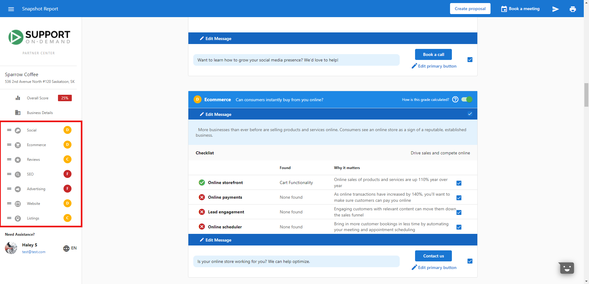

#### Removing Report Sections
You can remove default Snapshot sections for different scopes:

**For All Accounts:**
1. Navigate to **Partner Center > Customize > Partner Defaults > Sales**
2. Select **Edit Default Snapshot Template**
3. Toggle off the sections you wish to remove

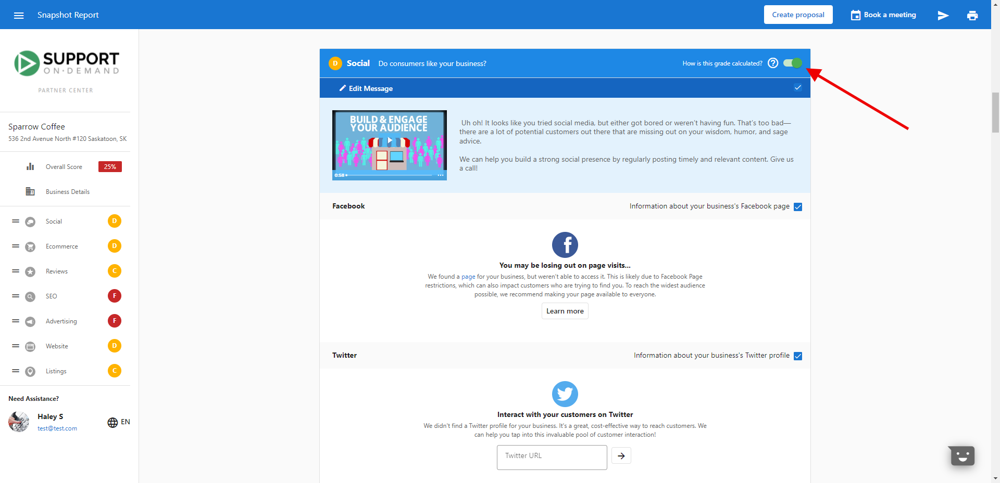

**For Specific Markets:**
1. Go to **Partner Center > Customize > Markets** tab
2. Select the desired market name
3. Navigate to **Sales > Edit Default Snapshot Template**  
4. Check the boxes of sections you wish to remove

### Content Customization

#### Editing Messaging
Personalize the message text that appears in reports:

1. In the report configuration, find the section you want to edit
2. Click on the **Edit** button for the message field
3. Modify the text as needed
4. Save your changes

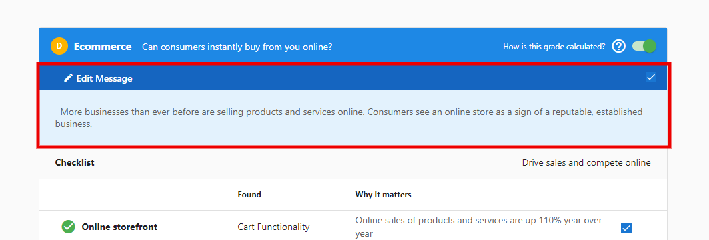

#### Using Default Templates
Snapshot Reports come with pre-configured templates to get you started quickly:

1. Access the report configuration page
2. Select from available templates based on your industry or use case
3. Customize further as needed

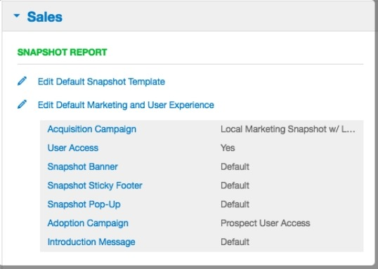

#### Changing Report Language
Customize the language used in your reports for international clients:

1. In the report configuration, locate the language settings
2. Select your preferred language from the dropdown
3. The report content will update to reflect your selection

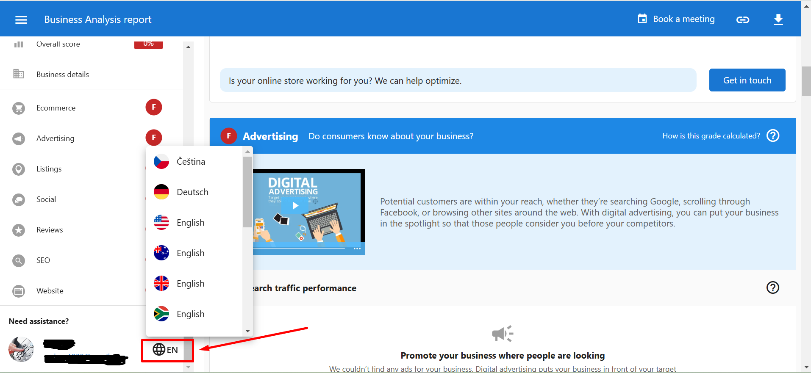

### Custom Headers and Banners

#### Creating Custom Headers
The Snapshot Report incorporates both a header and footer that you can customize:

1. Go to **Partner Center > Administration > Customize**
2. Navigate to **Sales > Snapshot Banner**
3. To begin customizing the header, open the 'source code' option (\<\>)
4. Insert your custom HTML into the 'source code' and click **Ok**
5. Click **Save & Continue**

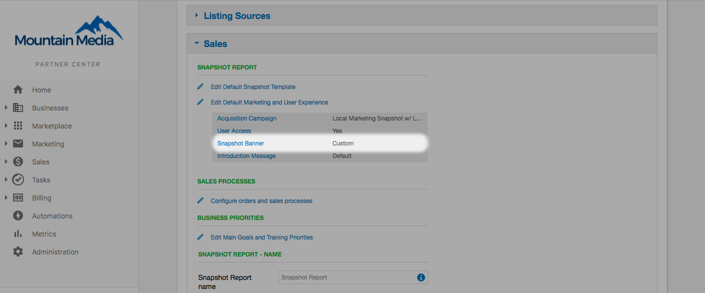

:::note
Remember to use the 'Preview' feature before saving changes, use in-line or scoped CSS when adding custom source code, and ensure any images are externally hosted.
:::

#### Sample HTML for Custom Headers

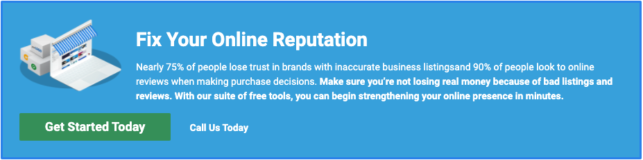

```html
<div class="call-to-action" style="background: #3FAAE0; border: 3px solid #308CED; border-radius: 2px;">

<h1 style="color: white;">Fix Your Online Reputation</h1>
<p style="color: white;">Nearly 75% of people lose trust in brands with inaccurate business listings and 90% of people look to online reviews when making purchase decisions. <strong>Make sure you're not losing real money because of bad listings and reviews. With our suite of free tools, you can begin strengthening your online presence in minutes.</strong></p>
<a class="cta-button snapshot-cta-button" style="background-color: #3d9a63;" target="_blank">Get Started Today</a>
<a class="snapshot-salesperson-phone-container" target="_blank">Call Us Today</a>
</div>
```

:::tip
To change the background color, find `div class="call-to-action" style="background: #3FAAE0;"` and replace `#3FAAE0` with your preferred hex color code.
:::

#### Managing Banner Images

**Updating Banner Images:**
1. From **Partner Center**, go to **Products → Snapshot Report**
2. Click the **Settings** tab
3. Under **Custom Headers**, click the **Edit** icon next to the header
4. Click on the **Logo** tab  
5. Click **Replace** to upload a new image

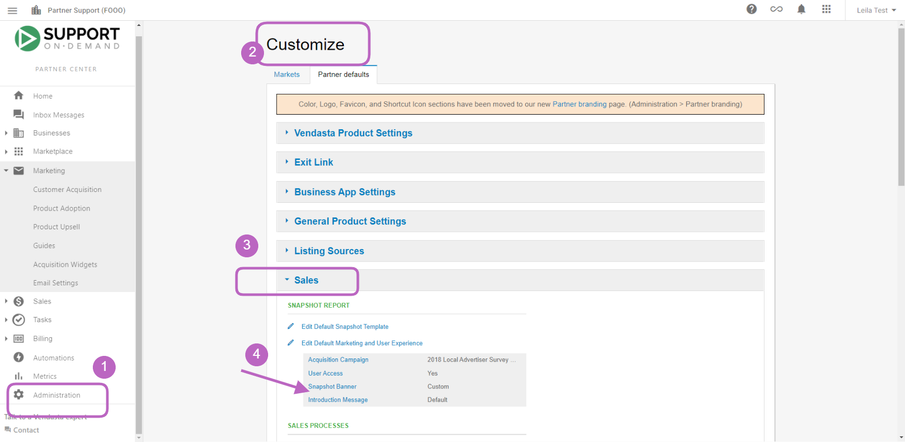

**Optimal Image Specifications:**
- **Recommended size**: 750 x 250 pixels
- **Format**: JPG, PNG, or GIF
- **Quality**: High-resolution for professional appearance
- **Branding**: Should represent your brand consistently

**Replacing Banner Images:**
1. Click **Replace** under the banner image preview
2. Click **Choose File**
3. Select an image from your computer  
4. Click **Upload**

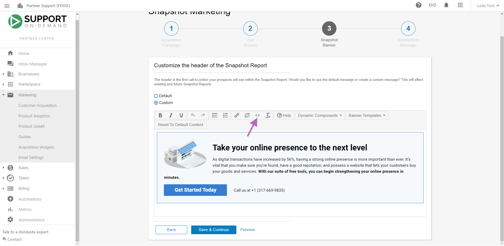

#### Using Banner Images in Email Templates

To use your banner image in email templates:

1. From **Partner Center**, go to **Products → Snapshot Report**
2. Click the **Settings** tab
3. Under **Custom Headers**, click **Edit** next to the header
4. Click on the **Logo** tab
5. Right-click on the banner image
6. Select **Copy Image Address**

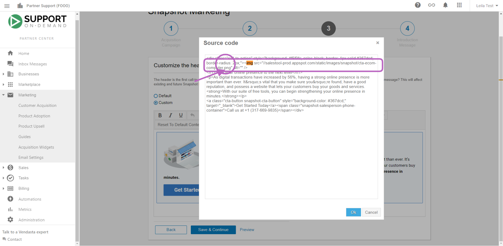

**Inserting into Email Templates:**
1. Go to **Partner Center → Products → Email Marketing**
2. Select or create an email template
3. Click where you want to insert the image
4. Click the image icon in the editor
5. Paste the copied URL into the **Source** field
6. Adjust size and alignment as needed
7. Click **OK** to insert the image

### Package Integration

#### Adding Packages to Reports
Direct clients to your packages and services directly from the Snapshot Report:

1. Go to **Administration > Customize > Sales > Edit Default Snapshot Template**
2. Locate the specific section where you want to enable a package
3. Scroll to the bottom of that section and find **Edit Message**
4. Below the call-to-action button, click **Edit primary button**
5. Select **Package** and choose the specific package from the dropdown menu


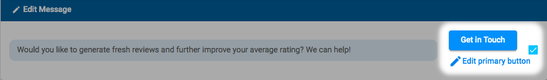

:::note
You can only add packages and services that have been added to your store from the marketplace.
:::

## How to Configure Advanced Customization

### Voice-Over Settings
You can customize voice-over options in the report configuration settings:

1. Navigate to the customization options within your Snapshot Report settings
2. Select different voice-over styles that match your brand
3. Choose from available voice-over types based on your presentation preferences

### Report Naming
Customize report names through the report configuration settings:

1. Access report configuration in your Snapshot Report settings
2. Modify the report title to match your naming conventions
3. Use descriptive names that help organize multiple reports for different prospects

### Template Configuration
Set up default templates for consistent branding:

1. Configure templates based on industry or client type
2. Set default messaging for different markets
3. Establish consistent branding elements across all reports

## Best Practices for Customization

### Design and Branding
1. **Maintain Consistency**: Use consistent colors, fonts, and messaging across all reports
2. **Professional Quality**: Use high-quality images and ensure clean, professional design
3. **Brand Recognition**: Include your logo and brand elements prominently
4. **Mobile Optimization**: Ensure customizations look good on all devices

### Content Strategy
1. **Keep it Concise**: Focus on the most relevant data for your client
2. **Highlight Strengths**: Arrange sections to showcase positive aspects first
3. **Provide Context**: Add custom messages to explain what the data means
4. **Include Actionable Insights**: Always connect data to possible actions or recommendations

### Technical Considerations
1. **Test Before Deploying**: Always preview customizations before saving
2. **External Hosting**: Host images externally for better performance
3. **Responsive Design**: Ensure customizations work across different screen sizes
4. **Browser Compatibility**: Test in different browsers to ensure consistency

## Frequently Asked Questions (FAQs)

<details>
<summary>How do I remove sections of the Snapshot Report?</summary>

For all accounts: Navigate to **Partner Center > Customize > Partner Defaults > Sales > Edit Default Snapshot Template** and toggle off unwanted sections. For specific markets: Go to **Partner Center > Customize > Markets > Select Market > Sales > Edit Default Snapshot Template** and check boxes to remove sections.
</details>

<details>
<summary>Can I change the voice-over type in the Snapshot Report?</summary>

Yes, you can customize voice-over options in the report configuration settings. Navigate to the customization options within your Snapshot Report settings to select different voice-over styles that match your brand and presentation preferences.
</details>

<details>
<summary>How do I edit the cover page of the Snapshot Report?</summary>

Edit the cover page through the banner and header customization options. Go to **Partner Center > Administration > Customize > Sales > Snapshot Banner** to modify headers, add custom HTML, upload banner images, and customize the overall appearance of your report's cover page.
</details>

<details>
<summary>Can I rename the Snapshot Report?</summary>

Yes, you can customize report names through the report configuration settings. This helps organize multiple reports and makes them easier to identify when managing several prospects or different report versions.
</details>

<details>
<summary>How do I edit banners in the Snapshot Report?</summary>

Access banner editing through **Partner Center > Products > Snapshot Report > Settings > Custom Headers > Edit > Logo tab**. From here you can replace banner images, copy image addresses for use in other materials, and manage all visual branding elements.
</details>

<details>
<summary>What image formats are supported for banner images?</summary>

Banner images support JPG, PNG, and GIF formats. The optimal size is 750 x 250 pixels. Use high-quality images that represent your brand consistently. Images that are too large may not display correctly in your Snapshot Reports.
</details>

<details>
<summary>Can I use different templates for different markets?</summary>

Yes, you can configure different templates for specific markets through the **Partner Center > Customize > Markets** section. This allows you to tailor messaging, sections, and branding for different geographic regions or client types.
</details>

<details>
<summary>How do I add custom CSS to my Snapshot Reports?</summary>

When adding custom HTML through the source code editor, use in-line or scoped CSS styles. Avoid external stylesheets as they may not load properly. Test your custom CSS thoroughly across different devices and browsers before implementing.
</details>

## Screenshots or Videos

### Configuration Interface
The customization interface allows comprehensive control over report appearance and content.

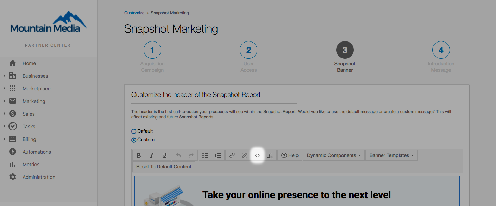

### Template Selection
Choose from pre-built templates or create custom configurations for different use cases.


### Banner Management
Upload and manage banner images for professional report branding.


---