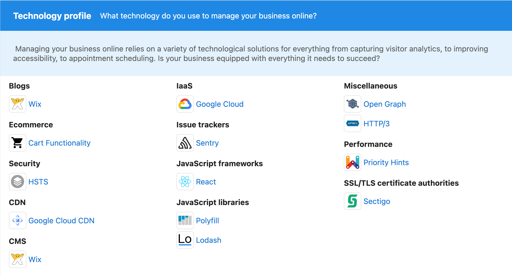
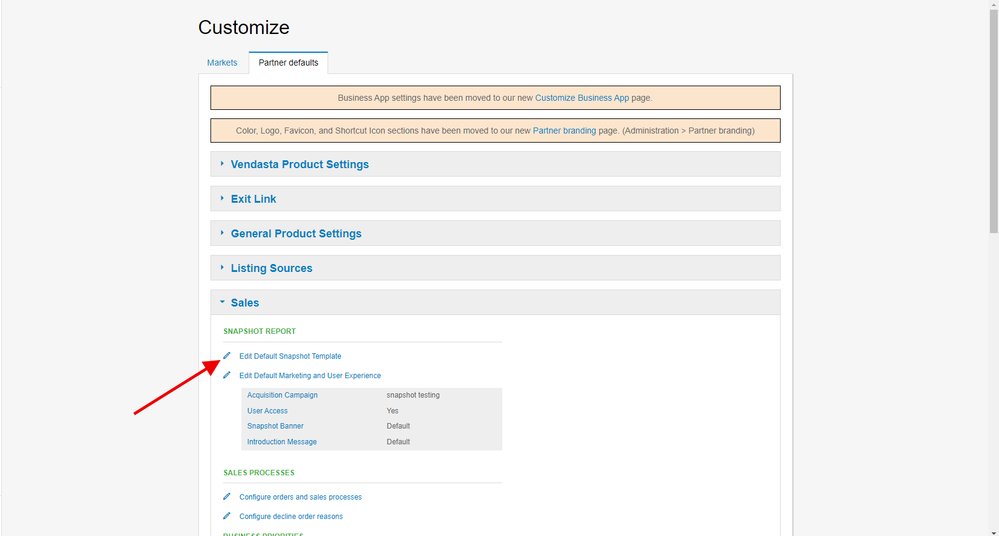

# Snapshot Report Sections – Ecommerce and Technology

## What are Ecommerce and Technology Assessments?

The Ecommerce and Technology sections analyze critical components for online business success. Ecommerce assessment evaluates a business's ability to sell products and services online, while technology analysis reveals the tech stack and marketing tools powering their digital presence.

## Why are Ecommerce and Technology important?

### Ecommerce Impact
- **Revenue Growth**: E-commerce capabilities enable businesses to generate online sales and expand revenue streams
- **Market Expansion**: Online sales allow businesses to reach customers beyond their geographic limitations  
- **Customer Convenience**: Modern customers expect the ability to purchase products and services online
- **Competitive Necessity**: As ecommerce continues growing, businesses without online sales capabilities fall behind competitors

### Technology Impact
- **Operational Efficiency**: The right technology stack can streamline business operations and improve productivity
- **Marketing Effectiveness**: Marketing technology tools help businesses engage customers and generate leads
- **Growth Limitations**: Poor technology choices can hinder SEO efforts and limit business growth potential
- **Solution Opportunities**: Understanding current technology reveals gaps where better solutions can be offered

## What's Included with Ecommerce Assessment?

The Ecommerce section analyzes four critical categories for online business success:

### 1. **Online Storefront**
Checks whether the prospect has the ability to sell their products/services through their website using a recognized commerce platform.

**What it evaluates:**
- Presence of ecommerce platforms (Shopify, WooCommerce, Magento, etc.)
- Product catalog functionality
- Shopping cart implementation
- Checkout process availability

### 2. **Online Payments** 
Determines if the prospect can accept transactions through their site using recognized payment software.

**What it analyzes:**
- Payment gateway integration (PayPal, Stripe, Square, etc.)
- Credit card processing capabilities
- Secure payment forms
- Multiple payment method options

### 3. **Lead Engagement**
Scans the website to see if it's set up to properly engage customers with relevant content, encouraging them to move down the sales funnel or make repeat purchases.

**What it includes:**
- Live chat software presence
- Email marketing integration
- Retargeting capabilities
- Customer relationship management tools
- Personalization features

*Example: Showing recent website visitors digital ads showcasing items they previously viewed in the online store.*

### 4. **Online Scheduler**
Crawls the website to identify scheduling software that makes it easy for customers to book appointments with the business.

**What it detects:**
- Appointment booking systems
- Calendar integration tools
- Automated scheduling software
- Service booking capabilities

### Ecommerce Grade Weighting

The ecommerce grade is weighted based on sales professional insights, focusing on areas that matter most:

- **Online Storefront**: **High weight** (most critical for online sales)
- **Online Payments**: **Medium weight** (important for transaction completion)  
- **Lead Engagement**: **Low weight** (helpful but not essential for basic ecommerce)

This weighting helps focus on areas with the greatest impact on online sales success.

### Automatic Section Enablement

:::info
The Ecommerce section is automatically enabled if you're using the default Snapshot Report configuration. If you've customized the report, you'll need to manually enable this section for it to appear in new reports.
:::

**To enable the Ecommerce section:**
1. Go to **Administration > Customize > Sales > Edit Default Snapshot Template**
2. Find the Ecommerce section and enable it
3. Refresh existing reports to include this section

:::note
This only affects new Snapshot Reports. Existing reports require refreshing to display the ecommerce section. If you've customized the layout, enable the section first before refreshing.
:::

## What's Included with Technology Assessment?

### Technology Stack Analysis

The Technology section displays the complete technology stack and marketing stack used on the prospect's website, providing insights into:

#### Website Platform
- **Content Management Systems**: WordPress, Drupal, Squarespace, Wix
- **Ecommerce Platforms**: Shopify, WooCommerce, Magento, BigCommerce
- **Website Builders**: Custom development, template-based solutions

#### Marketing Technology
- **Analytics Tools**: Google Analytics, tracking pixels, conversion monitoring
- **Email Marketing**: Mailchimp, Constant Contact, automated email systems
- **Social Media Integration**: Social media widgets, sharing tools
- **Lead Generation**: Contact forms, lead capture tools, CRM integration

#### Performance and Security
- **Hosting Solutions**: Server technology, CDN usage, security certificates
- **Performance Tools**: Caching systems, optimization plugins
- **Security Features**: SSL certificates, security plugins, backup systems

### Strategic Technology Insights

The technology analysis helps identify opportunities to offer better solutions:

#### Solution Opportunities
- **Platform Limitations**: Are they using website solutions that slow down SEO efforts, such as Squarespace or Wix?
- **Missing Tools**: What marketing or business tools are absent from their current setup?
- **Outdated Technology**: Are they using legacy systems that could be modernized?
- **Integration Gaps**: Where could better integrations improve their efficiency?

#### Competitive Analysis
- **Industry Standards**: How does their technology stack compare to industry best practices?
- **Growth Limitations**: What technology constraints might limit their business growth?
- **Upgrade Opportunities**: Where can technology improvements drive better results?

### Technology Section Configuration

The Technology section is automatically included with default configurations, but can be customized:

**To disable the Technology section:**
1. Go to **Administration > Customize > Sales > Edit Default Snapshot Template**
2. Find the Technology section
3. Uncheck the checkbox at the top of the section

:::note
This only affects new Snapshot Reports. Existing reports need refreshing to reflect changes. If you've customized the layout, adjust settings before refreshing reports.
:::

## How to Use Ecommerce and Technology Information

### Ecommerce Strategy Development
1. **Assess Current Capabilities**: Identify gaps in online sales infrastructure
2. **Prioritize Improvements**: Focus first on high-weight areas (storefront, payments)
3. **Plan Implementation**: Develop step-by-step approach for ecommerce enhancement
4. **Track Performance**: Monitor ecommerce metrics after improvements
5. **Scale Gradually**: Add advanced features as basic capabilities are established

### Technology Optimization
1. **Audit Current Stack**: Evaluate effectiveness of existing technology
2. **Identify Bottlenecks**: Find technology limitations hindering growth
3. **Research Alternatives**: Compare current tools with better solutions
4. **Plan Migrations**: Develop strategies for upgrading outdated systems
5. **Integrate Solutions**: Ensure new technology works well together

## Recommended Next Steps

### Ecommerce Enhancements
- **Storefront Development**: Implement or improve online store functionality
- **Payment Integration**: Add secure, multiple payment options
- **Customer Experience**: Enhance lead engagement and retargeting capabilities
- **Appointment Systems**: Add online scheduling for service businesses
- **Mobile Optimization**: Ensure ecommerce works seamlessly on mobile devices

### Technology Improvements
- **Platform Assessment**: Evaluate if current website platform meets business needs
- **Marketing Tools**: Add missing marketing technology for better lead generation
- **Performance Optimization**: Upgrade hosting, caching, and speed optimization tools
- **Security Enhancement**: Implement or upgrade security measures and SSL certificates
- **Analytics Implementation**: Add comprehensive tracking and analytics tools

## Frequently Asked Questions (FAQs)

Why is it showing an F when my prospect has ecommerce enabled on their website?

While the system covers main solution providers in each market, the growing and dynamic ecommerce industry may include smaller or custom platforms that aren't recognized. This causes the system to show that nothing was found. The platform may also show "none found" if the ecommerce solution is behind a login page that can't be crawled. If you notice a specific platform missing, contact support to add it to the recognition list.

What does 'Lead Engagement' refer to in the ecommerce section?

Lead engagement scans the website for software that allows businesses to engage with current or recent website visitors. This includes solutions like live chat, retargeting campaigns, email capture forms, and personalized content. For example, showing recent website visitors digital ads featuring items they previously viewed in the online store.

Is the ecommerce section automatically enabled?

The ecommerce section is automatically enabled with default configurations. If you've customized the report in any way, you'll need to manually enable this section for it to appear in Snapshot Reports. This respects existing customizations while allowing new features to be added.

Can the technology section identify custom or proprietary systems?

The technology section identifies widely-used, recognizable platforms and tools. Custom or proprietary systems may not be detected if they don't use standard signatures or technologies. However, the system can often identify underlying frameworks, hosting providers, and common third-party integrations even in custom setups.

How can I use technology insights to sell solutions?

Use technology insights to identify gaps in the prospect's current setup, highlight limitations of their current platform (like SEO challenges with certain website builders), propose better alternatives for outdated tools, and demonstrate how technology improvements can drive business growth and efficiency.

What if a business doesn't need ecommerce capabilities?

Not every business needs full ecommerce functionality. Service-based businesses might benefit more from online scheduling and lead engagement tools. Use the ecommerce analysis to identify which components (payment processing, scheduling, lead engagement) would be most valuable for their specific business model.

How often should technology stacks be evaluated?

Technology should be evaluated regularly as business needs evolve and new solutions become available. Annual reviews are recommended, with more frequent assessments for rapidly growing businesses or when experiencing performance issues. The Snapshot Report provides a baseline for tracking technology improvements over time.

Can I customize which technology categories are analyzed?

Yes, you can customize the technology section through the Snapshot Report configuration settings. You can enable or disable the entire technology section, and in some cases, focus on specific types of technology analysis based on your client's industry and needs.

## Screenshots or Videos

### Ecommerce Section Analysis
The Ecommerce section breaks down four critical categories for online business success with detailed grading.

### Technology Stack Overview
The Technology section displays comprehensive information about website platform and marketing tools.

### Configuration Options
Screenshots showing how to enable/disable ecommerce and technology sections in report customization.

---