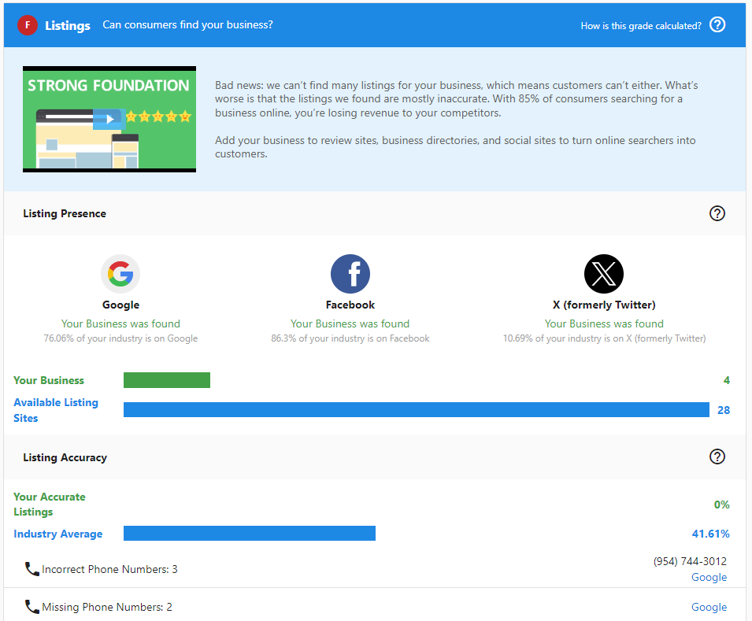
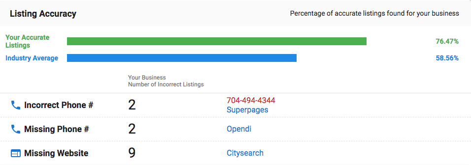
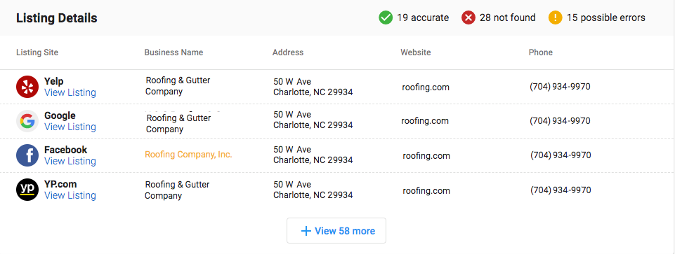

# Snapshot Report Sections – Business Listings and Reviews

## What are Business Listings and Reviews?

Business listings and online reviews are fundamental components of digital presence that directly impact customer trust and search engine visibility. The Snapshot Report evaluates both how well a business is listed across online directories and how their reputation appears through customer reviews.

## Why are Business Listings and Reviews important?

### Business Listings Impact
- **Improved Search Visibility**: Consistent, accurate listings help businesses rank better in search results
- **Customer Trust**: Accurate listings ensure customers find correct contact details, hours, and locations
- **Competitive Advantage**: Better listing presence and accuracy help businesses stand out from competitors

### Reviews Impact
- **Customer Decision Making**: 90% of people look to online reviews when making purchase decisions
- **Trust Building**: Nearly 75% of people lose trust in brands with inaccurate business listings
- **Revenue Protection**: Poor listings and reviews can cause businesses to lose real money from lost customers

## What's Included with Business Listings Assessment?

### Listing Score Components

The Listing Score indicates how well the business performs with online listings based on two primary factors:

#### 1. Listing Presence
Shows how many directories include the business across the web. A higher percentage means the business is listed in more directories, increasing visibility to potential customers.

#### 2. Listing Accuracy
Displays how accurate and consistent business information is across different directories. Inconsistent or inaccurate listings can confuse customers and hurt search engine rankings.

### Listing Details Analysis

The detailed section provides specific information about each directory where the business is listed, showing:
- Which directories list the business
- Whether listings are accurate or have inconsistencies  
- What specific information might be incorrect or missing

## What's Included with Reviews Assessment?

### Review Score Calculation

The Reviews grade combines scores from multiple subsections:

- **Reviews Found**: Volume of reviews across platforms (compared to industry percentiles)
- **Reviews Found Per Month**: Frequency of new reviews (monthly rate)
- **Average Review Score**: Overall rating across all review sources
- **Number of Review Sources**: How many different platforms have reviews

Each subsection receives a grade (A-F) based on industry percentiles:
- **A** = 90-100th percentile
- **B** = 75-89th percentile  
- **C** = 50-74th percentile
- **D** = 30-49th percentile
- **F** = 0-29th percentile

### Review Calculation Example

If a business receives grades of C, C, C, and C for the four subsections:
- Convert to point values: 2, 2, 2, 2 = 8 total points
- Divide by number of subsections: 8 ÷ 4 = 2
- Score of 2 = Overall grade of **C**

## How to Use Listings and Reviews Information

### For Business Listings
1. **Identify Missing Listings**: Look for important directories where the business is not listed
2. **Correct Inaccuracies**: Note inconsistencies in business information across directories
3. **Prioritize High-Impact Directories**: Focus first on the most important directories for the business's industry
4. **Track Improvements**: Use regular Snapshot Reports to monitor progress as listings are added or corrected

### For Online Reviews
1. **Assess Review Volume**: Compare against industry standards to identify gaps
2. **Evaluate Review Quality**: Look at average ratings and recent review trends
3. **Identify Review Sources**: Determine which platforms need attention
4. **Monitor Review Frequency**: Track if the business is generating consistent new reviews

## Recommended Next Steps

### Business Listings Improvements
- Use listing distribution services to automatically sync business information across directories
- Create a plan to add the business to missing directories
- Correct any inaccurate information found in existing listings
- Schedule regular checks to ensure listing information stays accurate as the business evolves

### Reviews Management
- Implement review monitoring across all major platforms
- Develop a strategy to encourage satisfied customers to leave reviews
- Create response protocols for both positive and negative reviews
- Track review performance metrics over time

## Frequently Asked Questions (FAQs)

How does the Snapshot Report find business listings?

The platform scans the internet for business information, searching online listing sources and directories. It matches the information found with what's entered into the platform (including potential variations) to identify which citations belong to that business. This process can take up to 24 hours to ensure listing sources don't identify the system as malicious software.

Why are some business listings showing as inaccurate?

Listing inaccuracies occur when business information differs across directories. Common issues include inconsistent business names, outdated addresses or phone numbers, incorrect hours of operation, or missing information. These inconsistencies can confuse customers and negatively impact search engine rankings.

How often should I check business listing accuracy?

Regular monitoring is essential as business information can change and directories may update independently. We recommend checking listings quarterly or whenever business information changes (address, phone, hours, etc.). Use Snapshot Reports to track improvements over time.

What review platforms does the Snapshot Report analyze?

The Snapshot Report analyzes reviews from major platforms including Google Business Profile, Facebook, Yelp, industry-specific review sites, and other relevant review sources based on the business type and location. The system automatically identifies the most important review sources for each business category.

How can I improve my business's review score?

Focus on generating more positive reviews by asking satisfied customers to share their experiences, responding professionally to all reviews (positive and negative), improving customer service to naturally generate better reviews, and monitoring review platforms regularly to address issues quickly.

Why might a business have few reviews despite being established?

Established businesses may have low review counts if they haven't actively encouraged customer reviews, aren't listed on major review platforms, have primarily offline customer interactions, or operate in industries where customers don't typically leave reviews. Implementing a review generation strategy can help increase review volume.

Can I see which specific directories are missing or inaccurate?

Yes, the Listing Details section shows specific information about each directory where the business is listed, including which directories are missing the business and what specific information might be incorrect or inconsistent across existing listings.

How do review scores compare to industry standards?

Review scores are calculated using industry percentiles, meaning businesses are compared to others in their specific industry and geographic area. This provides relevant benchmarks and ensures comparisons are meaningful for that particular business type and location.

## Screenshots or Videos

### Listings Section Overview
The Listings section displays overall listing performance with detailed breakdowns of presence and accuracy metrics.

### Reviews Section Analysis
The Reviews section shows comprehensive review performance across multiple platforms and metrics.

---

**Related Articles:**
- [Snapshot Report – Complete Guide](./snapshot-report-overview.mdx)
- [Snapshot Report Sections – Social Media and Advertising](./snapshot-report-social-advertising.mdx)
- [Snapshot Report Analytics and Grading](./snapshot-report-analytics.mdx)