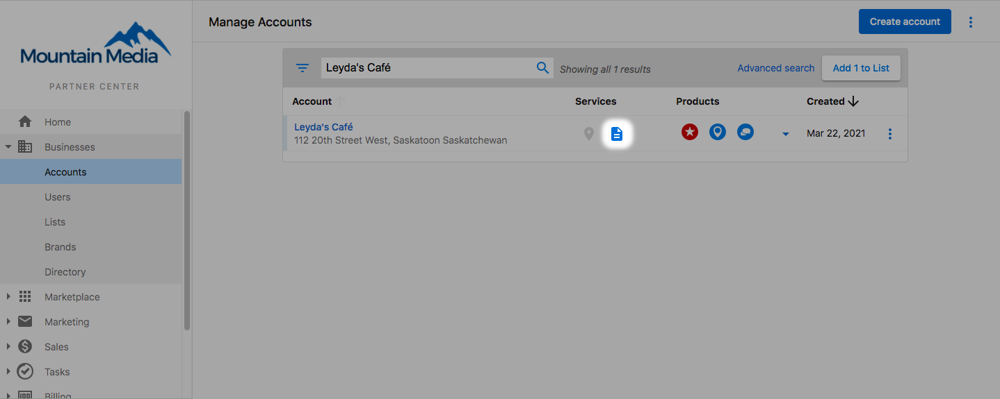
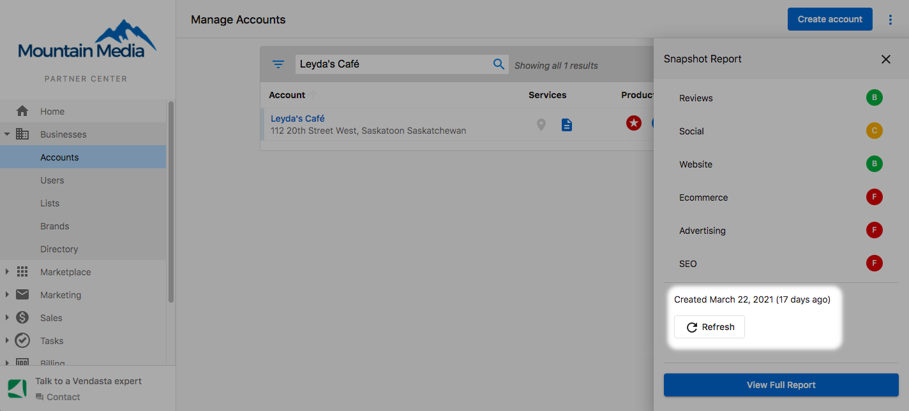
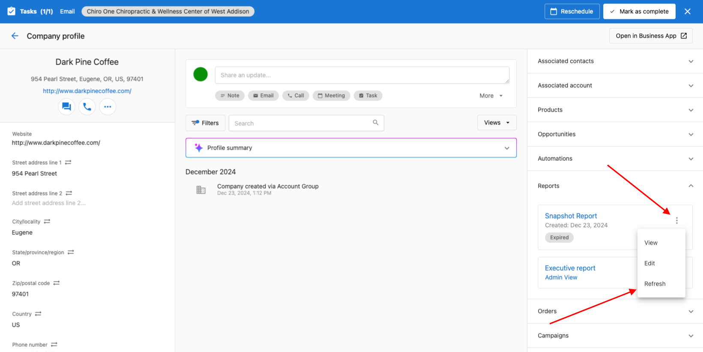
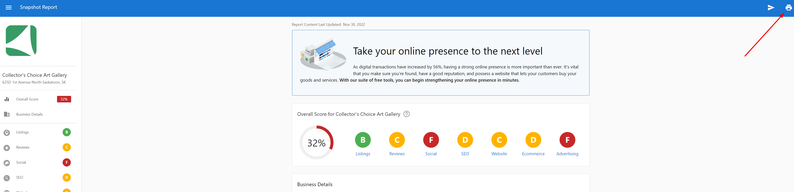
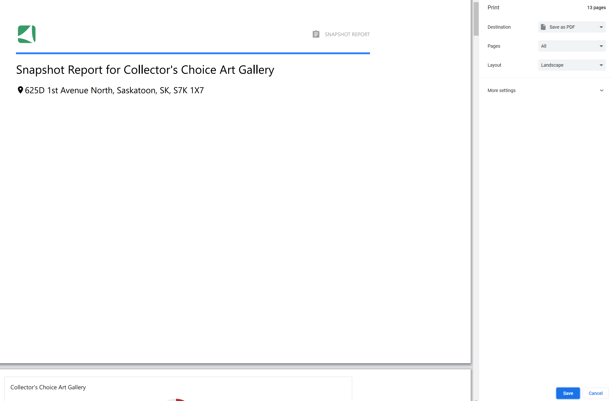
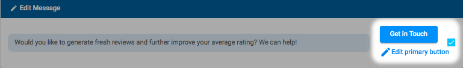

# Maximize Snapshot Report value

## What is maximizing Snapshot Report value?

Maximizing Snapshot Report value means turning your $2 investment into qualified leads, higher close rates, and increased revenue. This includes using reports as lead magnets, automating follow-up sequences, optimizing costs, and integrating solutions that convert prospects to customers.

## Why focus on value maximization?

- **ROI Optimization**: Turn each $2 report into qualified leads worth hundreds or thousands
- **Lead Generation**: Use reports as powerful lead magnets that prospects actually want
- **Sales Acceleration**: Automated workflows nurture prospects while you focus on closing
- **Cost Efficiency**: Strategic report usage minimizes waste and maximizes impact
- **Competitive Advantage**: Professional automation sets you apart from competitors

## Strategic report management

### When to refresh reports

Snapshot Reports are active and accurate for **seven days** after creation. After this period, the report stops updating and requires refreshing to provide current data. Common refresh scenarios include:

- **Extended Sales Cycles**: When you need more time to close a deal
- **Rekindling Prospects**: Providing updated data to re-engage old prospects  
- **Significant Changes**: When the business has made major website or online presence updates
- **Competitive Analysis**: When you want the most current competitive comparison data

### Refresh methods

#### Individual Account Refresh via Manage Accounts

**Steps:**
1. Navigate to **Partner Center > Accounts > Manage Accounts**
2. Open the Snapshot scorecard by clicking the **Snapshot icon** next to the account name
3. At the bottom of the scorecard, find the creation date and refresh option
4. Click **Refresh** and confirm the action

:::note
The refresh option only appears if the report is older than 7 days.
:::

#### Individual Account Refresh via Companies

**Steps:**
1. Navigate to **CRM > Companies > Select the desired company**
2. Find the expired Snapshot Report in the **Reports** section on the right side
3. Click the 3 dots next to the report
4. Select **Refresh**

#### Bulk Refresh Options

You can create and refresh multiple Snapshot Reports using **Lists** in Partner Center for efficient bulk management.

### Refresh characteristics

**Important Refresh Details:**
- **Same Cost**: Refreshed reports cost the same as new reports ($2 standard fee)
- **Processing Time**: Wait minimum of 10 minutes before accessing refreshed reports
- **Data Source**: Refreshed reports use current data from live sources
- **Report Replacement**: New refreshed report overrides the old report completely

:::warning
When a Snapshot Report is refreshed, the new report completely replaces the old report. Previous data is not preserved.
:::

## Professional report delivery

### Saving reports as PDF

**Export Process:**
1. Click **View Full Report** on the Snapshot Report
2. Click the printer icon in the top right corner of the report
3. Select **Save as PDF**

### PDF export benefits

- **Offline Access**: Share reports without requiring platform access
- **Professional Presentation**: Clean, branded PDF format for client meetings
- **Email Attachment**: Easy to include in email communications  
- **Print Capability**: Physical copies for in-person presentations
- **Archive Storage**: Keep historical records of prospect assessments

### Video tutorial

<iframe src="https://drive.google.com/file/d/13Ni-ECrVhce5p6AuJSrq_E2fdcNxoqUL/preview" width="640" height="480" allowFullScreen></iframe>

## Cost optimization strategies

### Snapshot Report pricing structure

#### Standard Fees
- **New Report Creation**: $2 per report
- **Report Refresh**: $2 per report (separate from creation)
- **Automatic Email Campaigns**: Standard fees apply for reports created or refreshed

#### Subscription Allocations
Some subscription tiers include a number of 'free' Snapshot Reports that can **only** be used for:
- Creating new Snapshot Reports for prospecting purposes
- **Not applicable** for refreshing existing reports

### Billing scenarios

#### Email Campaign Integration
When using Snapshot Creation Events in email campaigns:

- **No Existing Report**: System creates new report (standard fee applies)
- **Report Older than 30 Days**: System automatically refreshes report (standard fee applies)  
- **Report Younger than 30 Days**: System uses existing report (no additional charge)

#### Multi-Report Considerations
- Each individual report creation or refresh incurs the standard fee
- Bulk operations are charged per report processed
- Failed report generations are typically not charged

### Cost management strategies

1. **Plan Report Timing**: Create reports when you're ready to actively prospect
2. **Use Existing Reports**: Leverage reports under 30 days old in email campaigns
3. **Batch Creation**: Plan multiple reports strategically to maximize efficiency
4. **Monitor Usage**: Track report creation to stay within budget parameters

## Convert prospects with package integration

### Adding packages to reports

Direct prospects to your packages and services through call-to-action buttons in reports:

#### Configuration Steps
1. Go to **Administration > Customize > Sales > Edit Default Snapshot Template**
2. Locate the specific section for package integration
3. Scroll to **Edit Message** at the bottom of the section
4. Click **Edit primary button** below the call-to-action
5. Select **Package** and choose from the dropdown menu

#### Package Integration Benefits

- **Direct Client Access**: Prospects can access your solutions without salesperson intervention
- **Immediate Engagement**: Ideal for free versions or trial offers that can be used immediately
- **Increased Conversion**: Direct paths to solutions can improve close rates
- **Automated Sales Process**: Reduces manual follow-up requirements

:::note
You can only add packages and services that have been added to your store from the marketplace.
:::

## Use Snapshot Reports as lead magnets

### Automated lead capture with forms

Transform Snapshot Reports into powerful lead magnets that work 24/7:

**Setup Process:**
1. **Create Form**: Go to Marketing > Forms > Create form > Use "Acquisition Widget" template
2. **Business Auto-Fill**: The company name field uses Google Places API to auto-populate business details when prospects find their business
3. **Configure Automation**: 
   - Go to form's Automation tab
   - Configure marketing email campaign (or choose from recommended campaigns if you don't have one)
   - Turn on the automation
4. **Automated Workflow**: When someone fills the form:
   - Snapshot Report generates automatically
   - Marketing email sends once report is ready (24 hours later)
   - Lead appears in your CRM with complete business data

### Lead magnet benefits
- **High Value Offer**: Prospects get comprehensive business assessment worth hundreds of dollars
- **Automated Qualification**: Google Places integration ensures accurate business data
- **Professional Follow-up**: Automated email sequence maintains momentum while you focus on closing
- **24/7 Lead Generation**: Forms capture leads even when you're not working

## Value maximization strategies

### Lead magnet optimization
1. **Form Placement**: Embed forms on high-traffic pages and blog posts about digital marketing
2. **Compelling Headlines**: "Get Your Free Digital Marketing Assessment" or "See How You Compare to Competitors"
3. **Trust Signals**: Include testimonials and partner logos near forms
4. **Follow-up Tracking**: Monitor form conversion rates and optimize placement

### Cost-effective refresh strategy
1. **Strategic Timing**: Only refresh when actively working a hot prospect
2. **Batch Creation**: Plan multiple reports for coordinated outreach campaigns
3. **Campaign Integration**: Use 30-day refresh rule in email campaigns to minimize costs
4. **ROI Tracking**: Calculate cost per qualified lead to justify report expenses

### Conversion optimization
1. **Package Placement**: Add relevant solutions to high-impact report sections
2. **Free Trial Strategy**: Use reports to promote free trials and demos
3. **Follow-up Automation**: Set up email sequences that reference specific report findings
4. **Sales Process Integration**: Train team to reference report data in sales calls

## Frequently asked questions (FAQs)

Why am I charged for refreshing Snapshot Reports?

Snapshot Reports are prospecting tools typically generated once during the prospecting phase. Creating and refreshing are separate products, both charging $2. Some subscription tiers include 'free' reports that can only be used for creating new reports, not refreshing existing ones, as refreshing is treated as a separate product.

How long does a Snapshot Report take to be ready and when is best to present it?

Wait a minimum of 24 hours before viewing reports. The system scans the internet for business information and matches it across directories, which takes time to avoid being identified as malicious software. Reports continue gathering data for up to 7 days, with the most accurate presentation time being at the 7-day mark.

How do I track ROI from Snapshot Report lead magnets?

Monitor form submission rates in Marketing > Forms analytics, track lead quality in CRM, and measure conversion rates from Snapshot Report leads to closed deals. Calculate cost per qualified lead (report cost ÷ qualified leads) to optimize your investment.

What happens if I refresh a report multiple times?

Each refresh generates a completely new report and incurs the standard $2 fee. The new report replaces the previous version entirely—previous data is not preserved. Multiple refreshes in short periods are not recommended as data may not change significantly.

Can I recover old report data after refreshing?

No, refreshing completely replaces the old report with new data. If you need to preserve historical data, save the report as a PDF before refreshing, or maintain separate records of key metrics for comparison purposes.

When do prospects receive their Snapshot Report after filling the form?

Reports generate automatically when forms are submitted. The marketing email containing the report link sends 24 hours later, giving the report time to gather comprehensive data for maximum impact.

Can I set up automatic report refreshing?

While reports don't automatically refresh on their own, you can use email campaigns with Snapshot Creation Events to automatically refresh reports older than 30 days when sending campaigns. This provides a semi-automated approach to keeping prospect data current.

What's the difference between creating and refreshing in terms of data?

Creating a report generates entirely new data analysis for a business. Refreshing updates existing report data with current information. Both processes involve the same comprehensive analysis and data collection, which is why they cost the same amount.

---