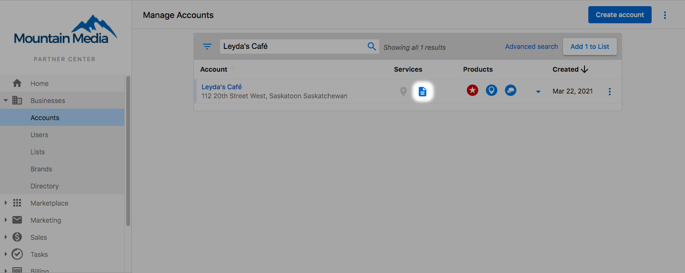
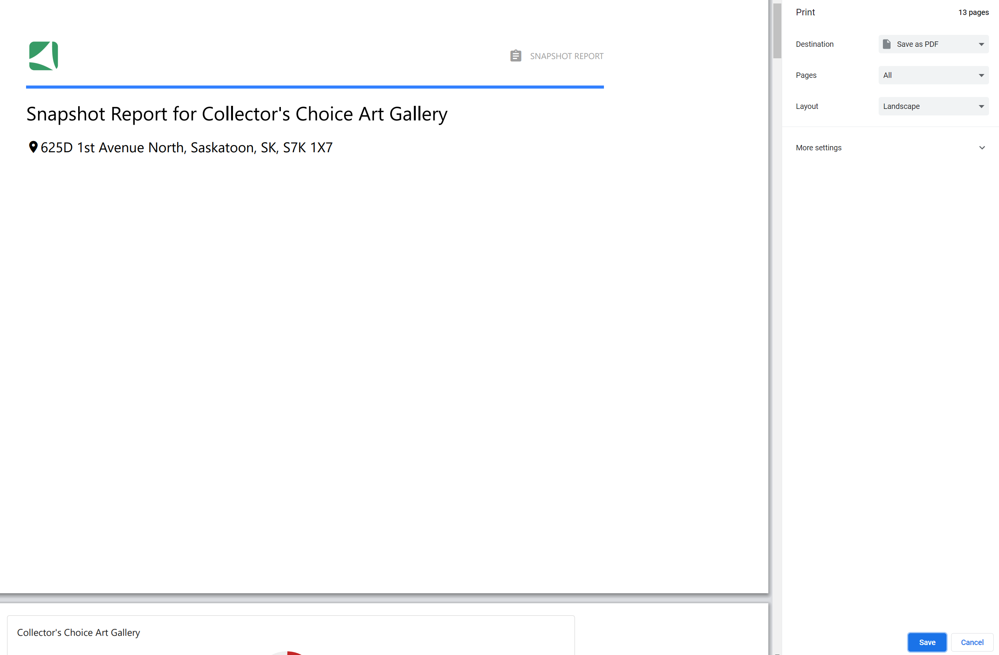

# Snapshot Report Management and Billing

## What is Snapshot Report Management?

Snapshot Report management encompasses all activities related to maintaining, updating, and utilizing your reports effectively. This includes refreshing outdated reports, exporting reports as PDFs, understanding billing structures, and integrating packages to maximize client engagement.

## Why is Management and Billing important?

- **Report Accuracy**: Proper management ensures prospects receive current, accurate data
- **Cost Control**: Understanding billing helps manage expenses and plan budgets
- **Client Engagement**: Effective management enhances prospect experience and conversion rates
- **Business Growth**: Proper utilization of reports can increase close rates and revenue
- **Operational Efficiency**: Streamlined management processes save time and reduce errors

## What's Included with Report Refresh Management?

### When to Refresh Reports

Snapshot Reports are active and accurate for **seven days** after creation. After this period, the report stops updating and requires refreshing to provide current data. Common refresh scenarios include:

- **Extended Sales Cycles**: When you need more time to close a deal
- **Rekindling Prospects**: Providing updated data to re-engage old prospects  
- **Significant Changes**: When the business has made major website or online presence updates
- **Competitive Analysis**: When you want the most current competitive comparison data

### Refresh Methods

#### Individual Account Refresh via Manage Accounts

**Steps:**
1. Navigate to **Partner Center > Accounts > Manage Accounts**
2. Open the Snapshot scorecard by clicking the **Snapshot icon** next to the account name
3. At the bottom of the scorecard, find the creation date and refresh option
4. Click **Refresh** and confirm the action

:::note
The refresh option only appears if the report is older than 7 days.
:::

#### Individual Account Refresh via Companies

**Steps:**
1. Navigate to **CRM > Companies > Select the desired company**
2. Find the expired Snapshot Report in the **Reports** section on the right side
3. Click the 3 dots next to the report
4. Select **Refresh**

#### Bulk Refresh Options

You can create and refresh multiple Snapshot Reports using **Lists** in Partner Center for efficient bulk management.

### Refresh Characteristics

**Important Refresh Details:**
- **Same Cost**: Refreshed reports cost the same as new reports ($2 standard fee)
- **Processing Time**: Wait minimum of 10 minutes before accessing refreshed reports
- **Data Source**: Refreshed reports use current data from live sources
- **Report Replacement**: New refreshed report overrides the old report completely

:::warning
When a Snapshot Report is refreshed, the new report completely replaces the old report. Previous data is not preserved.
:::

## What's Included with PDF Export and Sharing?

### Saving Reports as PDF

**Export Process:**
1. Click **View Full Report** on the Snapshot Report
2. Click the printer icon in the top right corner of the report
3. Select **Save as PDF**

### PDF Export Benefits

- **Offline Access**: Share reports without requiring platform access
- **Professional Presentation**: Clean, branded PDF format for client meetings
- **Email Attachment**: Easy to include in email communications  
- **Print Capability**: Physical copies for in-person presentations
- **Archive Storage**: Keep historical records of prospect assessments

### Video Tutorial

<iframe src="https://drive.google.com/file/d/13Ni-ECrVhce5p6AuJSrq_E2fdcNxoqUL/preview" width="640" height="480" allowFullScreen></iframe>

## What's Included with Billing Management?

### Snapshot Report Pricing Structure

#### Standard Fees
- **New Report Creation**: $2 per report
- **Report Refresh**: $2 per report (separate from creation)
- **Automatic Email Campaigns**: Standard fees apply for reports created or refreshed

#### Subscription Allocations
Some subscription tiers include a number of 'free' Snapshot Reports that can **only** be used for:
- Creating new Snapshot Reports for prospecting purposes
- **Not applicable** for refreshing existing reports

### Billing Scenarios

#### Email Campaign Integration
When using Snapshot Creation Events in email campaigns:

- **No Existing Report**: System creates new report (standard fee applies)
- **Report Older than 30 Days**: System automatically refreshes report (standard fee applies)  
- **Report Younger than 30 Days**: System uses existing report (no additional charge)

#### Multi-Report Considerations
- Each individual report creation or refresh incurs the standard fee
- Bulk operations are charged per report processed
- Failed report generations are typically not charged

### Cost Management Strategies

1. **Plan Report Timing**: Create reports when you're ready to actively prospect
2. **Use Existing Reports**: Leverage reports under 30 days old in email campaigns
3. **Batch Creation**: Plan multiple reports strategically to maximize efficiency
4. **Monitor Usage**: Track report creation to stay within budget parameters

## What's Included with Package Integration?

### Adding Packages to Reports

Direct prospects to your packages and services through call-to-action buttons in reports:

#### Configuration Steps
1. Go to **Administration > Customize > Sales > Edit Default Snapshot Template**
2. Locate the specific section for package integration
3. Scroll to **Edit Message** at the bottom of the section
4. Click **Edit primary button** below the call-to-action
5. Select **Package** and choose from the dropdown menu

#### Package Integration Benefits

- **Direct Client Access**: Prospects can access your solutions without salesperson intervention
- **Immediate Engagement**: Ideal for free versions or trial offers that can be used immediately
- **Increased Conversion**: Direct paths to solutions can improve close rates
- **Automated Sales Process**: Reduces manual follow-up requirements

:::note
You can only add packages and services that have been added to your store from the marketplace.
:::

### Acquisition Widget Management

#### Widget Overview
The Acquisition Widget allows prospects to request Snapshot Reports directly from your website:

**Automatic Process:**
1. Customer requests Snapshot Report via widget
2. Account is created in the platform
3. Assigned salesperson receives the prospect
4. Email notification is sent to the salesperson

#### Widget Benefits
- **Lead Generation**: Captures prospects organically through your website
- **Automated Assignment**: Streamlines prospect distribution to sales team
- **Immediate Notification**: Ensures prompt follow-up with new prospects
- **Self-Service Option**: Allows prospects to request reports at their convenience

## How to Optimize Report Management

### Best Practices for Refresh Management
1. **Monitor Report Age**: Track which reports are approaching the 7-day limit
2. **Plan Refresh Timing**: Refresh reports when you have active prospect engagement
3. **Budget Planning**: Account for refresh costs in your sales budget
4. **Data Comparison**: Use refreshed reports to show improvement over time

### Efficient PDF Workflow
1. **Standardize Process**: Train team on consistent PDF export procedures
2. **File Organization**: Establish naming conventions for saved PDF reports
3. **Distribution Lists**: Maintain contact lists for easy report sharing
4. **Follow-up Tracking**: Monitor which prospects have received PDF reports

### Package Integration Strategy
1. **Strategic Placement**: Add packages to sections most relevant to your offerings
2. **Free Trial Focus**: Use packages for free or trial versions to encourage immediate action
3. **Clear Value Proposition**: Ensure package descriptions clearly communicate benefits
4. **Track Performance**: Monitor click-through rates and conversions from package links

## Frequently Asked Questions (FAQs)

Why am I charged for refreshing Snapshot Reports?

Snapshot Reports are prospecting tools typically generated once during the prospecting phase. Creating and refreshing are separate products, both charging $2. Some subscription tiers include 'free' reports that can only be used for creating new reports, not refreshing existing ones, as refreshing is treated as a separate product.

How long does a Snapshot Report take to be ready and when is best to present it?

Wait a minimum of 24 hours before viewing reports. The system scans the internet for business information and matches it across directories, which takes time to avoid being identified as malicious software. Reports continue gathering data for up to 7 days, with the most accurate presentation time being at the 7-day mark.

Can I get notifications when Snapshot Reports are ready?

Yes, when prospects request reports via the Acquisition Widget, the assigned salesperson receives email notifications. For manually created reports, you can check report status in the Partner Center or set up reminders to check reports after the recommended 24-hour waiting period.

What happens if I refresh a report multiple times?

Each refresh generates a completely new report and incurs the standard $2 fee. The new report replaces the previous version entirely—previous data is not preserved. Multiple refreshes in short periods are not recommended as data may not change significantly.

Can I recover old report data after refreshing?

No, refreshing completely replaces the old report with new data. If you need to preserve historical data, save the report as a PDF before refreshing, or maintain separate records of key metrics for comparison purposes.

How do I know if someone requested a Snapshot Report via the Acquisition Widget?

Immediately after a customer requests a report via the Acquisition Widget, an account is created in the platform, the assigned salesperson gets the prospect, and they receive an email notification. You can also monitor new accounts in the Partner Center for widget-generated leads.

Can I set up automatic report refreshing?

While reports don't automatically refresh on their own, you can use email campaigns with Snapshot Creation Events to automatically refresh reports older than 30 days when sending campaigns. This provides a semi-automated approach to keeping prospect data current.

What's the difference between creating and refreshing in terms of data?

Creating a report generates entirely new data analysis for a business. Refreshing updates existing report data with current information. Both processes involve the same comprehensive analysis and data collection, which is why they cost the same amount.

## Screenshots or Videos

### Refresh Management Interface
Screenshots showing the refresh process through different Partner Center pathways.

### PDF Export Process
Visual guide to saving reports as PDF documents for offline use.

### Package Integration Setup
Interface for configuring package integration within report sections.

---