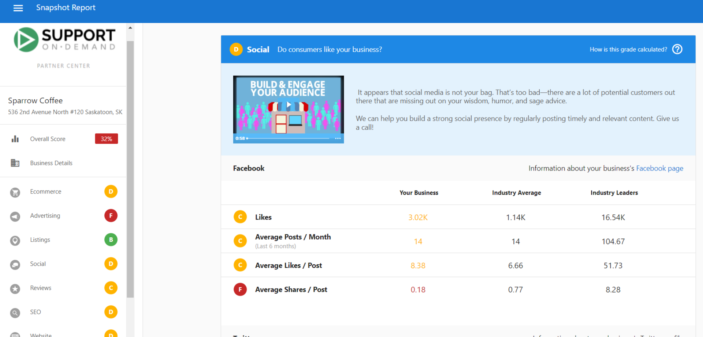
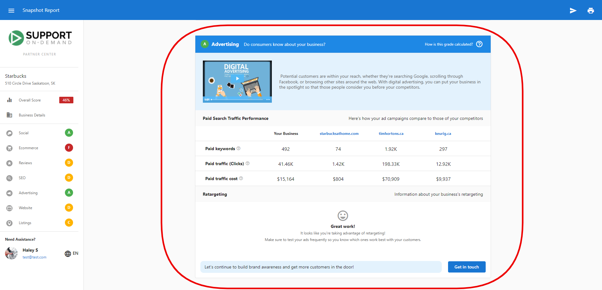
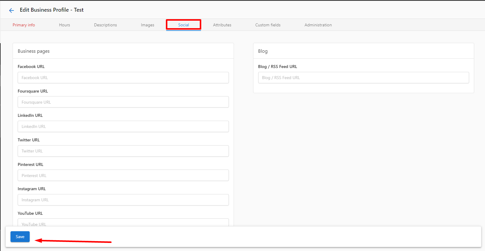

# Snapshot Report Sections – Social Media and Advertising

## What are Social Media and Advertising Assessments?

The Social Media and Advertising sections of the Snapshot Report analyze two critical components of digital marketing. Social media assessment evaluates presence and engagement across major platforms, while advertising analysis examines online advertising visibility and keyword performance.

## Why are Social Media and Advertising important?

### Social Media Impact
- **Brand Recognition**: Active social media presence builds stronger brand awareness and customer relationships
- **Customer Engagement**: Social platforms provide direct communication channels with customers
- **Search Engine Benefits**: Social signals can positively impact search engine rankings
- **Competitive Advantage**: Active social presence helps businesses stand out from competitors

### Advertising Impact
- **Immediate Visibility**: Paid advertising provides instant visibility in search results
- **Targeted Reach**: Advertising allows precise targeting of potential customers
- **Measurable ROI**: Digital advertising provides trackable performance metrics
- **Market Competition**: Understanding advertising landscape helps identify opportunities

## What's Included with Social Media Assessment?

### Platforms Analyzed

The Snapshot Report evaluates social media presence across major platforms:

#### Facebook Analysis
- **Page Likes/Followers**: Total audience size
- **Posting Frequency**: Average posts per month
- **Engagement Levels**: Interaction rates with content
- **Profile Completeness**: Whether business information is complete

#### Instagram Assessment
- **Follower Count**: Total Instagram following
- **Post Frequency**: Regular content posting activity
- **Visual Content Quality**: Assessment of business imagery
- **Business Profile Setup**: Professional account configuration

#### X (Twitter) Evaluation
- **Follower Numbers**: Twitter audience size
- **Tweet Frequency**: Regular posting activity
- **Engagement Rates**: Interaction with tweets
- **Profile Optimization**: Complete business profile information

### Social Media Grade Calculation

Social media grades are calculated by evaluating each platform separately, then combining the results:

1. **Individual Platform Scoring**: Each platform receives grades for subsections (likes, posts/month, engagement)
2. **Platform Grade Calculation**: Subsection grades are converted to numerical values and averaged
3. **Overall Social Grade**: Platform grades are combined and averaged for final social score

#### Example Calculation:
- Facebook: C, C, C, F = (2+2+2+0) ÷ 4 = 1.5 = **D**
- X (Twitter): Not found = **F**  
- Instagram: B, B = (3+3) ÷ 2 = 3 = **B**
- Overall: (1+0+3) ÷ 3 = 1.3 = **D** grade overall

### Updating Social Profiles

To update social profiles that the Snapshot Report analyzes:

#### Via Partner Center
1. Navigate to **Partner Center > Accounts > Manage Accounts**
2. Search for the account name and click the business name
3. In business details, click the **Edit** icon
4. Click the **Social** tab under **Business Pages**
5. Add or update social URLs in respective fields
6. Click **Save**

#### Via CRM
1. Go to **CRM > Companies > Edit Company**
2. Select **Additional Information**
3. Update URLs under social media sections
4. Click **Save**

## What's Included with Advertising Assessment?

### Keyword Analysis

The Advertising section analyzes online advertising presence using sophisticated keyword research:

#### Top Keywords Identification
- **Content Analysis**: System identifies top 5 keywords based on website content and business information
- **Industry Relevance**: Keywords selected based on business category and location
- **Competition Assessment**: Analysis of how these keywords perform in the market

#### Search Results Analysis
- **Top 8 Ad Results**: Analyzes first 10 search results focusing on top 8 advertising positions
- **Keyword Performance**: Compares prospect's website against top advertising results
- **Visibility Assessment**: Determines if business appears in top advertising positions

### Advertising Performance Metrics

The system evaluates advertising effectiveness through:

#### National-Level Analysis
- **Keyword Rankings**: Position in national search results for top keywords
- **Competition Analysis**: How business compares to competitors in advertising space
- **Visibility Score**: Overall advertising presence for identified keywords

#### Cost and Value Estimates
- **Estimated Cost Per Click**: Calculated as estimated monthly ad budget ÷ estimated monthly paid clicks
- **Market Competition**: Analysis of advertising competition for key industry terms

:::note
**Important**: Advertising data is gathered at the national level. If a business shows engagement from local advertising but receives an F grade, they're likely ranking at the local level, which the system cannot track due to limitations in analyzing localized results.
:::

## How to Use Social Media and Advertising Information

### Social Media Optimization
1. **Audit Current Presence**: Identify which platforms need attention or setup
2. **Develop Content Strategy**: Create regular posting schedules for active platforms
3. **Engage with Audience**: Respond to comments and messages promptly
4. **Complete Profiles**: Ensure all business information is accurate and complete
5. **Track Performance**: Monitor follower growth and engagement metrics

### Advertising Strategy Development
1. **Keyword Opportunities**: Use identified top 5 keywords for new advertising campaigns
2. **Competitive Analysis**: Understand where competitors are advertising successfully
3. **Local vs. National**: Consider local advertising if national visibility is limited
4. **Budget Planning**: Use cost estimates to plan advertising budget allocation

## Recommended Next Steps

### Social Media Improvements
- Set up business profiles on platforms where the business is not present
- Develop a content calendar for consistent posting across platforms
- Optimize existing profiles with complete business information
- Implement social media monitoring to track mentions and engagement
- Create platform-specific content strategies

### Advertising Enhancements
- Consider advertising campaigns using the top 5 keywords identified
- Evaluate current keyword strategies if advertising but not appearing in results
- Explore local advertising options if national visibility is challenging
- Develop landing pages optimized for advertising traffic
- Set up tracking to measure advertising ROI

## Frequently Asked Questions (FAQs)

What keywords does the Advertising section use?

The Advertising section identifies the top 5 keywords for a business based on content gathered from their website and business information. These keywords are selected by analyzing website content, business category, and location to determine the most relevant terms for that specific business.

Why don't the keywords match what the prospect is currently running?

If keywords don't match current advertising campaigns, it could mean the prospect's current keywords aren't considered top 5 for their business based on location, business information, and website content. This presents an opportunity to suggest keyword strategy improvements.

Why isn't the prospect's advertising showing despite running campaigns?

This likely occurs because they're not appearing in the top 8 ad results for the identified keywords. Reasons include using unique keywords, not ranking highly enough for top keywords, or focusing on local rather than national advertising. This can be an opportunity to suggest keyword optimization or campaign improvements.

How does the system analyze advertising keywords?

The system analyzes search results for the first 10 results per page, focusing on the top 8 advertising positions. It compares these results with the prospect's top keywords to determine the data displayed in the advertising section.

What if advertising campaigns show engagement but get an F grade?

The Advertising section only gathers data at the national level. If showing an F but campaigns have engagement, the business is probably ranking at the local level. The system is limited to top 100 results for global keywords and cannot display local-level keyword data.

What is reported in the social section of the Snapshot Report?

The social section analyzes presence across Facebook, Instagram, and X (Twitter). It evaluates follower counts, posting frequency, engagement levels, and profile completeness. The system checks for business pages and provides grades based on social media activity and audience size compared to industry standards.

How can I improve social media grades?

Focus on increasing follower counts through consistent, quality content, posting regularly according to platform best practices, engaging with audience through comments and messages, completing all profile information, and using platform-specific features like Instagram Stories or Facebook Events to boost engagement.

Can I exclude certain social media platforms from analysis?

Yes, you can customize which social media platforms are included in Snapshot Reports through the customization settings. Navigate to report configuration options to enable or disable specific social media platform analysis based on your client's needs.

## Screenshots or Videos

### Social Media Section Analysis
The Social section shows comprehensive analysis across multiple social media platforms with individual platform grades.

### Advertising Section Overview
The Advertising section displays keyword analysis and competitive positioning in online advertising.

### Social Profile Management
Screenshots showing how to update social media profiles for accurate reporting.

---

**Related Articles:**
- [Snapshot Report – Complete Guide](./snapshot-report-overview.mdx)
- [Snapshot Report Sections – Business Listings and Reviews](./snapshot-report-listings-reviews.mdx)
- [Snapshot Report Sections – Website Performance and SEO](./snapshot-report-website-seo.mdx)