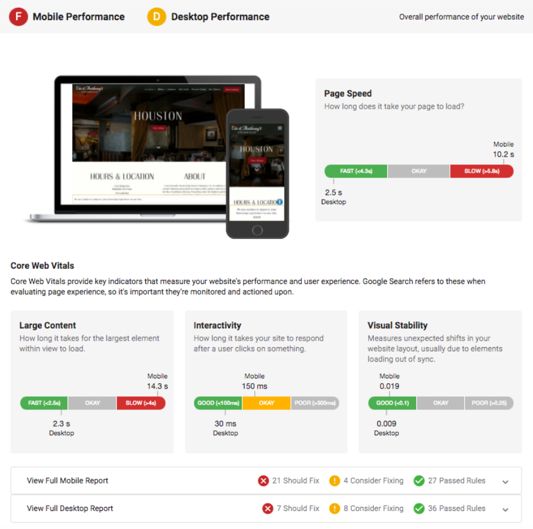

# Snapshot Report Sections – Website Performance and SEO

## What are Website Performance and SEO?

Website Performance and SEO (Search Engine Optimization) are critical factors that determine how well a business's website functions and ranks in search engines. The Snapshot Report uses Google's Core Web Vitals and comprehensive SEO analysis to evaluate these essential digital marketing components.

## Why are Website Performance and SEO important?

### Website Performance Impact
- **User Experience**: Fast, responsive websites create enjoyable experiences that build stronger brand recognition
- **Conversion Rates**: Smooth page experiences can lead to increased online sales, especially for ecommerce websites
- **Search Rankings**: Page experience metrics are important factors in Search Engine Optimization strategies
- **Customer Retention**: Without good website performance, businesses may not rank high in search engines, impacting their ability to be found by prospective customers

### SEO Impact
- **Organic Visibility**: Proper SEO helps businesses appear in search results when potential customers look for their services
- **Cost-Effective Marketing**: Organic search traffic provides long-term, sustainable customer acquisition
- **Local Discovery**: Local SEO helps businesses be found by customers in their geographic area
- **Competitive Advantage**: Better SEO performance helps businesses outrank competitors

## What's Included with Website Performance Assessment?

### Core Web Vitals Analysis

The Snapshot Report uses Google's Core Web Vitals to evaluate website performance, focusing on three key areas:

#### 1. **Speed (Page Loading)**
- **Page Speed**: Measures how quickly content is visually displayed during page load
- **Large Content Loading**: Measures how long it takes for the largest element within view to load for site visitors

#### 2. **Responsiveness (Interactivity)**
- **Interactivity**: Measures how long it takes the website to respond after a user engages with an on-site element

#### 3. **Visual Stability**
- **Visual Stability**: Measures unexpected shifts in website layout, which can be caused by site elements loading out of sync

### Device-Specific Performance

#### Mobile Performance
Google's PageSpeed Insights scores both speed and UX (user experience) scores for mobile devices. The system combines these scores and compares them to industry percentiles to determine the Mobile grade.

#### Desktop Performance
For desktop scoring, the system takes Google PageSpeed Insights score (out of 100) and compares it to industry percentiles for that business category.

### Homepage Content Analysis

The system evaluates whether key business information is found on the website's homepage, including:

- **Address on homepage**: Physical location information
- **Phone number on homepage**: Contact information accessibility
- **Homepage size**: Overall page size optimization
- **Video on homepage**: Multimedia content presence
- **Social media links**: Facebook, X (Twitter), Instagram presence

### Detailed Performance Metrics

The Snapshot Report assesses 10 speed metrics in total:

#### Critical Performance Factors
- **Eliminate render-blocking JavaScript and CSS**: When external stylesheets delay first render
- **Leverage browser caching**: When responses lack caching headers or specify short cache times
- **Optimize images**: When images can be optimized to reduce file size without quality loss
- **Enable compression**: When compressible resources aren't served with gzip compression

#### Technical Optimization
- **Minify HTML**: When HTML size could be reduced through minification
- **Minify CSS**: When CSS could be reduced through minification
- **Minify JavaScript**: When JavaScript could be reduced through minification
- **Reduce server response time**: When server response time exceeds 200ms
- **Avoid landing page redirects**: When multiple redirects exist from URL to final page
- **Prioritize visible content**: When additional network requests are required for above-the-fold content

### Performance Report Categories

The detailed report categorizes improvements into three levels:

- **Should Fix**: Rules that failed PageSpeed Insights' tests (immediate priority)
- **Consider Fixing**: Rules that passed tests but could use improvement (optimization opportunities)
- **Passed Rules**: Rules that passed PageSpeed Insights' tests (performing well)

:::note
PageSpeed scores can vary as they are estimates of website performance, not exact numbers. Many factors can influence performance including internet traffic, types of ads being served, device type, and antivirus software.
:::

## What's Included with SEO Assessment?

### SEO Grade Components

The SEO grade is determined by multiple factors:

- **Keyword Usage**: How well the website uses relevant keywords
- **Meta Data**: Title tags, meta descriptions, and structured data
- **Content Quality**: Relevance and depth of website content
- **Architecture**: Website structure and navigation
- **Links**: Internal and external link strategies
- **Social Signals**: Social media integration and signals
- **Trust Factors**: Security, authority, and credibility indicators

### Search Results Visibility

This section shows whether the business appears in search results on major search engines:

- **Google Search Results**: Presence in Google organic results
- **Yahoo Search Results**: Visibility in Yahoo search
- **Bing Search Results**: Appearance in Bing search results

#### Google Business Profile Integration
If a Google Business Profile exists for the business, the report shows whether the website is properly linked to the GBP listing, which is crucial for local SEO performance.

### Organic Keyword Performance

The SEO analysis includes detailed keyword performance data:

#### Keyword Metrics
- **Monthly Searches**: Number of monthly searches for each keyword
- **In Top 20**: Whether the business website appears in top 20 search results
- **Position**: Approximate position in search results for each keyword
- **Competitiveness**: How difficult it is to appear in top Google search results
- **Local vs Global Searches**: Estimated searches in the prospect's country vs. worldwide

#### Keyword Ranking Analysis
The system identifies the top 5 keywords that the prospect is currently ranking for, displayed with:

- **Rank Position**: Current position in Google search results
- **Search Volume**: Monthly search volume for each keyword
- **Competition Level**: Difficulty of ranking for each term

### Local SEO Assessment

The local SEO subsection score is based on where the business appears in search results for local search terms:

- **1st Position**: Grade A
- **2nd or 3rd Position**: Grade B  
- **4th - 20th Position**: Grade C
- **21st - 100th Position**: Grade D
- **Outside Top 100**: Grade F

The local SEO grade combines with the overall SEO value per click grade to determine the section grade.

:::note
The system cannot perform localized searches and searches from a centralized location. If a business has ads or SEO targeting only their local area, results may not appear in the national-level analysis.
:::

## How to Use Website Performance and SEO Information

### Website Performance Optimization
1. **Prioritize Critical Issues**: Address "Should Fix" items immediately for best impact
2. **Plan Technical Improvements**: Work through "Consider Fixing" items for optimization
3. **Monitor Core Web Vitals**: Track improvements in speed, responsiveness, and visual stability
4. **Optimize for Mobile**: Ensure mobile performance meets or exceeds desktop performance
5. **Regular Performance Audits**: Use tools like Google PageSpeed Insights for ongoing monitoring

### SEO Strategy Development
1. **Keyword Opportunities**: Focus on improving rankings for identified top keywords
2. **Content Optimization**: Improve website content based on keyword analysis
3. **Technical SEO**: Address website architecture and technical factors
4. **Local SEO**: Optimize for local search if serving local customers
5. **Link Building**: Develop strategies to improve domain authority and trust signals

## Recommended Next Steps

### Website Performance Improvements
- Implement technical fixes for critical performance issues
- Optimize images and enable compression for faster loading
- Improve mobile user experience based on Core Web Vitals
- Add missing homepage elements (contact info, social links)
- Set up regular performance monitoring and reporting

### SEO Enhancements
- Develop content strategy around top-performing keywords
- Optimize meta titles and descriptions for better click-through rates
- Improve website architecture and internal linking
- Ensure Google Business Profile is properly connected
- Implement local SEO strategies for geographic targeting

## Frequently Asked Questions (FAQs)

Why does the SEO score seem inaccurate for my business?

SEO scores are based on industry percentiles and multiple factors including keyword usage, meta data, content, architecture, links, social presence, and trust signals. The score reflects how the business compares to others in their industry, not absolute performance. Factors like recent website changes, new content, or evolving competition can affect scores.

Where does the Snapshot Report find organic SEO keywords?

The platform automatically scans the prospect's website content and business information to identify the top keywords in the database. The system analyzes website content, business category, and location to determine the most relevant keywords for that specific business.

How often do website performance scores change?

Website performance scores can vary because they are estimates based on real-time analysis. Factors that influence scores include internet traffic, types of ads being served, device types, antivirus software, and server performance. Regular monitoring helps track trends rather than focusing on individual score variations.

Can I see the full website performance report?

Yes, within the website section below the Core Web Vitals metrics, you'll find separate detailed reports for both mobile and desktop. Click the arrow on the far right of each bar to expand the report and see specific rules that pass or require fixing. You can dive deeper into each rule by clicking the + next to each item.

Why might a website rank well locally but poorly in the Snapshot Report?

The Snapshot Report analyzes SEO performance at the national level. A business may rank well for local searches but not appear in national results for broader keywords. This is common for location-based businesses and doesn't necessarily indicate poor SEO performance in their target market.

What should I do if Core Web Vitals scores are poor?

Focus on the "Should Fix" recommendations first, which typically include optimizing images, enabling compression, fixing render-blocking resources, and improving server response times. These technical improvements often provide the most significant performance gains.

How do I improve local SEO rankings?

Improve local SEO by ensuring Google Business Profile is complete and verified, using location-specific keywords in content, getting listed in local directories, encouraging customer reviews, and ensuring NAP (Name, Address, Phone) consistency across all online listings.

Can website performance affect SEO rankings?

Yes, Google uses Core Web Vitals and page experience as ranking factors. Websites with better performance metrics (faster loading, good user experience, mobile-friendliness) can rank higher in search results, making website performance optimization essential for SEO success.

## Screenshots or Videos

### Website Performance Analysis
The Website section shows comprehensive performance analysis using Google's Core Web Vitals with both mobile and desktop assessments.

### Detailed Performance Report
Expanded view showing specific performance recommendations categorized by priority level.

### SEO Keyword Analysis
The SEO section displays organic keyword performance with search volume and ranking data.

---

**Related Articles:**
- [Snapshot Report – Complete Guide](./snapshot-report-overview.mdx)
- [Snapshot Report Sections – Social Media and Advertising](./snapshot-report-social-advertising.mdx)
- [Snapshot Report Sections – Ecommerce and Technology](./snapshot-report-ecommerce-technology.mdx)