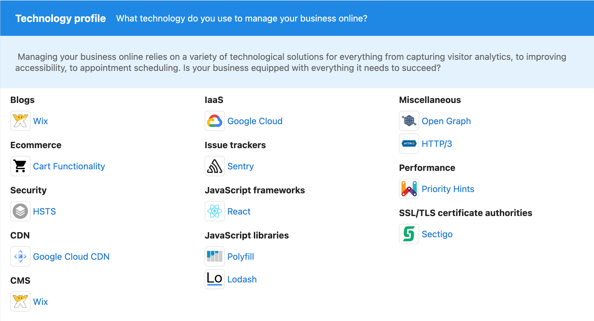
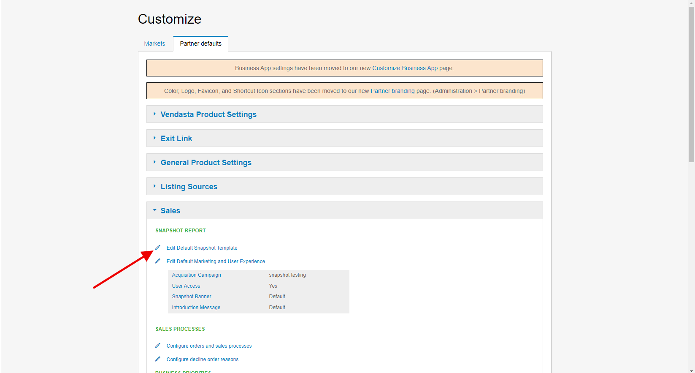

Partners can find out what technology their prospect is using to manage their business online and reveal the tech stack behind any website to identify potential gaps in the current setup.

### What's included?

The technology section displays the technology stack and marketing stack your clients are using on the website.

- Are there opportunities for you to offer better solutions?
- Are they using a website solution that slows down their SEO efforts? Such as Squarespace or Wix?

Gain valuable insights into their technology needs before approaching the prospect, empowering you to offer targeted solutions that align with their business goals.

### Is this Section Automatically Included? 

This section will be enabled automatically if you're currently running with the default configuration. If you want to disable the section, you can go to "Administration" > "Customize" > "Sales" > "Edit Default Snapshot Template." From here, uncheck the checkbox at the top of the "Technology" section.

**NOTE:** This will only affect new Snapshot Reports. If you have already created one for your prospect, you will need to refresh it for this section to appear. If you've customized the layout, you will need to make sure you enable it first before refreshing the report. 

