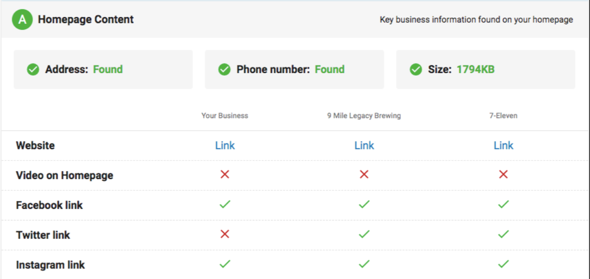
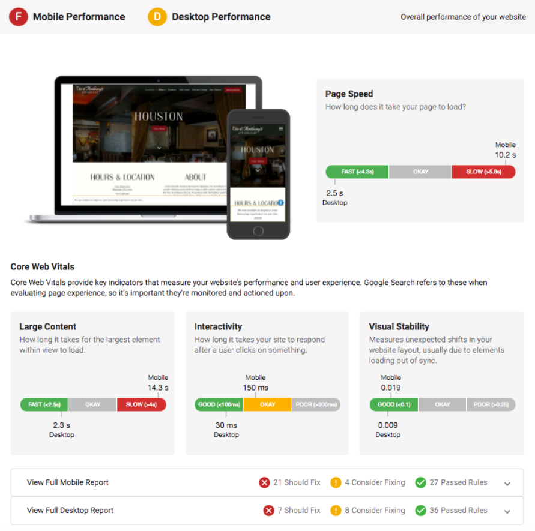
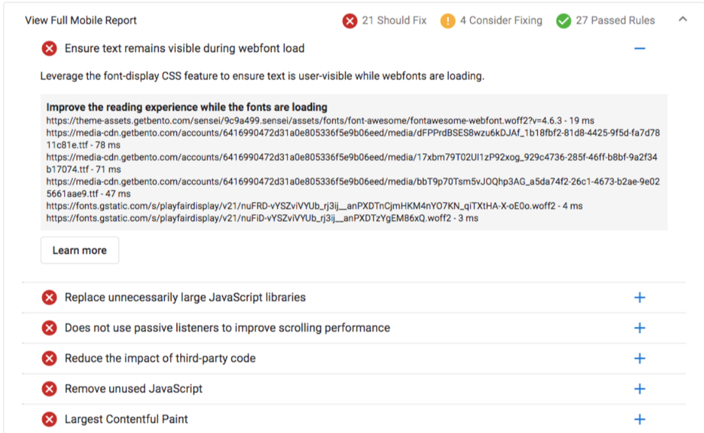

# Snapshot Report: Website Performance

Websites are critical to succeed in today's online marketplace, providing consumers a virtual doorway into your client's business. Similar to how you'd want physical customers to have a great experience in-store, their online visit should be just as enjoyable. 

This is where the Snapshot Report's website section can help as it breaks down the key components required for a great online experience. Page experience is important for multiple reasons:

- Creating an enjoyable website experience helps to build stronger brand recognition with consumers. 
- If the business owner runs an ecommerce enabled website, a smooth page experience can lead to an increase in online sales. 
- These page experience metrics are important factors when it comes to Search Engine Optimization (SEO) strategies. 

That last point is vital for business owners. Without a good website experience, they may not rank high within search engines, impacting their chances of being found by prospective customers. 

The Snapshot Report breaks down website performance using Google's Core Web Vitals, the set of key indicators they use as ranking criteria. 

### What are Page Experience and the Core Web Vitals?

**Page experience** measures aspects of how customers experience and interact with a website. By optimizing for these factors, business owners can create delightful experiences across all web browsers and devices. This can lead to more engaged consumers, increases in sales, and a strong brand affinity. 

**Core Web Vitals** are a set of real-world, user-centered metrics that can help to quantify key factors of a user's experience. They focus on 3 areas: speed, responsiveness, and visual stability. Google combines these factors in determining search ranking as they help provide a holistic picture of page experience. 

### Snapshot Report Homepage Content

Within the Snapshot Report, we first give a look at the homepage content for your clients website. This will show if key business information is found on your client's website. Having easy access to this information creates a smooth page experience for visitors and is essential when it comes to search engine ranking. 

### Snapshot Report Website Performance

**Overall Grades** - The Snapshot Report breaks down performance for both Mobile and Desktop. Both grades can be seen at the top of the section, along with an image of how they appear on both devices. **NOTE**: If needed, salespeople have the ability to turn off either the desktop or mobile version within the Snapshot Report. Visit our support article to learn more about [customizing the Snapshot Report.](/customizing-snapshot-report)

**Page Speed** - To the right of the device image you'll find page speed. This measures how quickly the content of your client's website is visually displayed during page load. 

**Large Content** - This metric measures how long it takes for the largest element within view to load for site visitors. 

**Interactivity** - This measures how long it takes the client's website to respond after a user engages with an on-site element. 

**Visual Stability** - This will measure any unexpected shirts in your website layout. This can be caused by site elements loading out of sync. 

:::note
**NOTE**: If the Snapshot Report has been customized to only show desktop or mobile, then that will be reflected in these metrics by only showing how that particular device measures up. 
:::

Below the Core Web Vital scores, you'll find a more detailed report on what should be fixed on your client's website for both desktop and mobile devices. 

If your client has the ability to make changes on their own, you can provide this detailed look at what needs to be fixed as an additional value for the Snapshot Report. Or if you offer website services, this can be an effective talking point about how much you can help them improve their website experience.