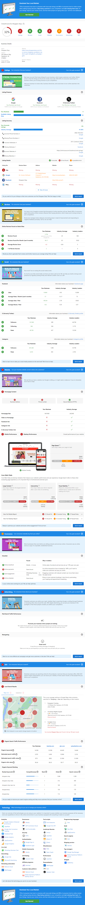

The Snapshot Report is an award-winning marketing needs assessment that arms sales reps with automated insights into a business's online marketing performance. These insights make for powerful and persuasive sales pitches. Use the Snapshot Report to start the conversation with business owners, highlight gaps in their marketing, and propose optimal solutions.

<iframe 
  src="//www.loom.com/embed/Snapshot-Report-Overview-c4b79c187ea24b50aaa534e5b2cadc02" 
  width="560" 
  height="315" 
  frameBorder="0" 
  allowFullScreen
></iframe>

### **Sample Snapshot Report**

You can also [download a sample Snapshot Report PDF](/files/snapshot-report/Snapshot_Report_Sample.pdf).