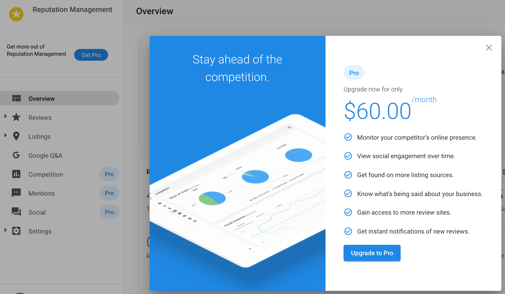

# Configure the product upgrade path

You can configure what happens when a customer requests to upgrade a Standard product in Business App. By default, when a customer wants to upgrade, they are prompted to submit an order form for the Pro product edition. Other options include: having the salesperson reach out to the customer and upgrade them to a different product or package OR upgrading to a custom package.

**To configure the upgrade path:**

1. Go to **Partner Center** > **Marketplace** > [**Products**](https://partners.vendasta.com/marketplace/manage-products).
2. Click on one of the following products: 
   - Reputation Management
   - Customer Voice
   - Social Marketing
   - Website
   - Local SEO
   - Advertising Intelligence
3. Click on the **Product Info** tab.
4. In the **Upgrade Path** section, select whether you would rather have customers upgrade through an order form, salesperson, or custom package.
5. For setting the upgrade path to **Upgrade to a custom package**, [follow these instructions](/vendasta-products/vendasta-products-general/create-manage-custom-packages).

When **Upgrade to a custom package** is selected, you can select your custom package(s) from the drop-down menu. You can also click the button: **Custom modal content** to customize the content your clients will see when they click on an upgrade button. 

When **Contact a Salesperson** is selected, after your customers click on an upgrade button in the product, they are directed to a page where they can send a message to the assigned salesperson.

  <a 
    href="https://partners.vendasta.com/marketplace/manage-products" 
    style={{
      fontSize: '16px',
      fontWeight: 'bold',
      color: '#ffffff',
      backgroundColor: '#33ace2',
      textDecoration: 'none',
      borderRadius: '5px',
      padding: '10px 30px 9px 30px',
      border: '1px solid #33ACE2',
      display: 'inline-block',
      textAlign: 'center'
    }}
    target="_blank"
    rel="noopener"
  >
    Configure upgrade path
  </a>

