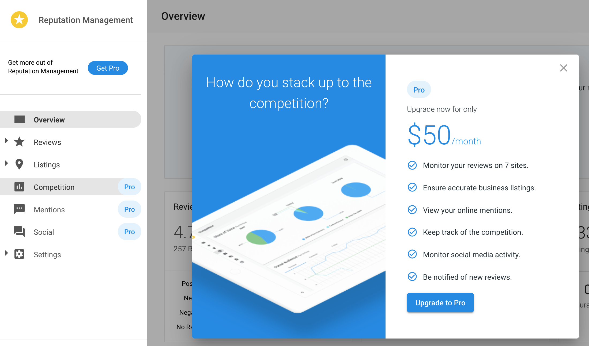

When a customer clicks on a Pro feature in [Business App](/vendasta-products/business-app), they are prompted to upgrade from the Standard edition of the product to the Pro edition. Business App displays the Pro edition Manufacturer's Suggested Retail Price (MSRP) by default. This article provides instructions on how to set the retail price to a new value.

- [Set retail prices](#set-retail-prices)
  - [A. Reputation Management, Customer Voice, Website, and Social Marketing](#a-reputation-management-customer-voice-website-and-social-marketing)
  - [B. Advertising Intelligence](#b-advertising-intelligence)
  - [C. Local SEO](#c-local-seo)
- [Reset retail prices](#reset-retail-prices)

## Set retail prices

### A. Reputation Management, Customer Voice, Website, and Social Marketing

To set the retail price for a Reputation Management, Customer Voice, or Social Marketing product upgrade:

1. Go to **Partner Center** > **Marketplace** > [**Products**](https://partners.vendasta.com/marketplace/manage-products).
2. Search for the product you want to set the retail price for. Click on the product name.
3. Click on the **Product Info** tab.
4. If applicable, select a Market.
5. Click on the **Lock** icon  under the **Retail Price** heading.
6. Set the retail price:
   a. Select a currency from the dropdown menu.
   b. Enter a retail price.
   c. Select a billing frequency from the dropdown menu.
7. Click on the **Unlock** icon  to submit the new retail price.

The new retail price will now appear in Business App. You have the option to [reset the retail price to the default MSRP](#reset-retail-prices) if desired.

  <a 
    href="https://partners.vendasta.com/marketplace/manage-products" 
    style={{
      fontSize: '16px',
      fontWeight: 'bold',
      color: '#ffffff',
      backgroundColor: '#33ace2',
      textDecoration: 'none',
      borderRadius: '5px',
      padding: '10px 30px 9px 30px',
      border: '1px solid #33ACE2',
      display: 'inline-block',
      textAlign: 'center'
    }}
    target="_blank"
    rel="noopener"
  >
    Set retail price
  </a>

### B. Advertising Intelligence

To set the retail price for an Advertising Intelligence product upgrade:

1. Go to **Partner Center** > **Marketplace** > [**Products**](https://partners.vendasta.com/marketplace/manage-products).
2. Search for the *Advanced Reporting* product. Click on the product name.
3. Follow Steps 3-7 in [Section A](#a-reputation-management-customer-voice-website-and-social-marketing).

The new retail price will now appear in the Business App when a user clicks **Upgrade to Pro** in **Advertising Intelligence**. You have the option to [reset the retail price to the default MSRP](#reset-retail-prices) if desired.

  <a 
    href="https://partners.vendasta.com/marketplace/manage-products" 
    style={{
      fontSize: '16px',
      fontWeight: 'bold',
      color: '#ffffff',
      backgroundColor: '#33ace2',
      textDecoration: 'none',
      borderRadius: '5px',
      padding: '10px 30px 9px 30px',
      border: '1px solid #33ACE2',
      display: 'inline-block',
      textAlign: 'center'
    }}
    target="_blank"
    rel="noopener"
  >
    Set retail price
  </a>

### C. Local SEO

Within the Local SEO product, a customer can request an upgrade for Citation Builder or Listing Sync.

- [Citation Builder](#citation-builder)
- [Listing Sync](#listing-sync)

#### Citation Builder

To set the retail price for a Citation Builder product upgrade:

1. Go to **Partner Center** > **Marketplace** > [**Products**](https://partners.vendasta.com/marketplace/manage-products).
2. Search for the Citation Builder product. Click on the product name.
3. Follow Steps 3-7 in [Section A](#a-reputation-management-customer-voice-website-and-social-marketing).

The new retail price will now appear in the Business App when a user clicks **Upgrade now** in the Citation Builder tab. You have the option to [reset the retail price to the default MSRP](#reset-retail-prices) if desired.

  <a 
    href="https://partners.vendasta.com/marketplace/manage-products" 
    style={{
      fontSize: '16px',
      fontWeight: 'bold',
      color: '#ffffff',
      backgroundColor: '#33ace2',
      textDecoration: 'none',
      borderRadius: '5px',
      padding: '10px 30px 9px 30px',
      border: '1px solid #33ACE2',
      display: 'inline-block',
      textAlign: 'center'
    }}
    target="_blank"
    rel="noopener"
  >
    Set retail price
  </a>

#### Listing Sync

To set the retail price for a Listing Sync product upgrade:

1. Go to **Partner Center** > **Marketplace** > [**Products**](https://partners.vendasta.com/marketplace/manage-products).
2. Search for the Listing Sync product. Click on the product name.
3. Follow Steps 3-7 in [Section A](#a-reputation-management-customer-voice-website-and-social-marketing).

The new retail price will now appear in the Business App when a user clicks **Upgrade now** in the Listing Sync tab. You have the option to [reset the retail price to the default MSRP](#reset-retail-prices) if desired.

  <a 
    href="https://partners.vendasta.com/marketplace/manage-products" 
    style={{
      fontSize: '16px',
      fontWeight: 'bold',
      color: '#ffffff',
      backgroundColor: '#33ace2',
      textDecoration: 'none',
      borderRadius: '5px',
      padding: '10px 30px 9px 30px',
      border: '1px solid #33ACE2',
      display: 'inline-block',
      textAlign: 'center'
    }}
    target="_blank"
    rel="noopener"
  >
    Set retail price
  </a>

## Reset retail prices

If you previously set a custom retail price and want to revert to the default Manufacturer's Suggested Retail Price (MSRP):

1. Go to **Partner Center** > **Marketplace** > [**Products**](https://partners.vendasta.com/marketplace/manage-products).
2. Search for the product you want to reset the retail price for. Click on the product name.
3. Click on the **Product Info** tab.
4. If applicable, select a Market.
5. Click on the **Lock** icon  under the **Retail Price** heading.
6. Click **Reset to default MSRP**.
7. Click on the **Unlock** icon  to submit.

The retail price will now be reset to the default MSRP and will appear as such in Business App.

  <a 
    href="https://partners.vendasta.com/marketplace/manage-products" 
    style={{
      fontSize: '16px',
      fontWeight: 'bold',
      color: '#ffffff',
      backgroundColor: '#33ace2',
      textDecoration: 'none',
      borderRadius: '5px',
      padding: '10px 30px 9px 30px',
      border: '1px solid #33ACE2',
      display: 'inline-block',
      textAlign: 'center'
    }}
    target="_blank"
    rel="noopener"
  >
    Reset retail price
  </a>

