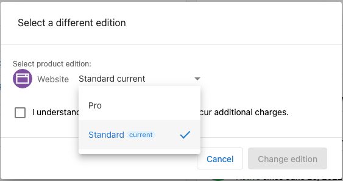
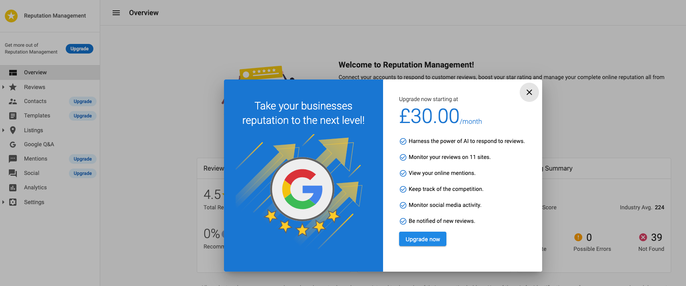
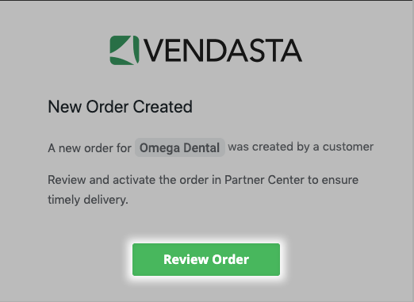
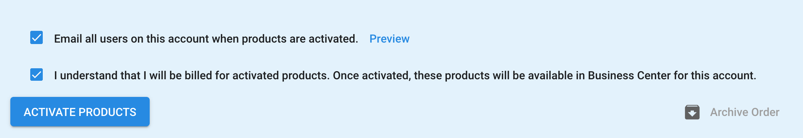

# Upgrade a product edition (fulfill an order)

You can upgrade product editions directly in your Business App or fulfill an order that's been placed in the Marketplace.

## **Option 1: Upgrade a Product's Edition in the Business App**

You can change your product editions directly in your Business App.

1. From your Business App, select the **hamburger menu** in the top-left corner.

2. Select **Billing**.
3. On the **Active Products** page, select **Change Edition** for the product you'd like to upgrade.

4. Select the edition you'd like to upgrade to. 
5. If you're upgrading to a more premium product, you may be prompted to **Upgrade to Pro**. Select this button to continue.

6. You'll be redirected to a checkout page to complete the transaction.

## **Option 2: Fulfill an Order from the Marketplace**

If a customer has placed an order for a product upgrade from the Marketplace, you can fulfill the order via your Business App.

1. Go to Vendasta Platform > **Orders** > **ID** of the order you wish to fulfill.

2. From the right-hand pane, select **Actions** > **Activate Products**.

3. Confirm the business details are correct and hit **Continue**.
4. Complete the order details by filling in the required fields and hitting **Continue**.
5. Review the order details. When you're ready, select **Confirm** to fulfill the order.  

**Note:** You can also fulfill an order by selecting the Order notification from your notifications panel.