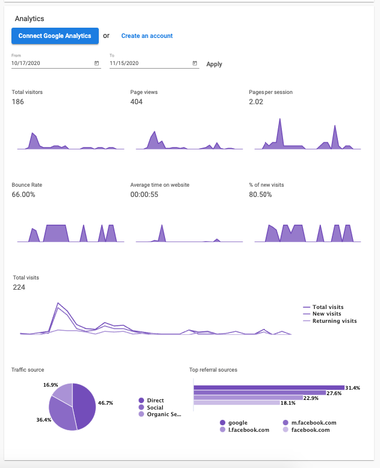
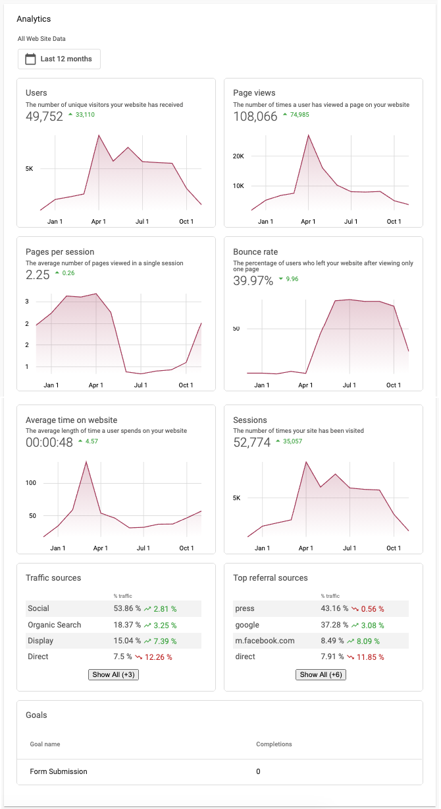

# Google Analytics View

The Google Analytics view in Website Pro allows Partners and their clients to view their Top Traffic Sources and Page View metrics within the product. Some available metrics include:

| | |
|---|---|
|<ul><li>Total Visitors</li><li>Pageviews</li><li>Pages per Session</li><li>Bounce Rate</li></ul>|<ul><li>% of New Visits</li><li>Total Visits</li><li>Traffic Source</li><li>Top Referral Sources</li></ul>|

## How to add your own Google Analytics account

Click [here](/vendasta-products/vendasta-products-website/article-4406961562007) for steps on how to add your Google Analytics account

## How does the Google Analytics view work?

When you set up a site on Website Pro, you have the option to either allow the platform to collect GA data for you, or you could connect your own GA account view.

1. **Default Google Analytics pulled in by the system**: Note, that if there is a prompt at the top informing you to connect a GA view, you are using the default view and not a custom view.
   
   

2. **Custom Google Analytics View**: note for a custom connected view, you get the option to toggle the amount of data shown at the top and also more refined traffic metrics.
   
   

## Which should I use?

We *strongly* encourage customers to connect their own views, as it provides the most accurate data. When customers use the built-in Google Analytics system, the Google Analytics Website Pro ID is used, which does not provide data that is as accurate as the one provided by connecting one's own Google Analytics view - this is the reason we built it in the first place. When customers rely on the built-in offering, data is not accurate because the GA ID is shared between sites, so Google Analytics sends data that is aggregated over multiple sites, rather than exactly the domain of the site in question.

## How much Google Analytics data does the platform collect?

When customers connect their own Google Analytics views, the platform pulls in data for the past 12 months. So, provided they select a view that has 12 months of historical data, they will have access to that, and data going forward as well.

## My client connected GA but there is no data

Historically, the most likely issue resulting from this is Partners and their clients are connected to the incorrect view. In Google Analytics (outside of Vendasta), users can configure their own view, with specific data collection and filtering behavior. As long as users connect a view that has data, the platform will pull the data in; in addition, it will pull in 12 months' worth of data upon connection.