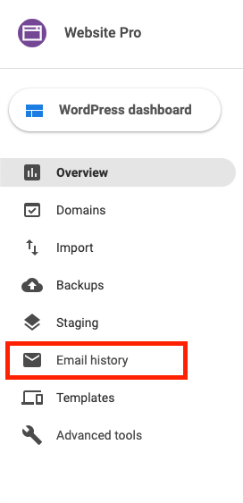
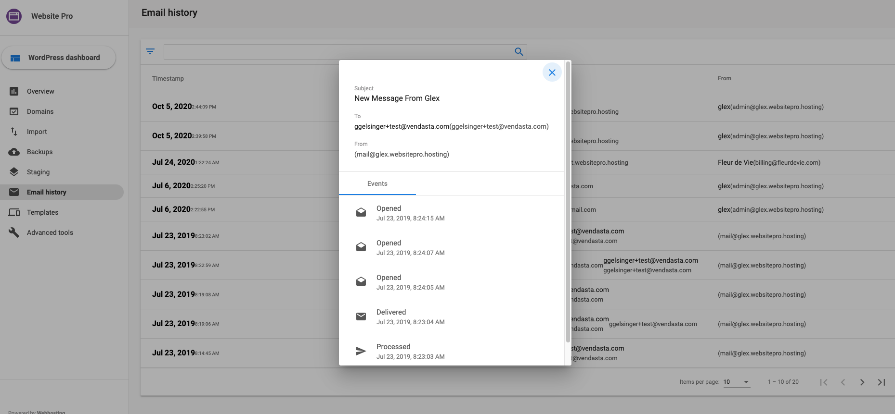

Vendasta has made it easier to understand the deliverability of outgoing emails sent through both Website Standard and Pro with the **Email History** feature. This centralized location allows all users to see details of all outgoing emails such as their delivery status and the time sent. To protect the privacy of your clients, Vendasta partners will not be able to see the actual content of the emails, however, your clients will be able to.

Emails being sent through a user's website are usually automatically triggered when a customer fills out a contact form or expresses interest by providing their email address somewhere on the site. These outgoing emails will now be displayed in the Email History tab.

*Note: A user is not able to send or respond to emails via the Email history tab.*

### How does Email History work?

To see any emails that have been sent, a user will enter the **Website** product and navigate to the **Email History** tab.

They will now see a list of all the emails that have been delivered via their site. A user can click on a specific email to get more information about it.

*Note: the above screenshot is what a Partner Admin user would see.*