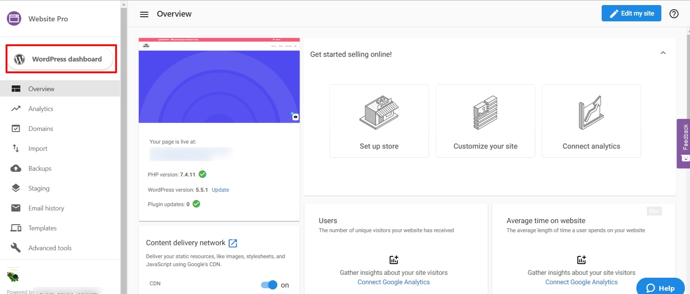

Are your emails getting bounced after a website migration? 

If yes, then an important aspect of the steps may have been missed during the migration.

Here's how to fix it:

**Step 1:** Navigate to Website Pro > WordPress dashboard.

**Step 2:** Click on Plugins on the left side panel > Click on 'Add new'

{/*  */}

**Step 3:** Type and search for the All-in-One plugin > Install the plugin

{/*  */}

**Step 4:** Activate the plugin

{/*  */}

**Step 5:** After the plugin has been activated, click on the All-in-One WP Migration

- Select the Advanced option
- Ensure that the '**Do not replace email domain (sql)**' is selected.

{/*  */}

This will fix the email bouncing issue.

Note: You can also download the website file by following the steps below:

- Click on the Export to
- Click File to begin the download
- Click the downloaded file to download it to the local drive

{/*  */}