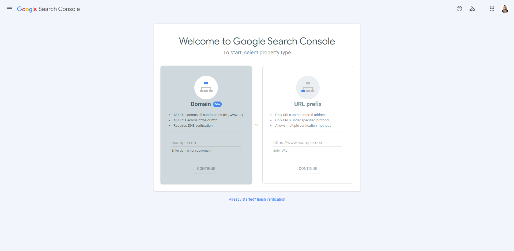
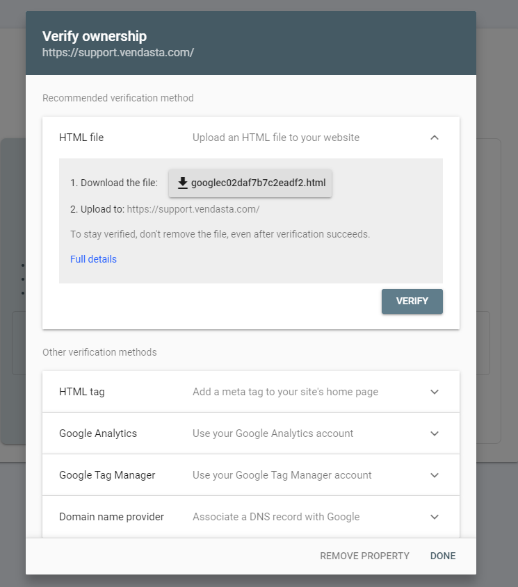

Search Console tools and reports help you measure your site's search traffic and performance, fix issues, and make your site shine in Google Search results.

A page is indexed by Google **if it has been visited by the Google crawler ("Googlebot"), analyzed for content and meaning, and stored in the Google index**. Indexed pages can be shown in Google Search results.
(If they follow Google's webmaster guidelines).

Proper website indexing **allows search engines to see all of your important pages** and gives your site a major boost. It can even send you on your way to page one of the search results!

Enter your domain into the [Google Search Console](https://search.google.com/search-console/welcome):

Type your website URL into "URL prefix". Please note, that the URL must have the "https://" prefix. For checking an entire domain, you will need access to your domain registrar to enter a TXT record. This will take time as DNS Records take time to propagate (6-12 hours). Either way, you will need to verify that you own the domain in order to view the results:

Step 2: Once the Records are Verified, you would need to add the XML sitemap in the Sitemap section in the Google console.

Where to Find the XML sitemap?

- **Log in to your WordPress website.**
- **Click on 'SEO'**
- **Click on 'General'. ( Here we will be able to find the XML sitemap URLs).**

**Yoast SEO:** [**https://yoast.com/help/xml-sitemaps-in-the-wordpress-seo-plugin/**](https://yoast.com/help/xml-sitemaps-in-the-wordpress-seo-plugin/)
**Rank Math SEO:** [**https://www.youtube.com/watch?v=bK2DHBhUUOo**](https://www.youtube.com/watch?v=bK2DHBhUUOo)
**Please note: The location to find the Sitemap will vary depending on the Plugin that is used.**

{/* Note: Image for SEO plugin interface could not be retrieved */}

Step 3: The Sitemaps must be added here once the TXT records are verified successfully.
Login here: [https://search.google.com/search-console/](https://search.google.com/search-console/)

{/* Note: Image for sitemap submission interface could not be retrieved */}

Step 4: Submit a Page URL to Google

In Search Console, Go to the inspection URL - [https://search.google.com/search-console/](https://search.google.com/search-console/) and paste in the page URL you want to index.

If the page **isn't indexed**, you'll see that GSC says *'URL is not on Google.'* To get it crawled, just click on **Request Indexing.**

{/* Note: Images for URL inspection interface and request indexing button could not be retrieved */}

Please note: Google Crawling takes 7-15 days to show accurate results in the search engine.