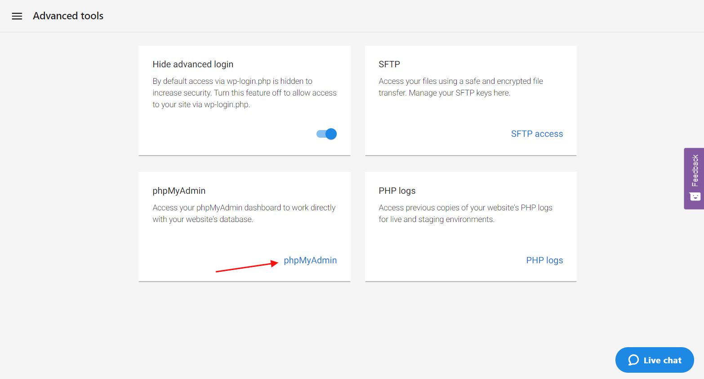
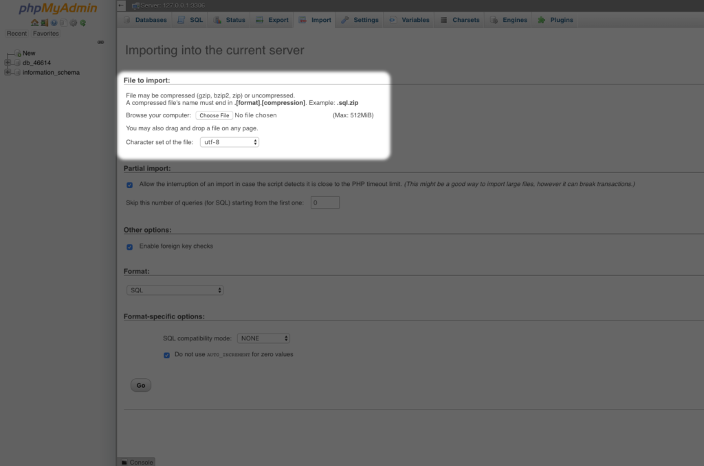
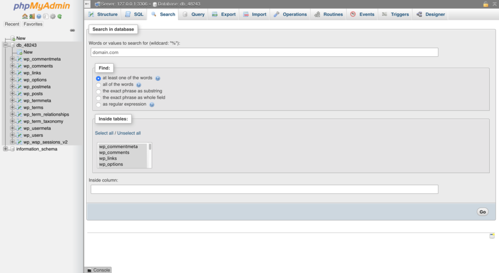
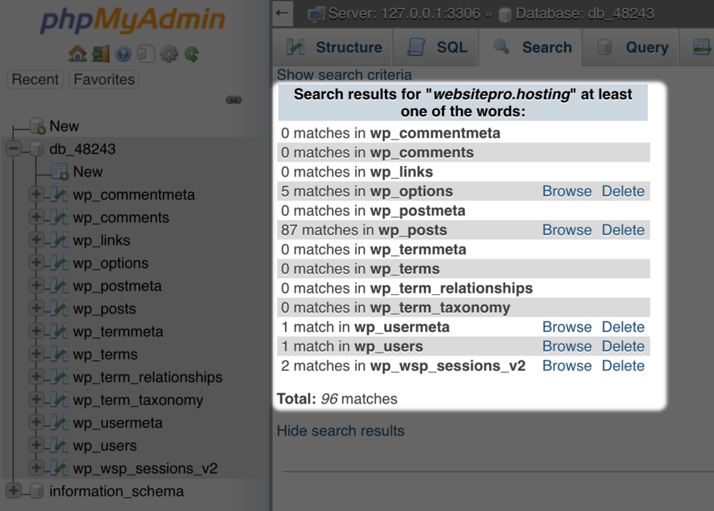

If you do not wish to use a migration plugin–such as if your site is larger than the supported size or you've already exported your site from your previous host–you can manually import that site into Website Pro. Please note that if you need the current Website Pro site to stay active, you may wish to import your site to your staging environment.

## Step 1: Back up your current website's files

This can be done via a backup plugin such as All-in-one Migration, or via an FTP program connected to your host. You will also need to export your current WordPress database. This is usually done via phpMyAdmin if you have access to it through your host by clicking the **Database Name > Export > Go**.

## Step 2: Extract the backup

Most backups will be downloaded as a zipped file containing your site's files and database information. In order to use this, you'll need to extract that file to access the files. Depending on the type of file, you may need to use a program like WinRAR.

## Step 3: Import your database to Website Pro.

1. From **Website Pro**, open **Advanced Tools** > **PHPMyAdmin**.
   

2. Select the database created by Website Pro. This will take the form of *db_##*.

3. Click **Import**. Under **File to import**, click **choose file** and select the database file included in your site export. This will generally be a .sql file.
   

4. Click **Go** at the bottom right of the screen. Once the import is complete, you should see a message at the top of the page letting you know the import was successful.

Of note, as Website Pro aims to make importing as easy as possible, you will not need to update your *wp-config.php* file to point to this database.

## Step 4: Upload your website files to Website Pro

To upload your site, you'll need to make use of [Website Pro's SFTP support](https://help.websitepro.hosting/?p=202). Ensure you upload the entire contents of your WordPress export to the root directory (the first folder that should load when connecting to the server).

## Step 5: Updating your database to use your new domain

*Please note that if you are using the same domain name in Website Pro, you do not need to perform this step.*

WordPress relies heavily on it's database to ensure your site functions correctly. In order to ensure it continues working correctly after migration, you'll need to replace any previous instances of the old URL with the new. To make this process easier, you may wish to use a tool such as [Search and Replace](https://github.com/interconnectit/Search-Replace-DB). This will search your database for any instances of your old domain name and replace them with your new.

Alternatively, you can manually search for and replace any instances of your previous domain name within phpMyAdmin:

1. From **Website Pro**, select **phpMyAdmin**

   

2. Click on the WordPress database. This should appear in the form of *db_##*

3. Click **Search**, then enter in the previous domain name under **Words or values to search for**.

4. Under **Inside tables**, click **Select all**, then click **Go**.
   

5. Click **Browse** next to any of the tables that return results.
   

6. Double-click on any fields that contain the old domain name and manually enter the new.

## Step 6: Pointing your domain name to Website Pro

Finally, it's time to point your domain over to Website Pro. You can use the steps presented in **Website Pro > Domains** to do so.