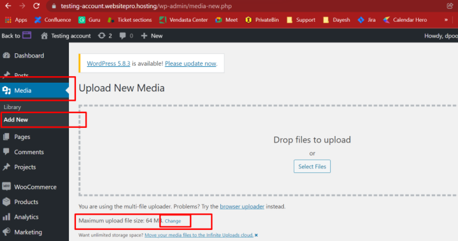
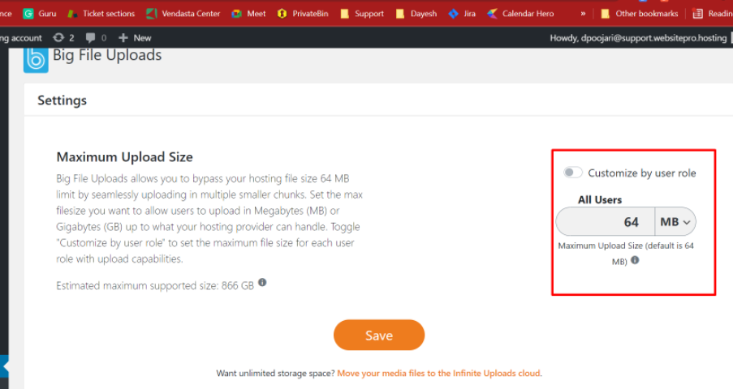

Do you want to increase the maximum file upload size in WordPress? Sometimes limited file upload size can stop you from uploading files via media uploader, or installing plugins and themes.

In this article, we will show you how to easily increase the maximum file upload size in WordPress to fix those issues.

## Step 1

In the WordPress dashboard, head over to the plugin section and install Plugin: **Big File Uploads – Increase Maximum File Upload Size.**

## Step 2

Once Installed, Click on 'activate' and Select Media in the WordPress dashboard.

## Step 3

Now you will be able to change the upload limit up to 256MB in Website Pro.

:::note
Please note: The **maximum** file upload limit in Website Pro is 256 MB. Anything above that would result in an error. In which case, we can suggest [making use of SPTF to upload Files above 256 MB](/vendasta-products/vendasta-products-website/vendasta-products-website-faqs/uploading-large-files-with-sptf).
:::