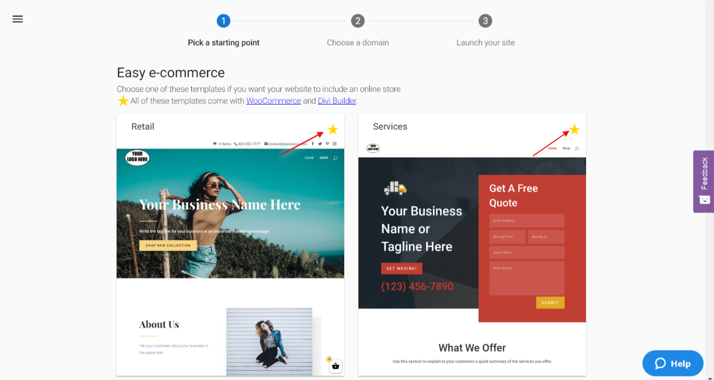

Divi builder comes by default **only** for select themes in Website Standard/Pro, therefore when selecting a theme, make sure to choose a theme that supports the DIVI builder. 

Themes that support DIVI builder will have a yellow star displayed in the top right corner.

