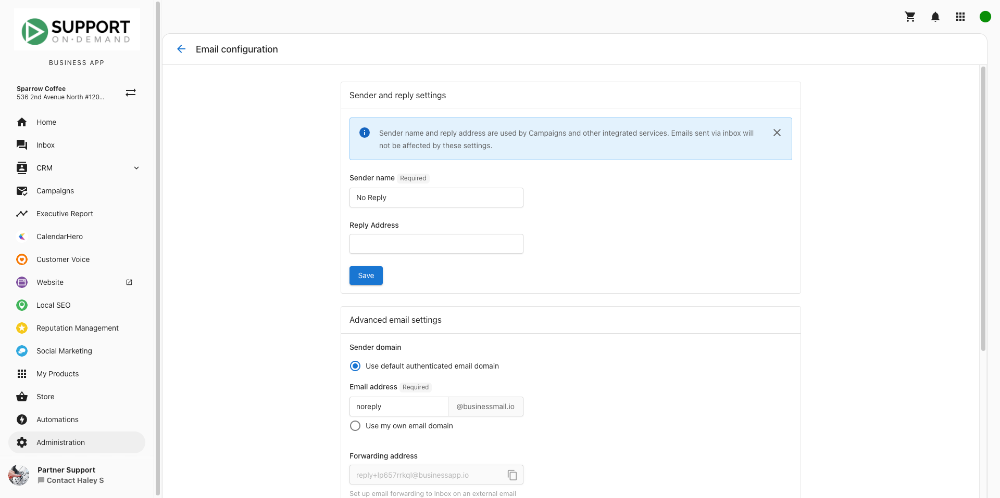

To ensure emails from Website Pro don't end up in spam, please verify if your DNS settings are configured correctly in your Business app. Go to **Administration > Email Configuration** and ensure all required validations are complete. Remember, while having a verified domain can help prevent spam, it doesn't guarantee complete immunity. It simply confirms that the sender is authorized to use the email address.

See this article on [Adding SPF, DKIM, DMARC Records](/vendasta-products/vendasta-products-website/vendasta-products-website-general/adding-spf-dkim-dmarc-records)

