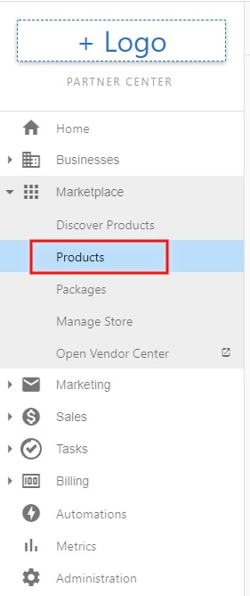
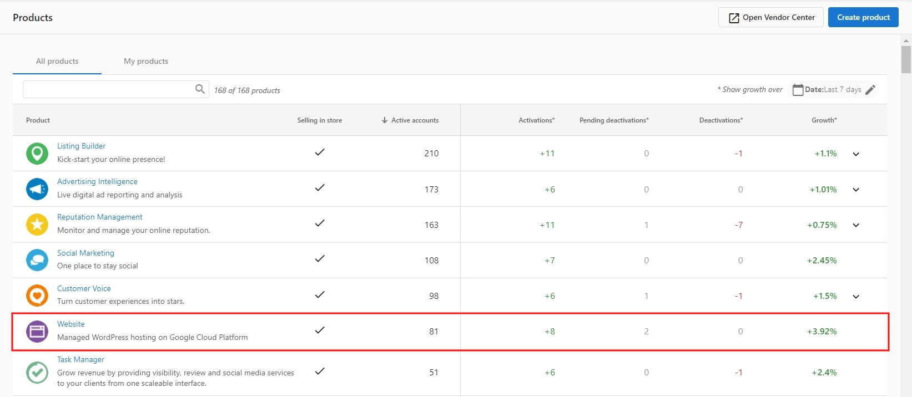
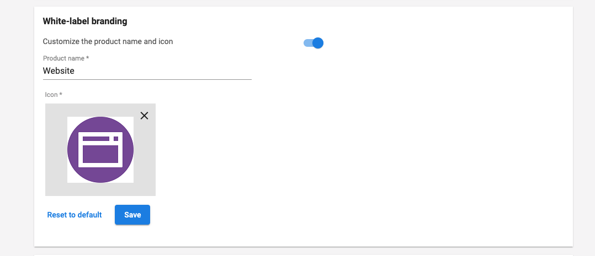

Partners (depending on [subscription tier](https://www.vendasta.com/pricing/)) who are selling Vendasta's Website product in their marketplace, are able to white-label the product name and logo. This means that partners can brand, market, and sell it as their own solution.

At Vendasta we want to make our Partners the trusted local experts in their communities and the ability to white-label our marketing solutions is a big part of that.

### How to white-label product name and logo

1. In Partner Center, click the **Marketplace tab** then select **_Products_**.
   

2. Search for the **Website** product and click it.
   

3. Next, navigate to the **Product info** tab and scroll down to the **White-Label Branding** section where you can change the name and icon.

