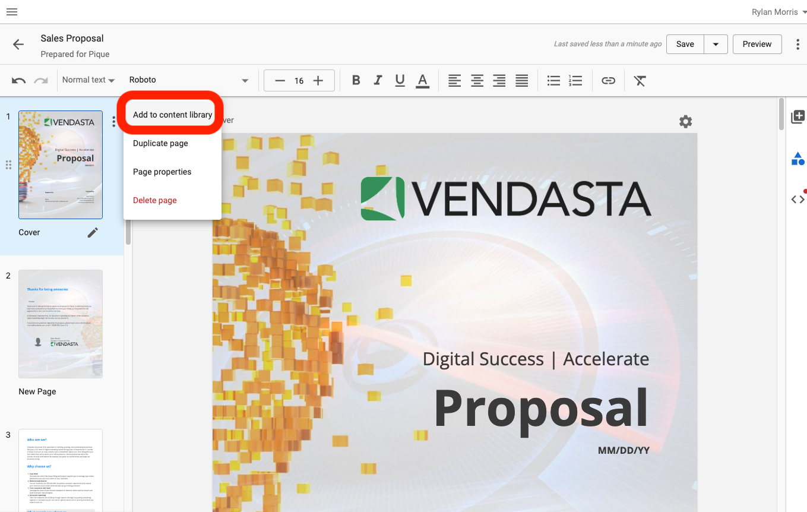

Partners can create and manage custom templates for all of their website accounts through the Templates tab in the Website Standard/Pro product.

Custom templates allow partners to save themes, plugins, and site content for use when creating a new site. Only Partner Admin users in your organization have access to this tab, but the templates you create will be visible to anyone making a new site. Create and edit up to 12 of your own templates.

Creating and managing your templates is friction-free.

Partners creating websites often have to spend a lot of time installing the same set of plugins, themes, and sometimes even content. With templates, Partners can save time by setting up templates as starting points for each website that they create, skipping over repeating manual work for each website. Making this process as easy as possible saves agencies even more time so they can focus more on delivering quality website content for their clients.

## How do custom templates work?

### Duplicate Template

This feature lets Partners duplicate their existing templates, or create new ones using any of the pre-built templates as a starting point.

:::note
You can only duplicate a template that has been published. To publish a template, click on **Edit Template > Template Management > Publish as Template.**

:::

1. Go to **Website Standard/Pro > Templates** and hover over a template. You will now see a **Duplicate** option. 

2. Clicking on Duplicate will prompt you to define a new template name. Simply type in your new template name and click **Create Template**.
3. To edit the template, simply click on **Edit Template.** You will be taken to the WordPress Dashboard where you can edit your site.
4. To save the changes made to your new custom template, click **Update Template** under Template Management.

{/*  */}