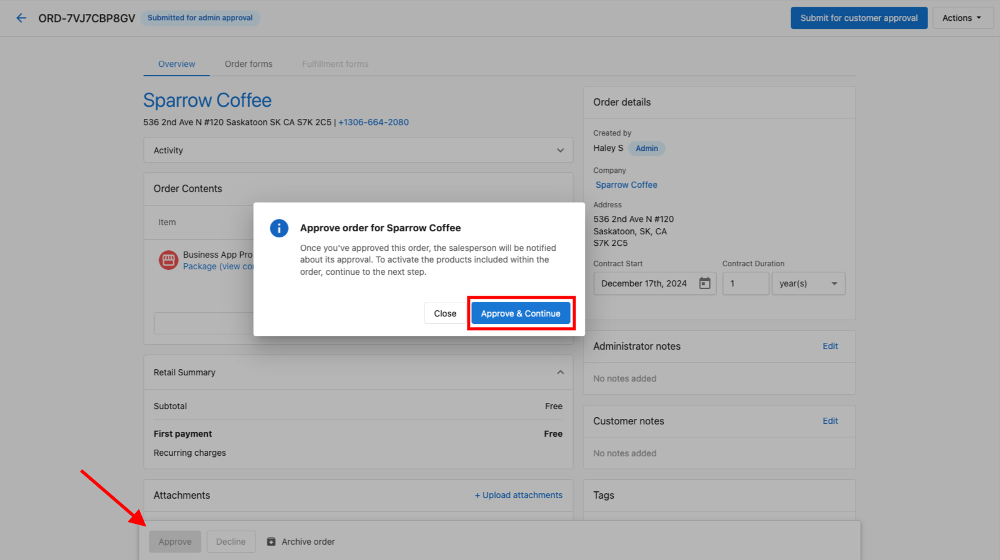

Having exceptional customer relationships is crucial to the success of any business. By automatically syncing the information of purchasing customers, clients can create targeted campaigns, ask for reviews, or contact their customers individually to nurture their existing clientele, improve customer retention, drive loyalty, and increase repeat purchases or orders.

When a new customer makes an order on a client's WooCommerce-enabled **Website Standard or Website Pro** website, their information (name, email address, and phone number) will be automatically synced to the client's Customer List in Business App. This allows clients to contact them through email, phone, [Customer Voice](/vendasta-products/reputation-management/customer-voice), or other ways to build and strengthen their customer relationships.

It's simple and automatic. When a customer makes an order through a client's online store that is powered by WooCommerce, the information entered during checkout (name, email address, and phone number) is immediately synced to Customer List in Business App. These customers will appear on the list with "Website Pro" as the source.

Order details from WooCommerce:

{/*  */}

Synced information in Customer List:

{/*  */}

[Learn more about Customer List →](/vendasta-products/website/how-do-contacts-generate-from-website-pro)