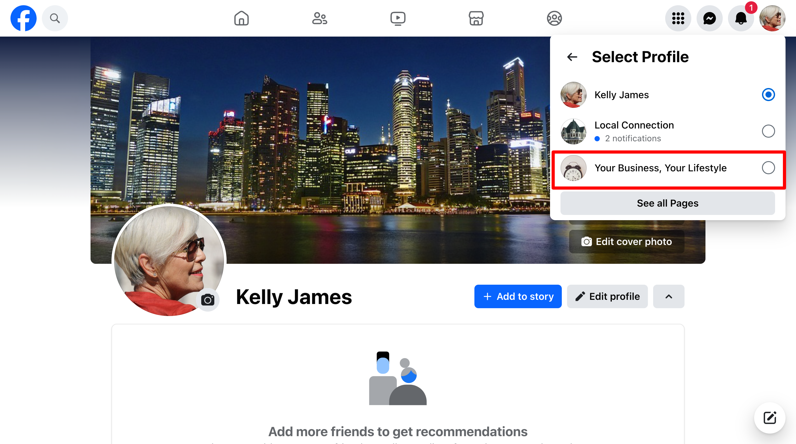
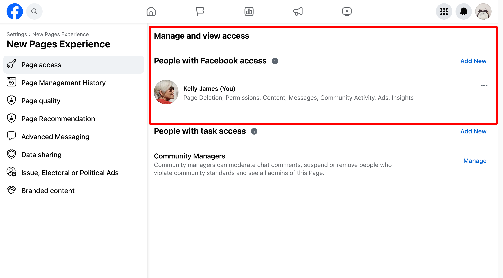

You want to get started with a successful MatchCraft Managed Ads Campaign as quickly as possible. During the first month of the campaign, the advertising platform and our specialists are going through a learning phase to understand and optimize your ad. What can you do to ensure your ad is successful as quickly as possible?

### Consider doing a promotion

Adding a promotion or a sale can incentivize your potential customers to click on your ad and check you out. Let us know if your promotions change so that we can incorporate them into an ongoing campaign.

### Add the Google Tag Manager code to your website.

Our team will provide you with a code that can be added to your website. Including this code on your website allows us to improve tracking and boost the ad's performance over time. 

If we're managing your website, we can do this for you. 

### Accept your Facebook Page Access Request

If running Facebook ads, accepting the request quickly will ensure your ads will be ready to go as soon as possible. Follow these steps:

Log in to Facebook and switch your profile to your business page.

Once switched, you should appear on Manage Page. 

Click Settings. 

Now click on New Page Experiences

You'll see a section for Page Access and inside of it you may see an access request from Vendasta Services or Digital Agency.

Accept the request.

