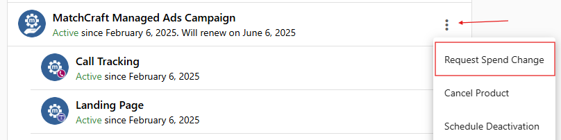
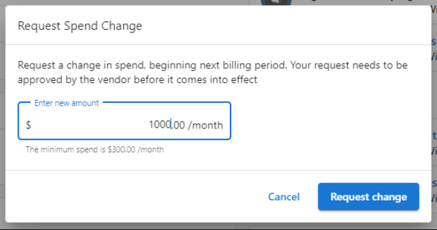

## Budget Changes for Future Months

The **Request Spend Change** feature makes it easy for you to make changes to your monthly digital ads budgets. 

**Note:** The method described below will only apply to future ad spend and not the current month's spend. To add additional funds to the current month, use the One-Time Boost add-on.

Head to [Partner Center](https://partners.vendasta.com/)​ → [Manage Accounts](https://partners.vendasta.com/manage-accounts) and select the account with the live digital ads campaign. Below the "Products" section, click on the three dots next to the active _MatchCraft Managed Ads Campaign_ or _MatchCraft Managed AI AdVantage_ product.

There you'll find the "Request Spend Change" button, pictured above. Enter the _new monthly budget_ that you would like in the pop-up box, pictured below.

​Our ads team will make the requested changes in 2-3 business days.

Please note that the new ad spend will begin to take effect in the _next_ billing cycle.
