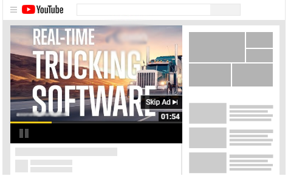

With the [MatchCraft Managed Ads Campaign](https://partners.vendasta.com/marketplace/products/MP-WM65PB2J5PL6BCNLB5JJN58DDQWXZVPN), [MatchCraft Managed AI AdVantage](https://partners.vendasta.com/marketplace/products/MP-23KNRJZRP2HZDXQHRSNV775DDKDPCC5D) and [MatchCraft Express Ads](https://partners.vendasta.com/marketplace/products/MP-8MS2CFPW6TM2WW4RZK3D4JZGKM6LF6MZ), Vendasta Services offers advertising across a diverse range of platforms for advertising, catering to different needs and budgets.

## Search Ads - Google & Bing

Search campaigns on Google and Bing are among the most popular formats. These text-based ads appear in search engine results when users search for terms like "hairstylists in New York City" or "florist for events." They target people actively looking for a business's services, making them highly effective for generating immediate conversions.

The setup is quick since no creatives are needed. These ads are pay-per-click, meaning you only pay when someone clicks on your ad. Depending on your monthly ad spend budget, we can run these ads on either Google or both Google and Bing. This is beneficial as we often yield high conversions on Bing. Running ads across both platforms maximizes reach and potential results.

* **Supported by:** [MatchCraft Managed Ads Campaign](https://partners.vendasta.com/marketplace/products/MP-WM65PB2J5PL6BCNLB5JJN58DDQWXZVPN), [MatchCraft Managed AI AdVantage](https://partners.vendasta.com/marketplace/products/MP-23KNRJZRP2HZDXQHRSNV775DDKDPCC5D) and [MatchCraft Express Ads](https://partners.vendasta.com/marketplace/products/MP-8MS2CFPW6TM2WW4RZK3D4JZGKM6LF6MZ)

## Display Ads - Google

Display ads are image-based banners shown on websites alongside the website’s regular content. They help increase brand awareness by targeting users as they browse online. You can also retarget users who have previously interacted with your ads or website.

Unlike search ads, display ads are great for promoting niche products or services that people might not be searching for. They use visuals to familiarize potential customers with your product. These ads are not pay-per-click; you pay for impressions, meaning your ad gets seen regardless of clicks. This exposure helps build unconscious brand familiarity, increasing the likelihood of future conversions.
* **Supported by:** [MatchCraft Managed Ads Campaign](https://partners.vendasta.com/marketplace/products/MP-WM65PB2J5PL6BCNLB5JJN58DDQWXZVPN) and [MatchCraft Managed AI AdVantage](https://partners.vendasta.com/marketplace/products/MP-23KNRJZRP2HZDXQHRSNV775DDKDPCC5D)

## Facebook & Instagram (Meta) Social Ads

Facebook and Instagram ads are better for demand creation, similar to display ads, rather than immediate conversions. Leveraging Facebook’s extensive user data allows for precise targeting based on demographics and interests.

The most effective ads on these platforms resemble social posts rather than traditional ads. For example, an ad for dog dental products might feature a cute picture of a dog, making it look like a regular post that users might share, like, or engage with. This approach increases the likelihood of users pausing to read and interact with the ad.

When creating ads, choose high-quality images and videos that blend seamlessly into users' feeds, ensuring they look like natural social media content. This strategy enhances engagement and makes your ads more effective on these visually-driven platforms.
* **Supported by:** [MatchCraft Managed Ads Campaign](https://partners.vendasta.com/marketplace/products/MP-WM65PB2J5PL6BCNLB5JJN58DDQWXZVPN) and [MatchCraft Managed AI AdVantage](https://partners.vendasta.com/marketplace/products/MP-23KNRJZRP2HZDXQHRSNV775DDKDPCC5D)

## YouTube Video Ads

****

YouTube, one of the world's top media platforms, offers immense reach for your business. Our team ensures your ads target the right audience, whether they're ready to buy or engage with your brand. We can target based on demographics, interests, keywords, or specific YouTube channels.

YouTube ads are ideal for expanding brand awareness through engaging video content. These ads can appear in various places: before, during, or after videos (skippable or unskippable), as banners at the bottom, or on the sidebar with recommended videos.

Content creators on YouTube strategically place ads in their videos to maximize impact, often at high engagement points. This practice, combined with YouTube's targeting capabilities, ensures your ads reach the right audience at the right time, making them memorable and effective for driving engagement and conversions.
* **Supported by:** [MatchCraft Managed Ads Campaign](https://partners.vendasta.com/marketplace/products/MP-WM65PB2J5PL6BCNLB5JJN58DDQWXZVPN)

## LinkedIn Ads

LinkedIn is a business-focused platform, making it ideal for job recruitment, lead generation, and increasing company visibility, such as announcing new locations. However, it's not always the best fit for every advertising scenario.

LinkedIn ads have a higher minimum ad spend, but the value of conversions can be significant. For instance, while you might see fewer conversions than with search campaigns, each conversion could lead to high-value contracts, making the investment worthwhile.

A key consideration is that LinkedIn ads cannot be white-labeled. Ads must be managed through personal LinkedIn accounts, which are publicly searchable. This limitation means you may want to adjust how you present LinkedIn ad campaign processes to your clients. If you’d like recommendations on how to pivot this approach, we recommend reaching out to your Vendasta sales rep for their insight.
* **Supported by:** [MatchCraft Managed Ads Campaign](https://partners.vendasta.com/marketplace/products/MP-WM65PB2J5PL6BCNLB5JJN58DDQWXZVPN)

## Amazon Display Ads

Amazon Display ads allow businesses to reach shoppers with image-based banners on and off Amazon, across a network of sites and apps. This helps increase brand and product awareness by targeting users based on their shopping behaviors.

*Please note*: This platform is currently available only for businesses located in the United States.
* **Supported by:** [MatchCraft Managed AI AdVantage](https://partners.vendasta.com/marketplace/products/MP-23KNRJZRP2HZDXQHRSNV775DDKDPCC5D)

## Request a Proposal

To have our strategists review your campaign goals and provide platform, budget, and strategy recommendations, you can [request a digital ads proposal](https://digital-ads-proposal.websitepro.hosting/) prior to ordering.

MatchCraft advertising campaigns can be run across a diverse range of platforms, catering to different business needs and budgets. This guide outlines the key platforms and associates them with the available managed ad services.

## Frequently Asked Questions (FAQs)

  
What’s the difference between Search Ads and Display Ads?

  Search ads appear in Google or Bing results when users actively search for a service (pay-per-click).  
  Display ads are visual banners shown across websites (pay-per-impression) to build awareness, even when users aren’t searching.

  
Can I have admin access to the ads account or Google Analytics?

  No. To protect campaign integrity, data security, and compliance with Google’s policies, we cannot provide admin access. This prevents unauthorized changes, protects sensitive information, and ensures proper account oversight.

  If you have further questions, please contact us at [marketingservices@yourdigitalagents.com](mailto:marketingservices@yourdigitalagents.com).

  
Can I run ads on both Google and Bing?

  Yes. Running ads on both expands reach and often improves conversion results, since Bing sometimes yields high conversion rates. Our campaigns can be set to run across one or both platforms depending on budget.

