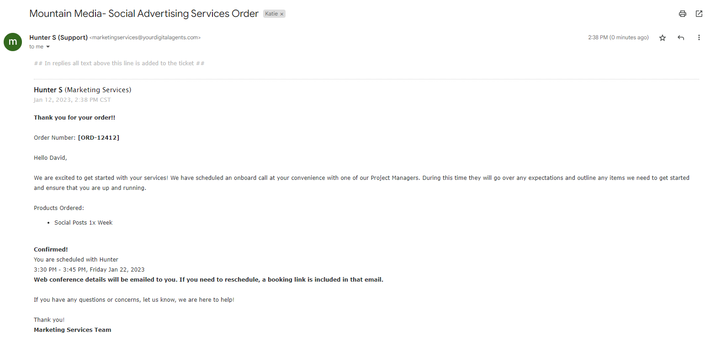

With Vendasta Services, you have access to a team of AI and marketing experts. Leveraging our team, you can claim and optimize your online listings, boost your reputation, engage your followers with content on social and blogs, build your website, and drive awareness of your business with digital advertising. All the while, our team will communicate with you to help set service expectations, inform you about updates, and respond to questions related to your service.

With so many services available, it's important to understand what to expect from each one. This article will break down what you can expect based on each product line.

# Expectation by Managed Service

| Service Feature | Listings | Reputation | Social | Blogs | Websites | DigitalAds |
|---|---|---|---|---|---|---|
| **Order confirmation email within 48 hours** | ✅ | ✅ | ✅ | ✅ | ✅ | ✅ |
| **Pre-launch call** | ❌ | ✅ | ✅ | ✅ | ✅ | ✅ |
| **Post-launch call** | ❌ | ❌ | ❌ | ❌ | ❌ | ✅ |
| **Direct-to-customer communication is available** | ✅ | ✅ | ✅ | ✅ | ✅ | ❌ |
| **Project tracking in Business App** | ✅ | ✅ | ✅ | ✅ | ✅ | ✅ |
| **Business App connections required** | ✅ | ✅ | ✅ | ❌ | ❌ | ✅ |
| **External credentials (passwords) required** | ❌ | ✅ | ✅ | ❌ | ✅[\*](#external-credentials-passwords-required) | ❌ |
| **Digital Agents access required** | ✅ | ✅ | ✅ | ❌ | ✅[\*](#digital-agency-access-required) | ✅[\*](#digital-agency-access-required) |
| **Business days to launch after assets received** | **3**[\*](#business-days-to-launch-after-assets-received) | **1-2** | **5** | **5** | **5-10** | **1-10** |

\*See more in definitions below.

# Definitions

## Order confirmation

All points of contact that have been included on the order form will receive an order confirmation email within 48 hours for any services ordered to confirm that a member of the Vendasta Services team has processed the order. This email will include an order reference number and request details and information that will be needed for fulfillment to complete the service. For services that include a pre-launch call, details about that call will be included here.

If you would only like specific people to be contacted in relation to the order placed, please make sure to note this in the order form.

This is what an order confirmation email looks like:

## Pre-launch call

This call happens before the launch or completion of a service and in many cases will gather the information that is necessary for service work to begin. A Pre-Launch call includes three main elements: welcome & expectations, connections & account authorizations, and a content questionnaire. You will be given a rundown of what to expect and when, will be helped to connect relevant accounts in Business App and be asked to provide required credentials and authorizations, and then go through a content questionnaire for any information that fulfillment teams require to complete the service.

## Post-launch call

This is unique to MatchCraft Managed Ads orders. All work is completed and the ads are made ready to launch, after which a post-launch call is set up with you to discuss expectations around campaign performance, optimizations, and future strategy calls (when applicable).

## Direct-to-customer communication

For all services, with the exception of Digital Ads, partners have the option of having our team communicate directly with the customer at the business. This includes all emails and calls. For Digital Ads, due to the sensitive nature of discussions around budgets, wholesale prices, and retail prices, all communication is kept partner-only to protect this sensitive information.

## Project tracking in Business App

All services will showcase a tracker found in Business App > Projects that showcases the tasks to be completed, expected completion dates, and notes.

## Business App connections required

Several services require connections for Google Business Profile, Facebook, or other accounts inside of Business App and the products accessed inside of it. While our teams typically will provide instruction or help you to make these connections, any connections that can be completed in advance of the service being fulfilled will ensure quick delivery of the services.

## External credentials (passwords) required

Our Review Responses and Website creation products will often require additional credentials. These will vary, but typically it will be user names and passwords for review sources that will allow our team to respond on your behalf or gain access for a domain registrar to be able to set your website live. 

Our Social Posting products will need credentials for Pinterest posting if requested. 

_\*Note that for Website services, either credentials are required or delegate access is provided to Digital Agency, not both._

## Digital Agency access required

Almost all services may require you to provide access to our team under the Digital Agency name. This typically comes up for Google Business Profile listing claims, Facebook access (for services like Review Responses, Social Posting, and Facebook Digital Ads Campaigns), or delegate access for a domain registrar. 

This means that you may see a request coming from an @yourdigitalagents.com email address or an account called Digital Agency. This cannot be changed, even if you are leveraging our white-label communications. We recommend that you be aware that you will be seeing these requests come through before ordering the product to ensure a clear understanding and an expedient onboarding process.

_\*Note that for Website services, either credentials are required or delegate access provided to Digital Agency, not both._

## Business days to launch after assets received

Timelines for delivery can vary depending on additional services ordered and project complexity. If you are concerned that a business may require complex services (eg. a high volume of social posts, a listing claim requiring intervention from the source’s support team, or a highly customized website), reach out to your account contact with Vendasta for more information and assistance.

_\*Note that complex listing claims, including Google Business Profile claims and optimization, may take up to 90 days to complete._
