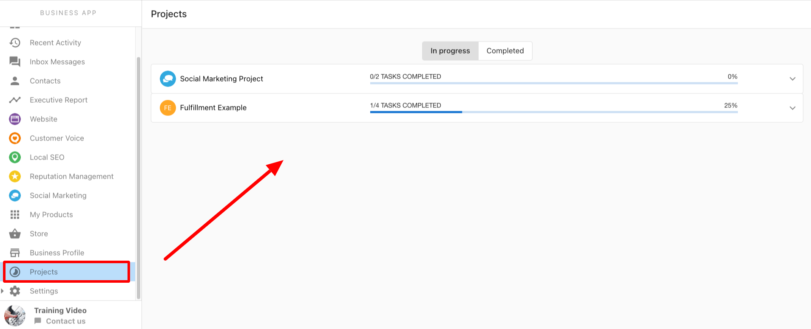

# Google Business Profile Optimization

## Overview

Google Business Profile (GBP) Optimization is a fully managed solution where a team of listing specialists claims, maintains, and optimizes your business listing on a monthly basis.

## What's Included

The service includes a one-time initial optimization once the listing is claimed, plus an ongoing monthly service with two main components: monthly profile updates and content posting.

### Initial profile optimization

Once the listing is successfully claimed, the team performs an initial optimization to ensure the profile is accurate and complete. This includes:

* Confirming the accuracy of the business name, address, phone number, website, hours, and category.
* Adding a logo, cover photo, up to 5 videos, and up to 5 photos.
* Adding attributes like Highlights, Amenities, and Service Options where applicable.

You will receive a confirmation email within 2 business days after this work is completed.

### Monthly profile updates

Once per month, our team logs into the Google Business Profile to:

* Ensure all information remains accurate.
* Manage any edits you provide, including uploading new photos and videos.
* Work to lift any listing suspensions that may occur to maintain your online presence.

### Monthly content posting

One service-based post is published to the listing each month. These posts provide general information about your business to potential customers.

* Posts feature a call to action, such as `Book`, `Learn More`, or `Call Now`.
* Content is based on relevant information and links from the business website.
* Images are sourced from stock photo websites or the business website.
* You can provide specific images or content you would like to see posted.

## Prerequisites

* **Eligibility:** Businesses that conduct in-person business with customers, either from a storefront or in a service area, are eligible. Not eligible: rental or for-sale properties, lead generation companies, brands/organizations/artists, and online-only businesses (including eCommerce). See [Google's guidelines](https://support.google.com/business/answer/3038177) for representing your business online.
* **Business details for the fulfillment form:** Business name, address, phone number, website, hours, and category, plus a logo, cover photo, and any photos/videos.
* **A physical address:** P.O. boxes cannot be used when claiming GBP listings.

## Getting Started

The initial setup involves submitting your business information, claiming and verifying the listing, and performing an initial optimization.

### 1. Submitting your information

The process begins when you complete and submit a fulfillment form with your business details. To avoid delays, provide as much detail as possible. The team reviews the order and starts the process within 2 business days; initial fulfillment work is completed within two business days of receiving the completed form.

### 2. Listing claim and verification

Our team works to claim and verify the listing using the information you provided. This step can take two weeks or more to complete, depending on Google's requirements and how quickly requested information is provided.

You may be required to comply with one of Google's allowed verification methods, which can include:

* **Video Verification:** Providing a video of the physical location, equipment, or assets used by the business. In some cases, this may be a live video call.
* **Phone Call/Text Message:** Google sends an automated call or text with a PIN to the business phone number.
* **Postcard:** A physical postcard with a PIN is mailed to the business's physical address, which can take two weeks or more. P.O. boxes cannot be used.
* **Email:** Google sends a PIN to an email address at the business’s domain.

:::note Please note

*   You may need to verify with more than one method.
*   The available methods depend on a variety of factors (Google cites business category, public information, region, and more).
*   We do not have visibility on the method that Google will select for any given business, nor can we control or change the methods available when claiming and verifying a business.

:::

### 3. Initial profile optimization

Once the listing is claimed, the team performs the initial optimization (see [What's Included](#whats-included)) and sends a confirmation email within 2 business days, after which the monthly optimized service begins.

## FAQ

 What types of businesses are eligible for this service?

Businesses that conduct in-person business with customers, either from a storefront or in a service area, are eligible. Businesses that are not eligible include rental properties, lead generation companies, and online-only businesses, including eCommerce.

What type of business cannot be claimed with this service?

* Rental or for-sale properties such as vacation homes, model homes, or vacant apartments
* An ongoing service, class, or meeting at a location that you don't own or have the authority to represent
* Lead generation agents or companies
* Brands
* Organizations
* Artists

Other online-only businesses including ecommerce
For a full list of eligibility criteria, please refer to [Google’s guidelines](https://support.google.com/business/answer/3038177) for representing your business online.

 What happens if someone else already owns the business listing?

If the listing is already claimed by another owner, our team can request ownership and work with Google Support to gain access. If access cannot be gained, we will discuss the next steps with you.

 How long does the claiming process take?

While most new claims take less than a week, the process can take a month or longer if there is significant back-and-forth required with Google.

 What happens if my business listing gets suspended?

Making edits to a profile can sometimes trigger a re-verification requirement or a suspension. If a listing is suspended, our team will work with Google to have the suspension lifted. However, there is no guarantee that Google will agree to reinstate the listing.

 How do you decide what to post on the business profile?

Posts are created using relevant content from your business website. If you have specific content, promotions, or events you would like posted, you should provide that information to the team.

What is the status of my Google Business Profile verification? Is my verification complete?

You can view the current status of verification in the Projects tab of your dashboard. There you can find information about any in-progress or complete work that our team is fulfilling on your behalf. You will be able to see any notes left by our team about the status, including any issues that may require a different type of verification or may be waiting on resolution from a Google support ticket.

Why was my Google Business Profile suspended?

If your Google Business Profile becomes suspended, note that Google doesn't provide transparency on why businesses are unverified, why they become suspended, or how their support requests are triaged. We work with them as best as we can to pass information on when we are managing a support request, but we can only be as transparent as they are.

What's the status of my Google support ticket? When will it be resolved?

Note that Google is not transparent about their service level expectations and we won't know precisely when to expect an answer from them on tickets. If it's a brand new support or reinstatement request, we typically hear from them within 3 to 7 business days. If no response is received after 7 business days, we submit a new ticket. For existing support tickets, if there is no response and the process becomes blocked, we may have no options but to submit a new support request.

Can I be added to the Google Support ticket?

Our team is trained to use best practices to resolve an issue with Google. In order to streamline the communications with Google's Support team and work toward the best resolution possible, we do not typically add other stakeholders to the ticket. We are able to do so upon request. Note that we do pass on all of the updates as we receive them.

How does multi-location & bulk verification work?

For businesses with 10 or more locations, we can request bulk verification from Google. This process requires a spreadsheet containing the information for all locations. Please note that Google may still require individual verification for some or all of the locations.

What is the process for reinstating a suspended listing?

Making edits to a profile can sometimes trigger a re-verification requirement or a suspension from Google. If a listing is suspended, our team will work diligently with Google to have the suspension lifted. However, there is no guarantee that Google will agree to reinstate the listing, as the final decision rests with them.

What business types or categories don't have access to Google Business Profile posts?

* Adult Entertainment
* Camps
* Cannabis shop
* Casino
* Conference Center
* Gun Shop
* Hotel (all hotel categories)
* Vacation Rental
* Wine Store (and other alcohol-related categories)

