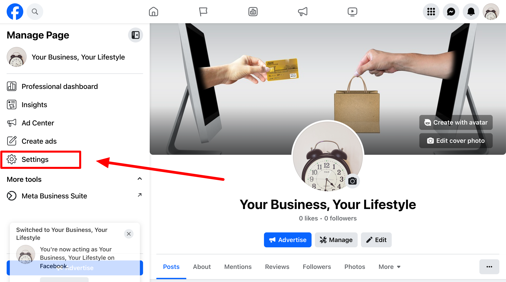
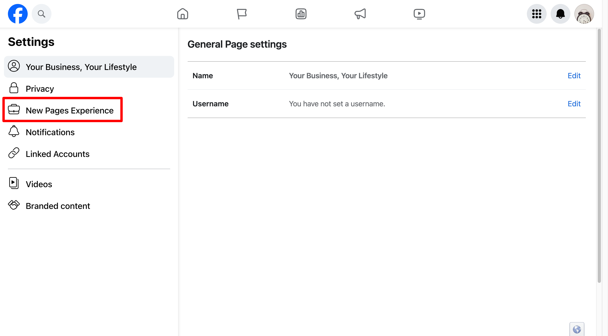

You want to build up your social following and ensure you're staying top-of-mind by providing continuous content to your customers. By partnering with our team, we'll help save you the hassle of keeping up on your social presence so you can focus more on running your business.

### Accept the Facebook access request

For our team to post on your behalf, we will need access to your Facebook page. You retain full ownership and control over the page; this access request simply allows us to operate on your behalf and post to your page.

Log in to Facebook and switch your profile to your business page.

Once switched, you should appear on Manage Page. 

Click Settings. 

Now click on New Page Experiences

You'll see a section for Page Access and inside of it you may see an access request from Vendasta Services or Digital Agency.

Accept the request.

