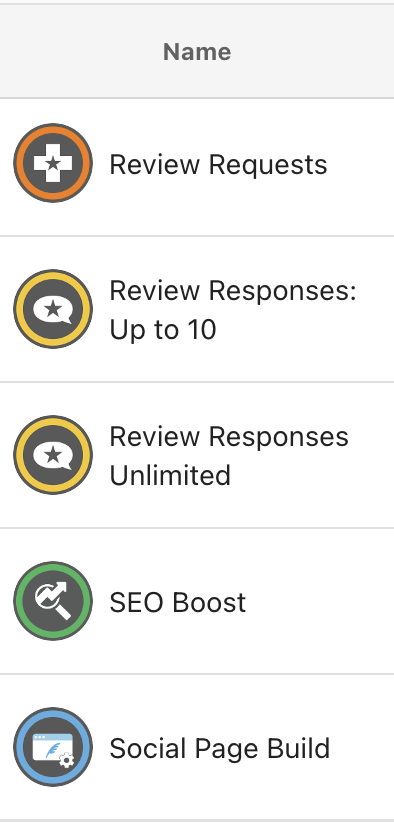

Vendasta Services is Vendasta’s in-house fulfillment vendor. Fulfilling with Vendasta Services allows you to enhance your agency efficiencies by leveraging our skilled teams of digital professionals to do the heavy lifting for you. 

With our team’s expertise and streamlined processes, partnering with us ensures your clients maintain an optimized online presence, a meticulously managed reputation, and an actively engaged customer base across social platforms.

Our products don’t have “Vendasta Services” in the title, so you may not recognize them at first glance. Below are 2 ways to easily identify our products while searching in the Marketplace alongside other vendors.

### Filtering by Vendor

1.  On your internet browser, open [Partner Center](https://partners.vendasta.com/login) and log in to your account.  
      
    
2.  Once logged in, seek out the navigation bar on the left side of the page. Click on “**Marketplace**” to expand the menu option. Click “**Discover Products**” from the Marketplace dropdown menu.
    1.  The Discover Products page shows all of the available products within the Vendasta Marketplace, regardless of whether you’re “Selling” them in your store or not.  
          
        
3.  From the Discover Products page, there is a new navigation menu on the left of this page. Under “Explore,” select “**All**” if it has not already been selected.  
      
    
4.  Within the table, click on the blue “**Add filter**” button and navigate to the following filter to apply it:
    1.  **Vendor** > **Vendasta Services** 
    2.  Click “**Apply.**”  
          
        
5.  With this filter applied, the table will now display all of the available products and services fulfilled by Vendasta Services.

### Recognizing Product Logos

Aside from using the product filters, you can recognize Vendasta Services products amidst your search results by our distinct product logos.

Vendasta Services products feature a distinct grey circular logo, with a colored ring on the border (colors vary) and a white icon in the center.

Each product page includes crucial information about what’s included in the service, sales resources, and FAQs. 

_Still have questions? Vendasta Services product-related queries can be directed to us via email at_ [_marketingservices@yourdigitalagents.com,_](mailto:marketingservices@yourdigitalagents.com) _and we’ll be happy to help!_
