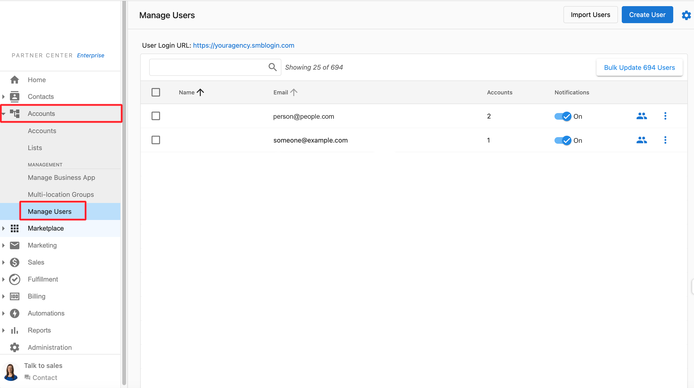
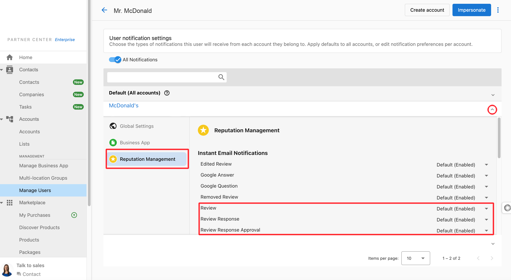

One of the reputation management services Vendasta Services offers is responding to reviews via products such as [Review Responses Standard](https://partners.vendasta.com/marketplace/products/MP-K8LLNZBS5DTVCHQ4J54C463F3HWGJCQP)_._

This service includes an (optional) approval process for [responding to negative reviews](../review-management/approval-process-options-for-responses-to-negative-reviews.md), where users can receive notifications with our proposed responses to negative reviews.

To receive these email notifications, you must [add the respective person as a user to the account in Partner Center](../../accounts/manage-users/add-a-user-to-an-account.mdx) and configure the applicable user notifications.

## Configuring User Notifications:

(Reputation AI will need to be active on the account)  
  

1.  In Partner Center, click on **Accounts** > **Manage Users**.  
      
      
    
2.  Next to the applicable user, click the 3 dots, then “**Edit Notifications**” from the drop-down menu.  
      
      
    
3.  You will be displayed a list of accounts that the user has been added to. Click on the drop-down arrow next to the applicable account to expand the notifications list.
    1.  Click on "**Reputation AI**" to display the notifications associated with the Reputation AI platform.  
          
          
        
4.  When you first add a user to an account, all of the notifications for that user/account will be enabled by default. Ensure that the following **Instant Email** notifications are enabled:  
    **Review****Review Response****Review Response Approval**

With these notifications enabled, the user will receive email notifications when there is a review response that requires their approval, such as a response to a negative review. The email will look like this:**Subject:** New Review Response Approval for Business Name

The user can click “**Approve or Request Changes**” within the email to be redirected to the platform, where they can provide feedback on the review response directly to the fulfillment team.
