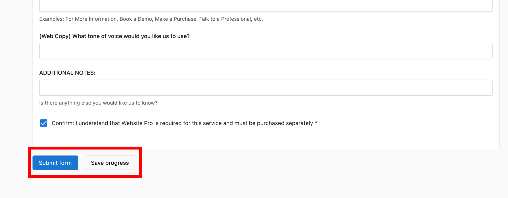
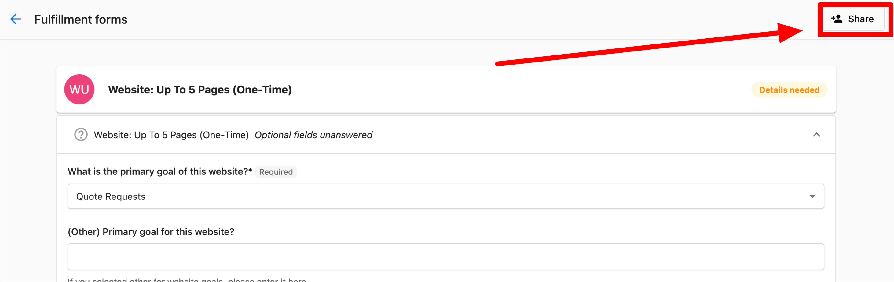

After submitting an order, it's crucial to complete the in-platform Fulfillment Form. Failure to do so can result in service delays. Fulfillment Forms can be completed before or after placing an order and they can be shared with others to receive their input.

# Fulfillment Form Overview

Welcome to the exciting world of Fulfillment Forms! This article will walk you through the process of using fulfillment forms after placing an order and how they can streamline your experience.

## Purchasing a Product

For more info, [check out this article.](../../commerce/orders/creating-and-managing-orders.mdx)

1.  Go to **Partner Center** → **Accounts** → **Manage Accounts**
2.  Select the account you want to make a purchase for
3.  Click **Order Products**
4.  Select the product(s) that you wish to activate
5.  Click **Proceed to Next Step**
6.  Ensure that the contact information is correct.
7.  Proceed to purchase and activate the product.
    *   After purchase, the order is submitted to the right team to process.
8.  You will be directed to the **Fulfillment Form.** This form will be available for you to fill out at your own pace after the product has been ordered and the team has received the order.

## Completing the Fulfillment Form

1.  **Entering Information:** The form contains fields for all the information you would previously have needed to provide before submitting your order. Now, you can provide this information after submitting it.
2.  **Saving Progress:** You can save your progress if you're not ready to submit the form, and return to it later. The button to save progress is located at the bottom of the form.
3.  **Submitting the Form**: Once the information in the form is complete, click **Submit form** button. This will notify our team and you will no longer be able to make changes to the form.

## Sharing the Fulfillment Form

1.  **Sharing the Form:** When in Partner Center, the fulfillment form has a share option in the top right corner. This feature allows you to share the form with a Business App user. This way, they can help provide the correct information needed to complete the services.
2.  **Collaboration:** Once you share the form, the recipient receives an email and can access the form to help you fill it out. They can also save progress in case they need to consult other stakeholders or complete it at a later time.
3.  **Updates:** From your end, you can see the updates that are made to the form.
4.  **Business App Access:** Any Business App user with permission to view the Orders tab will be able to view and edit the fulfillment form regardless of whether or not it has been shared with them.

**Note:**  Sharing can only be done by Partner Center Admins and Salespeople.  Business App users will not be able to share the form.

## Sales Team Interaction

**Fulfillment Form Drafts:** If you prefer, your salesperson can start filling out the fulfillment form before activating the product. 

1.  Select the account for which you want to create a draft order/draft fulfillment form.
2.  Select **Create order**
3.  Click **\+ Add items** and select the Vendasta Services product(s) you wish to include in the order
4. If the product(s) have an associated fulfillment form, the fulfillment form tab will be available to fill in details and can be saved by clicking the **Save progress** button.

For more information on managing orders Partner Center, [learn more here.](../../commerce/orders/creating-and-managing-orders.mdx)

## Notifications and Tracking

If your fulfillment form still requires information, you'll receive an in-app notification and an email notification. You'll also see a list of accounts with incomplete fulfillment forms on the home tab.

Once you've submitted a fulfillment form, the status updates to show whether it's in review. You can always keep track of different fulfillment form statuses in the order details.

Fulfillment Forms have been designed to speed up your ordering process. We hope this guide helps you navigate them with ease. If you have any questions, please reach out. Have an awesome day!
