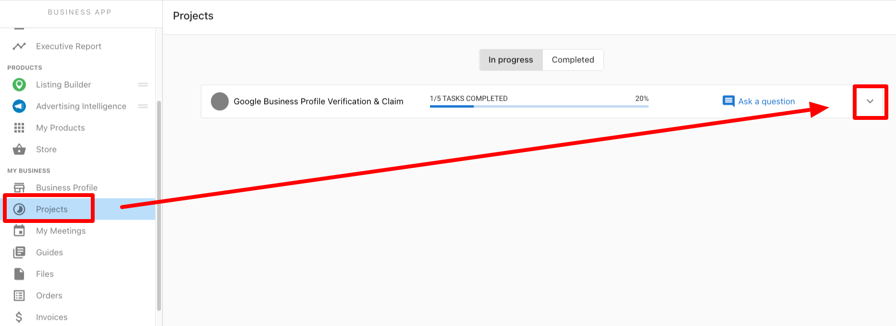
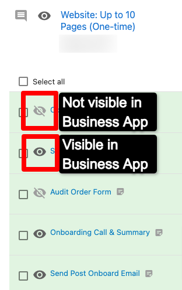

When will this website be live? What's the status of our digital ads campaign? Is my blog ready? When should I expect the next social calendar?

These are all common customer questions. With Project Tracking in Business App, your customers can find answers on their own without needing to contact you.

## Projects tab

1.  Open Business App for the customer's account.
2.  Click the `Projects` tab.
3.  Click the dropdown arrow on any in-progress project to see full details and timeline.
4.  Click `Completed` to view information on past projects.

## How does this impact your business?

Your customers get a clear view of what's being worked on, its current status, and upcoming due dates. This means fewer inbound questions about project status, since customers can check for themselves in Business App.

## FAQ

**What if I don't want my customers to see this information?**

No problem. You can turn off the `Projects` tab for all Business App users by going to `Partner Center` → `Administration` → `Customize` → `Business App` and toggling off tab access for `Projects`. You can also reach out to the Vendasta Services team to hide visibility for an individual project.

**Will my customers see every task that is being worked on?**

No, some tasks do not appear here. One-off tasks do not appear in the Projects tab. In addition, some tasks contain information that should not be shared with clients, so those are kept hidden. You can check which tasks are visible by viewing the project in your Task Manager. If a task has a crossed-out eye symbol, it is not visible in Business App.

