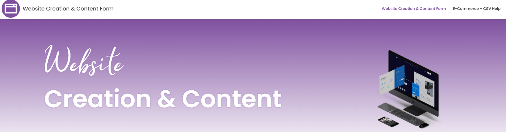
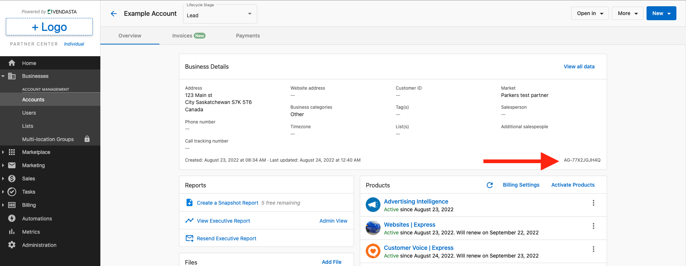
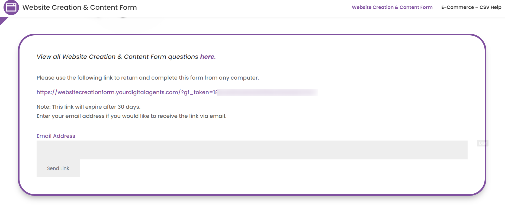
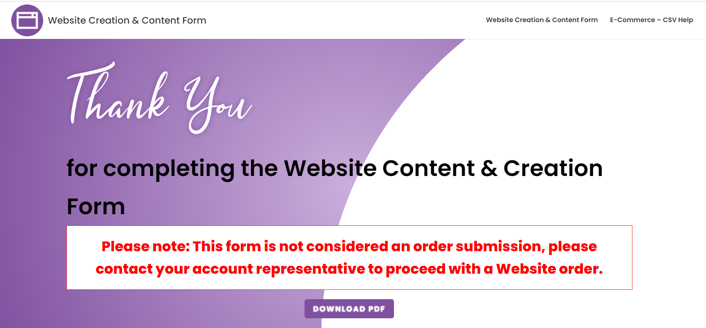

## Guide

There are a few steps that need to be taken to order a website from Vendasta Services. By following this guide, you will ensure that your website is delivered as quickly as possible. You can check out our [**walkthrough video**](https://www.loom.com/share/18352d523eea4be88fe1489adf1d5116?sid=bee977b3-758f-49a0-919b-60278214822f) for a quick overview and **read ahead for the full details**!

Ordering a website requires two steps:

1.  [Complete and download the Website Creation & Content Form.](https://websitecreationform.yourdigitalagents.com)
2.  [Activate the product in the platform](https://partners.vendasta.com/marketplace/products).

If both of these steps have not been completed, it will create delays in the completion of the website. 

The Website Creation & Content Form provides our teams with all of the necessary information to build the website. This form is outside of the platform and is unbranded so you can complete it at your own pace. This form should be completed first and can be done in steps as you decide on the best website for your needs. 

Product activation must be completed in the platform before any work is started. This step requires you to pay the wholesale cost of the website and kicks off the project for our team. Upon activation, you will be asked to confirm the contact details of anyone who will be communicating with our team about the website. After activation, you can upload a PDF of your completed Website Creation & Content Form.

## Complete and download the Website Creation & Content Form

**You can access the form [here.](https://1l.ink/XQ3D4T7)**

This page will dynamically request all of the information that our team needs to complete your website. That means that sections will expand to collect more information if required, based on previous answers. Some fields are required to begin, while others provide us with additional details that will help with the website's construction but could be provided later.

:::tip

The more information we have early on, the better! With copy, images, and products to include in the store (for an e-commerce website), we can include them early. However, we don't need everything at once. For example, if you don't have a photo of your team for your About Us page, we can include a stock photo as a placeholder on the live site until the real photo is ready.

:::

The following sections break down important information and details about each section in the Website Creation & Content Form. You can refer back to this as you complete the form for the first time. 

### Business information

This section will gather important details about the business, including the business name and social media pages. It also requires selecting the correct website product. Note that this reveals all the client website products that we offer (including monthly and one-time billing options), so keep this in mind before sharing it with a client. The Website Creation & Content Form will populate with more options when a multi-page site is selected versus when a landing page is chosen.

### Contact information

This section will request the contact information for the main point of contact our team will reach out to regarding this website project. If you would like to be the main point of contact, please put your contact info instead of the client's. As the project progresses, you can always notify us if your contact preferences change.

The emails that you supply in the Account Representative Email and the Primary Contact Email fields will receive copies of the form after submission.

:::note

One of the questions will ask “What is the AGID for this Website?” The AGID is the account’s unique identification code inside of the Vendasta platform. We receive many forms that may contain similar business names, and so this code allows our team to tie your Website Creation & Content Form to the correct account and product activation. The AGID can be found on your client's Account page under their Business Details. (Navigation: **Partner Center** → **Businesses** → **Accounts** → **Client account**)

:::

### Domain

In this section, you will be able to provide the login credentials for your domain registrar (eg. GoDaddy, NameCheap, etc). If you do not have a domain, you will need to purchase one before we set the website live. To purchase a domain, you can purchase it directly from the domain registrar of choice, or via one of the following products within the product Marketplace:

*   [Domains](https://partners.vendasta.com/marketplace/products/MP-L3DHRP5Z2RP4QVWLLTQGJLLVSH232WR5?tab=0)
*   [GoDaddy Domains](https://partners.vendasta.com/marketplace/products/MP-4TMLZSQ5FMJQX5T75TPC43FQBWD2VXLB)

### Navigation

This section refers to the different pages that you want (eg. About, Services, Blog) and how you want them arranged (for example, subpages for additional services that will nest underneath the Services header). You can provide additional notes and assets (any images/icons/etc) that you want to be used.

### Design

In this section, you can choose your template, fonts, color palette, and images.

**The template is the most important choice for your website.** Select from one of our [templates](https://1l.ink/LJZQDWL)

:::note

The template is key for any web development work to start. If you do not have a template selected, then our team will not be able to start building the website, but we can set up an "Under Construction" branded landing page until you are ready to begin.

:::

Our team uses [123rf.com](https://www.123rf.com/) for stock images and [Flaticon.com](https://www.flaticon.com/) for icons. You can provide Image IDs from these sources and/or links to a Google Drive or Dropbox folder with assets you want to be included on your website. If you have not selected or provided assets, our team will choose them on your behalf.

### Web copy

Depending on the size of the site purchased, our team will write copy (text) to be included on the website. We can also take web copy that you have created (it can be uploaded into the form) or use web copy from your existing website.

### E-commerce

If you plan to sell products or services through your website, we will need information about those products and your payment processors. We can connect an existing Square, Stripe, or PayPal account as part of the website build. To add products or services, we will need a CSV file that contains the product information (this can be provided after the website has been activated). For help on the e-commerce CSV file, you can [use this resource](https://1l.ink/DV84NL4).

### Additional functionality

In this section, you can include/upload files like terms & conditions and policy documentation, embed codes (eg. a third-party calendar booking code), and additional information about the site. We recommend reviewing any specific notes about the website during your onboarding call with our team.

### Saving, submitting, and downloading your form

At the bottom of the Website Creation & Content Form, you have the ability to _Save and Continue_. Choosing to do so will provide you with a link that will remain active for 30 days. Visiting that link will take you back to the Website Content & Creation Form with all of the content you have already added to it and allow you to complete it. Please note that you will have to **save** any changes and come to a new link if you are pausing again between updates before submitting the form.

When you submit your form, you will be taken to a confirmation page that includes a download link for the PDF copy of your form.

The PDF and a text copy of the form are sent to the email addresses that were included in the Account Representative Email and the Primary Contact Email fields.

:::tip

While a copy of the form is sent to our team and the specified emails provided, downloading the form will ensure you have a copy and will allow you to upload it in the next step. This makes it easier for our team to connect the right Website Content & Creation Form to the activation.

:::

## Activate the product

Part of the activation process will ensure that you are activating dependent products like [WordPress Hosting](https://partners.vendasta.com/marketplace/products/MP-ee4ea04e553a4b1780caf7aad7be07cd). You will also need to fill in a few fields, like the contact information for onboarding. After activation, you will see a fulfillment form that requests information that you may have already filled out in the Creation & Content form. You do not need to fill this information out, and instead, you will be given the option to upload the PDF of the completed form. Because the completion of the previous Website Creation & Content Form does not tie directly to the product activation, uploading the PDF in the fulfillment form will ensure a faster launch of your website project.

Once the product is activated, it will kick off a project that can be tracked in your Business App. Our team will process the order and book an onboarding call with the contacts provided during the activation to go over the expectations and discuss required assets and design choices.

And there you have it! By following these steps (completing the Website Content & Creation Form and then activating the product), you will be set up for success for your new website!
