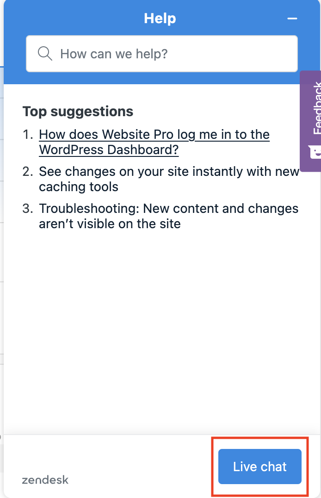

This article details the inclusions of Vendasta Services’ [Website Support](https://partners.vendasta.com/marketplace/products/MP-5FTSXB8XVSDRJW4RFQ84B8H3SGKG56JC) product and the process/best practices for submitting requests to our Website Support team.

**What is Included in Vendasta Services Website Support+?**

Website Support+ is a fulfillment service offered by Vendasta Services for WordPress websites hosted on Vendasta’s WordPress Hosting Pro platform. Website Support+ includes the following:

**Website Support+ includes:**

*   Access to the team for technical support
*   Minor changes to the website's appearance, such as:
    *   Fonts
    *   Colors
    *   Media (images, videos, icons)
    *   Text updates
    *   Contact form fields and settings
    *   Reorganization or duplication of existing sections
*   Backend updates are completed quarterly to ensure WordPress stability
*   Updates to plugins and themes upon request
*   Health checks to website upon request
*   Uptime monitoring and urgent support if your website goes offline
*   Upload up to 3 blog posts per month (content must be provided)
*   AI Chat Receptionist installation

**AI Chat Receptionist**

At no additional cost, our team will install the AI Chat Receptionist on your new website build or with an imported website. This includes:
*   Web chat code added to the website
*   Basic test (open chat, confirm a message can be sent)
*   Add brand colours to the AI Chat Receptionist

This service is not a full end-to-end configuration of the AI Chat Receptionist, and is only for basic code installation. If you need advanced features such as full brand configuration beyond basic brand colours, SMS messaging, voice calls, or custom conversation flows, please explore our [AI Receptionist Setup & Support](../ai-workforce-setup/ai-receptionist-setup.md) service.

**What's not included in monthly support**

Website Support+ is designed for ongoing maintenance and scoped updates, not full rebuilds or complex custom development.

The monthly charge does not include:

*   Maintaining or integrating emails
*   New functionality or complex development (scoped and billed hourly)
*   Adding plugins or code to add a new feature to the website
*   Integrating booking calendars, calculators, etc.
*   Additional images/product changes beyond the included scope of 25 a month (charged per product/image rate)
*   Supporting custom coded themes or templates
*   Creating additional sections or website pages
*   Integrating payments outside of Square, Stripe and PayPal

If you need help with any of these features, please reach out and our team can provide you a quote for how many hours of custom work it might take.

**How to submit a website support request to Vendasta Services:**

1.  Send an email to our team at [marketingservices@yourdigitalagents.com](mailto:marketingservices@yourdigitalagents.com) 
    1.  Sending edits via email ensures that your request is properly documented, as our teams use a ticketing system. This is the best forum to communicate with us.  
          
        
2.  Within your email, please share the details of the edit(s) you’d like addressed on your website. Clear & straightforward details will minimize any potential back-and-forth for clarification before our team can proceed with the work.
    1.  Please include all requested changes in a single email. This ensures that no details are left out as our communications team assigns the work to the website team and prevents confusion.
    2.  Attach any applicable attachments, images/screenshots, web copy, etc.  
          
        
3.  Upon receiving your email, a client solutions specialist will review your request. If they require additional clarification, they will inform you via their response. Otherwise, they will respond in the email thread to confirm receipt and provide you with an estimated update date. We can guarantee an update on the project within 3 business days.

_What is an update?_ It consists of one of the two:

*   The request is completed and you are informed of the work done.
*   If not complete, the update will provide information on the current status of the request and insights on any delays (eg. complexity, volume of requests received, additional assets/clarification required, etc.)

Please keep an eye out for our emails. Our team may request further clarification or need additional assistance (access to a link you shared, etc.). Our goal is to complete this work to your satisfaction in a timely manner, and your responsiveness is appreciated.

**In the event that your website goes down:**
  
_If you notice your website is down, first:_

1.  Check if your website is still hosted on WordPress Hosting Pro/if the WordPress Hosting Pro product is active on the account in Partner Center.
    1.  If you deactivate WordPress Hosting Pro while the DNS records point towards WordPress Hosting Pro (the hosting platform) this will cause the website to go down, as websites need a place to “live.” 
    2.  If you move the website to another hosting platform, you need to update the DNS records prior to deactivating WordPress Hosting Pro.  
          
        
2.  Check if this issue is on a certain page of the website or the entire website.  
      
    
3.  Check if this issue affects a specific device or all devices (e.g. Is this only on mobile devices, or are desktop browsers affected, too?).  
      
    _Contact Us:_
4.  Please email us with the details at [marketingservices@yourdigitalagents.com](mailto:marketingservices@yourdigitalagents.com)  
    Include answers to the above questions and, if possible, the error message you receive to assist us in determining the root cause. 
    1.  There are times when websites appear to be down for specific users, and so replication can sometimes be inconsistent. Providing details about your specific experience will help our team troubleshoot and resolve the issue.  
          
        
5.  After sending your email, please also give us a call. Our team does our best to catch urgent emails right away, but giving us a call will allow us to check in on your request and flag it with the website support specialists immediately:  
    Vendasta Services: **1-866-378-8031** _(Monitored Mondays-Fridays, 8 am - 5 pm CST)_
    1.  If your website is down outside of these hours, you can alternatively contact Vendasta’s Support on Demand team:
        1.  Open the WordPress Hosting Pro dashboard and click on the blue **Help** button at the bottom right:  
              
            
        2.  Click **Live Chat** at the bottom of the pop-up window:  
              
            This live chat is monitored 24/7, and they can assist with downed websites outside of Vendasta Services' operating hours.

## Frequently asked questions (FAQs)

What type of changes are included with this service?

The following customizations are all included with website support at no additional cost:

* Fonts
* Colors
* Media (Images, videos, icons)
* Text
* Contact form fields and settings
* Reorganization or duplication of existing sections
* Access to the team for technical support
* Updates to plugins, themes etc upon request
* Health checks to your website upon request
* Uptime monitoring and urgent support if your website goes offline
* Upload up to 3 blogs per month (if the content is provided)

Any plugin not added by our team will have limited support and if a plugin is no longer supported, we will do our best to correct the issue if possible or recommend a new solution at our hourly rate.

For any other type of customization, please reach out to [websites@yourdigitalagents.com](mailto:websites@yourdigitalagents.com) for a quote for the custom work needed.

**Note:** Any additional images/product changes beyond the included will be charged at a per product/image rate. Any new functionality changes to sites will need to be scoped out and charged at a per hour rate. The monthly charge does not include maintaining or integrating emails.

What is the turn-around for monthly changes?

Website Support Requests for image and text changes, information updates, uploading blogs and setting websites live on custom domains have a turn around time of 3 business days.

Larger edits such as larger lists of edits including Adobe XD files, plug-in integrations, changes to website functionality and additional services requiring hourly charges have a turn around time of up to 5 business days.

How will you provide support for Duda websites?

In order for us to provide support on your Duda website, we will need you to create a user for our team and provide us access to your site in the Duda dashboard. A user can be created with the following email: [websites@yourdigitalagents.com](mailto:websites@yourdigitalagents.com).

What should I do if I receive a Google indexing warning or error?

Everyone wants to make sure that their website is appearing in Google search results. When a new website is launched or changed, it needs to be indexed by Google.

There is no control over when Google indexes a website. That said, we include a WordPress plugin on each website that we create that automatically submits changes from your site to Google and other major search engines.

Also note that you do not need every page of your website indexed in order to be found by Google. So long as your homepage is indexed, then it can start to populate into search results.

If you have received an email from Google regarding an indexing error, forward it to our team at [marketingservices@yourdigitalagents.com](mailto:marketingservices@yourdigitalagents.com) and we can investigate and take any appropriate actions from there.

Can you install AI Chat Receptionist on my website?

Yes! Website Support+ includes installation of the AI Chat Receptionist on your new website build or with an imported website. This includes:
*   Web chat code added to the website
*   Basic test (open chat, confirm a message can be sent)
*   Add brand colours to the AI Chat Receptionist

This service is not a full end-to-end configuration of the AI Chat Receptionist, and is only for basic code installation. If you need advanced features such as full brand configuration beyond basic brand colours, SMS messaging, voice calls, or custom conversation flows, please explore our [AI Receptionist Setup & Support](../ai-workforce-setup/ai-receptionist-setup.md) service.

