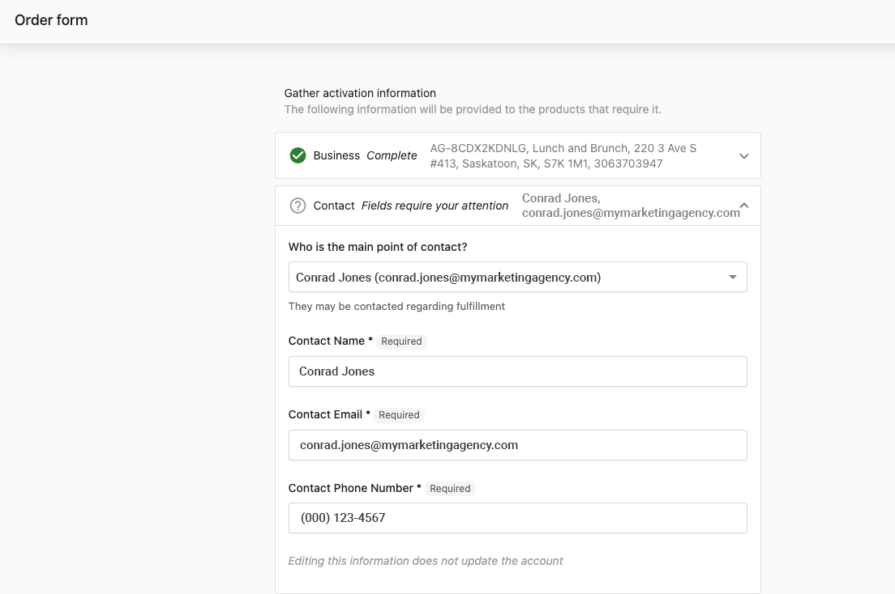

Vendasta Services is Vendasta's in-house fulfillment vendor. Our commitment to white-labeling best practices ensures seamless communication with your clients. Below, we outline our communications process.

## How does Vendasta Services communicate with my clients?

Vendasta Services' primary form of communication is email. Our default unbranded email address is [**marketingservices@yourdigitalagents.com**](mailto:marketingservices@yourdigitalagents.com) 

Our unbranded phone line is: **1-866-378-8031**

Our communications team will answer with an unbranded greeting and we will ask the following questions to determine the caller and relevant business information:

*   Caller Name
*   Business Name
*   The project they are calling about

## Our Communications Process

After completing a sale and activating the desired Vendasta Services products, we send a confirmation email to the contact(s) listed on the sales order and fulfillment form. Please ensure accurate contact information on these forms.

For more details on our fulfillment process, refer to [Vendasta Services Expectation Brochures](https://examples.yourdigitalagents.com/expectation-brochures/).

#### Non-Client-Facing Communication:

If you prefer non-client-facing communication, please provide _your_ contact information in the order and fulfillment forms. We are happy to adjust our communication channels as needed!

_Questions? Please reach out to us at_ [_marketingservices@yourdigitalagents.com_](mailto:marketingservices@yourdigitalagents.com)_, and we'll be happy to assist!_
